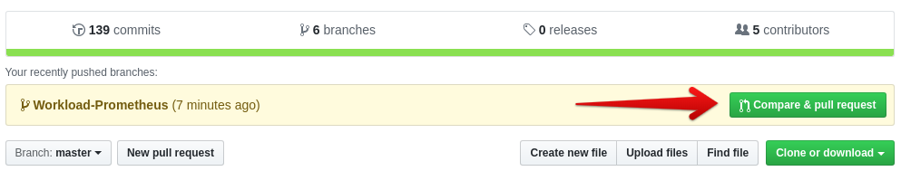
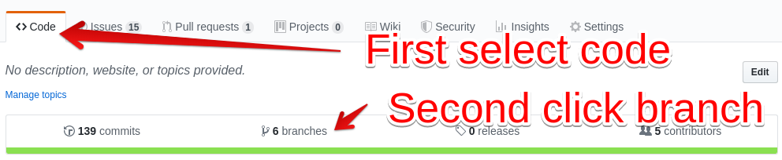
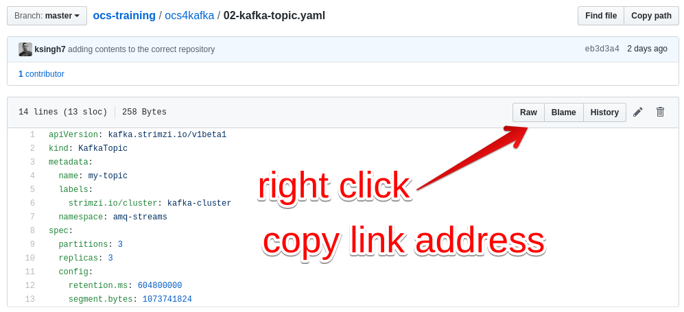

# Contributing
:toc: right
:toclevels: 2
:icons: font
:language: bash
:numbered:
// Activate experimental attribute for Keyboard Shortcut keys
:experimental:

Then contributing to this repository, please follow the below style guide.

## Pull Request Policy

Since people have started using this repository, no un-reviewed code will be allowed in the master branch.

Follow the <<Adding Content>> procedure to add your content. This applies to new documents as well as additions to already existing documents.

Once you are satisfied with your content and it has been verified by you, open a pull request to merge your branch into master.

To open a PR you can follow these steps:

.If you have recently pushed to your branch, Github will allow you to quickly open a PR


.If you did not recently push to your branch, go to the branch overview:


.Start a PR from the overview
image::imgs/open-PR-long-2.png[]

## Adding Content

- Create a new branch in which you work. The branch name should include your name.
  * Including your name helps us in finding out if the branch can be recycled
- Only work inside of your branch
- Write your content in ASCIIdoc format - respect the ASCIIdoc styling information below

## Testing work locally

To test your work locally before we deploy it to master, you can execute this command in the root of your Git project:

[source]
----
# Podman
podman run -v $PWD:/antora:Z --rm -t antora/antora --cache-dir=./.cache/antora antora-playbook-local.yml
# Docker
docker run -v $PWD:/antora --rm -t antora/antora --cache-dir=./.cache/antora antora-playbook-local.yml
----

Afterwards you will find a new folder `build`. Point your browser to build/site/index.html in this git repository to preview your changes.


## ASCIIdoc styling

### Document header

It is best practice to copy this to the beginning of your workshop:

----
= YOUR TITLE
:icons: font
:source-language: bash
:numbered:
// Activate experimental attribute for Keyboard Shortcut keys
:experimental:
----

This produces good defaults for your document.

### Executable commands

To make our lifes easier once we move over to Homeroom, please tag each executable command and follow this styling:

    [source,role="execute"]
    ----
    oc get replicaset -n openshift-monitoring
    ----
    .Example output:
    ----
    NAME                                     DESIRED   CURRENT   READY   AGE
    cluster-monitoring-operator-84cd9df668   1         1         1       6d23h
    grafana-5db6fd97f8                       1         1         1       6d23h
    kube-state-metrics-895899678             1         1         1       6d23h
    openshift-state-metrics-77d5f699d8       1         1         1       6d23h
    prometheus-adapter-57db7c5495            0         0         0       6d4h
    prometheus-adapter-67469c5b8b            0         0         0       6d23h
    prometheus-adapter-74f79b678f            0         0         0       6d4h
    prometheus-adapter-7cd7578f49            2         2         2       6d
    prometheus-operator-5df7bc8b4f           0         0         0       6d23h
    prometheus-operator-6584955c55           0         0         0       6d23h
    prometheus-operator-cbfd89f9             1         1         1       6d23h
    telemeter-client-66db9b8bb5              0         0         0       6d23h
    telemeter-client-7c65855db4              1         1         1       6d23h
    ----


### Do not require people to pull the repository

Expect people to not pull the ocs-training repository.

If you want to apply a specific file, use the raw link from within Github



[red]*Do NOT do this:*

Create kafka topic
```
oc apply -f 02-kafka-topic.yaml
```

[green]*Instead DO this:*

Create kafka topic
----
oc apply -f https://github.com/red-hat-storage/ocs-training/raw/master/ocs4kafka/02-kafka-topic.yaml
----

### Keyboard shortcuts

Keyboard shortcuts should leverage the built-in ASCIIdoc format

[red]*Do NOT do this:*

    press ``ctrl+c`` to cancel

[green]*Instead DO this:*

    press kbd:[Ctrl+C] to cancel


For this to work, you need to first activate the experimental features in your document by adding this to the top:

----
// Activate experimental attribute for Keyboard Shortcut keys
:experimental:
----

### Kubernetes objects should be printed in bold text

[red]*Do NOT do this:*

Once you finished these steps, you can see that we successfully mounted the rwx pvc inside of our toolbox pod, while it is also still mounted on the registry pods.

[green]*Instead DO this:*

Once you finished these steps, you can see that we successfully mounted the *RWX PVC* inside of our toolbox *Pod*, while it is also still mounted on the registry *Pods*.
