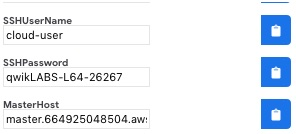

= "Got OpenShift Storage" Red Hat Summit 2019 Workshop Guide

:numbered:
== OpenShift Container Platform Environment Overview

You will be interacting with an OpenShift 3.11 cluster that is running on Amazon Web Services. During the lab you will also use OpenShift Container Storage 3.11 and and install Rook and Ceph on top of the OpenShift Cluster.

The complete environment consists of the following systems:

* 1 master node
* 1 infrastructure node
* 6 worker nodes
** 3 will run workload and the initial Container Native Storage instances
** 3 will be added to the cluster later and will be used to deploy Rook
* 1 server running Red Hat Identity Management (IdM, for LDAP authentication)

== Lab Environment

[NOTE]
Your facilitator will provide you with a sheet of paper containing the information to login into your lab environment. Go to the URL and enter the provided username and password into Qwiklabs which.

image::images/qwiklab_login.jpg[]

[NOTE]
After you `Start Lab` and then `End Lab` is completed you will see login information for your OCP master node. *Disregard Lab Guide link presented to you above SSHUserName and continue using this Lab Guide instead.*

image::images/lab_start.jpg[]

image::images/lab_end.jpg[]

.Lab Environment Overview
[options="header"]
|==============================================
| Role | Internal FQDN
| Master Node | master.internal.aws.testdrive.openshift.com
| Infrastructure Node | infra.internal.aws.testdrive.openshift.com
| Application Node #1 | node01.internal.aws.testdrive.openshift.com
| Application Node #2 | node02.internal.aws.testdrive.openshift.com
| Application Node #3 | node03.internal.aws.testdrive.openshift.com
| Application Node #4 | node04.internal.aws.testdrive.openshift.com
| Application Node #5 | node05.internal.aws.testdrive.openshift.com
| Application Node #6 | node06.internal.aws.testdrive.openshift.com
| IdM Server | idm.internal.aws.testdrive.openshift.com
|==============================================

All addresses are internal to the lab environment. The only system you
publicly access via SSH and the browser is the OpenShift Master node:

.Public Lab Access
[options="header"]
|==============================================
| Role | Public FQDN
| Master Node | Consult your *Lab home page* for the actual master URL (it will be similar to `master.1234567890.aws.testdrive.openshift.com`)
|==============================================

Note that references to product documentation will be specifically pointing to the OpenShift 3.11 versions.

=== Logging in

Most of the exercises in this lab will be facilitated using the OpenShift command line client on the master node.

Use the user name `cloud-user` and the password provided to you on the Lab home page to login using the SSH client on your local machine.

Using the same credentials you can use a web-based SSH console if needed. Consult the *Lab home page* for actual URL of the SSH Console

[source,bash,role="copypaste"]
----
ssh -l cloud-user <Your Master hostname from the Lab home page>
----

Once you are logged in you end up on the OpenShift Master Node:

----
[cloud-user@master ~]$
----

The `cloud-user` account has password-less sudo privileges and SSH login on
all systems using internal addressing from the table above.

// WK: Part 2 Installation / Verification
=== Installation and Verification

The primary method of installing OpenShift Container Platform is based on
Ansible playbooks. These playbooks ship as part of the product in the
`openshift-ansible` package.

This method has, in the past, been referred to as the `advanced installation
method` and it involves Ansible directly running the installation playbooks.
The advanced installer supports many configuration and customization options.
It also covers installation of supporting infrastructure like
OpenShift Container storage, logging and metrics components.

Your environment comes with a preinstalled cluster that has been deployed
using the installer's configuration file (`/etc/ansible/hosts`) when you
started the lab.

For more information on installing OpenShift Container Platform, please refer to the link:https://docs.openshift.com/container-platform/3.11/install/index.html[installation section] of the product documentation.

[NOTE]
====
At this point you should be logged in as `cloud-user` on the OpenShift Master
node via SSH.
====

==== Look at the Nodes

Execute the following command to see a list of the *Nodes* that OpenShift knows about:

[source,bash,role="copypaste"]
----
oc get nodes
----

.Sample Output
----
NAME                                          STATUS    ROLES     AGE	VERSION
infra.internal.aws.testdrive.openshift.com    Ready     infra     1m	v1.11.0+d4cacc0
master.internal.aws.testdrive.openshift.com   Ready     master    1m	v1.11.0+d4cacc0
node01.internal.aws.testdrive.openshift.com   Ready     compute   1m	v1.11.0+d4cacc0
node02.internal.aws.testdrive.openshift.com   Ready     compute   1m	v1.11.0+d4cacc0
node03.internal.aws.testdrive.openshift.com   Ready     compute   1m	v1.11.0+d4cacc0
----

All of the systems listed in the `[nodes]` group in the `/etc/ansible/hosts` file should be listed here: 1 Infrastructure Node, 1 Master and 3 Worker nodes.

The OpenShift *Master* is also a *Node* because it needs to participate in the software defined network (SDN). The *Infra* node will only run workloads related to supporting OpenShift infrastructure.

=== Verify the Storage cluster

In your environment Red Hat OpenShift Container Storage was installed as part of OpenShift. It will serve robust and persistent storage to both business applications as well as OpenShift infrastructure. It is based on Red Hat Gluster Storage, running in containers on OpenShift nodes and an additional API server called `heketi` that enables the API integration with OpenShift.

We will now use a command line client on the *master* to talk via this server to the container storage cluster. It's password protected, so let's export a couple of environment variables first to configure the client:

[source,bash,role="copypaste"]
----
export HEKETI_CLI_SERVER=http://$(oc get route heketi-storage -n storage -o jsonpath --template='{.spec.host}')
export HEKETI_CLI_USER=admin
export HEKETI_CLI_KEY=myS3cr3tpassw0rd
----

Then use the CLI tool `heketi-cli` to query `heketi` about all the storage clusters it knows about:

[source,bash,role="copypaste"]
----
heketi-cli cluster list
----

`heketi` will list all known clusters with internal UUIDs:

----
Clusters:
Id:998294af2211ff544338490e3e19db65 [file][block]<1>
----
<1> This is the internal UUID of the OCS cluster

[NOTE]
====
The cluster UUID will be different for you since it's automatically generated.
====

To get more detailed information about the topology of your OCS cluster (i.e.
nodes, devices and volumes heketi has discovered) run the following command
(output abbreviated):

[source,bash,role="copypaste"]
----
heketi-cli topology info
----

You will get a lengthy output that describes the GlusterFS cluster topology as it is known by `heketi`:

----
Cluster Id: 998294af2211ff544338490e3e19db65

    File:  true
    Block: true

    Volumes:

	Name: heketidbstorage <1>
	Size: 2
	Id: 0a9dd2d7c931dae933e5a6e6e701d49c
	Cluster Id: 998294af2211ff544338490e3e19db65
	Mount: 10.0.3.28:heketidbstorage
	Mount Options: backup-volfile-servers=10.0.4.14,10.0.1.83
	Durability Type: replicate
	Replica: 3
	Snapshot: Disabled

		Bricks:
			Id: 11b26cef66e828ece65d834138ffe976
			Path: /var/lib/heketi/mounts/vg_f3668aa3855cd9a84642ca29db45af1c/brick_11b26cef66e828ece65d834138ffe976/brick
			Size (GiB): 2
			Node: 7c43c7bf6d505c74c4a71cf4f7cc8b6a
			Device: f3668aa3855cd9a84642ca29db45af1c

			Id: 2a3d7a2b4392139fd26cc76d8354d474
			Path: /var/lib/heketi/mounts/vg_5a46f5d3788ed61352f565385edce8d5/brick_2a3d7a2b4392139fd26cc76d8354d474/brick
			Size (GiB): 2
			Node: 5a284ad7ed633f2d9879b3ff3833607b
			Device: 5a46f5d3788ed61352f565385edce8d5

			Id: 358a23c9511817a660a51aaaec90df08
			Path: /var/lib/heketi/mounts/vg_550bc327799e3c436a2e35e4b584c2ca/brick_358a23c9511817a660a51aaaec90df08/brick
			Size (GiB): 2
			Node: 7a814aa4abcebfad2ede80d51dc417b3
			Device: 550bc327799e3c436a2e35e4b584c2ca

    Nodes:

	Node Id: 5a284ad7ed633f2d9879b3ff3833607b
	State: online
	Cluster Id: 998294af2211ff544338490e3e19db65
	Zone: 2
	Management Hostnames: node02.internal.aws.testdrive.openshift.com
	Storage Hostnames: 10.0.3.28
	Devices:
		Id:5a46f5d3788ed61352f565385edce8d5   Name:/dev/xvdd           State:online    Size (GiB):49      Used (GiB):2       Free (GiB):47
			Bricks:
				Id:2a3d7a2b4392139fd26cc76d8354d474   Size (GiB):2       Path: /var/lib/heketi/mounts/vg_5a46f5d3788ed61352f565385edce8d5/brick_2a3d7a2b4392139fd26cc76d8354d474/brick

	Node Id: 7a814aa4abcebfad2ede80d51dc417b3
	State: online
	Cluster Id: 998294af2211ff544338490e3e19db65
	Zone: 3
	Management Hostnames: node03.internal.aws.testdrive.openshift.com
	Storage Hostnames: 10.0.4.14
	Devices:
		Id:550bc327799e3c436a2e35e4b584c2ca   Name:/dev/xvdd           State:online    Size (GiB):49      Used (GiB):2       Free (GiB):47
			Bricks:
				Id:358a23c9511817a660a51aaaec90df08   Size (GiB):2       Path: /var/lib/heketi/mounts/vg_550bc327799e3c436a2e35e4b584c2ca/brick_358a23c9511817a660a51aaaec90df08/brick

	Node Id: 7c43c7bf6d505c74c4a71cf4f7cc8b6a
	State: online
	Cluster Id: 998294af2211ff544338490e3e19db65
	Zone: 1
	Management Hostnames: node01.internal.aws.testdrive.openshift.com
	Storage Hostnames: 10.0.1.83
	Devices:
		Id:f3668aa3855cd9a84642ca29db45af1c   Name:/dev/xvdd           State:online    Size (GiB):49      Used (GiB):2       Free (GiB):47
			Bricks:
				Id:11b26cef66e828ece65d834138ffe976   Size (GiB):2       Path: /var/lib/heketi/mounts/vg_f3668aa3855cd9a84642ca29db45af1c/brick_11b26cef66e828ece65d834138ffe976/brick
----
<1> An internal GlusterFS volume that is automatically generated by the setup routine to hold the heketi database.

This output tells you that Red Hat OpenShift Container Storage currently
consists of a single cluster, which consists of 3 nodes, each with a single
block device `/dev/xvdd` of 50GiB in size. The GlusterFS layer will turn
these 3 devices/hosts into a single, flat storage pool from which OpenShift
will be able to carve out either distinct filesystem volumes or block devices
that serve as persistent storage for containers.

// WK: Part 2: OCS
== OpenShift Container Storage Concepts

In this lab we are going to provide a view 'under the hood' of OpenShift `PersistentVolumes` provided by OpenShift Container Storage (OCS). For this purpose we will examine volumes leveraged by example applications using
different volume access modes.

=== How OpenShift Container Storage runs

OpenShift Container Storage is GlusterFS running in containers, specifically in pods managed by OpenShift. We have looked at the pods making up the storage cluster already in the introduction chapter. Go ahead and switch to the storage project:

[source,bash,role="copypaste"]
----
oc project storage
----

Then, take a look at the storage *Pods*:

[source,bash,role="copypaste"]
----
oc get pods -o wide
----

.Sample Output
----
NAME                      READY     STATUS    RESTARTS   AGE       IP           NODE                                        NOMINATED NODE
glusterfs-storage-l5sxd   1/1       Running   0          3h        10.0.1.83    node01.internal.aws.testdrive.openshift.com <none> <1>
glusterfs-storage-l99db   1/1       Running   0          3h        10.0.4.14    node03.internal.aws.testdrive.openshift.com <none> <1>
glusterfs-storage-tsr4g   1/1       Running   0          3h        10.0.3.28    node02.internal.aws.testdrive.openshift.com <none> <1>
heketi-storage-1-c6tt8    1/1       Running   0          3h        10.128.2.7   infra.internal.aws.testdrive.openshift.com  <none> <2>
----
<1> OCS *Pods*, with each of the designated nodes running exactly one.
<2> heketi API frontend pod

[NOTE]
====
The exact *pod* names will be different in your environment, since they are
auto-generated. Also the heketi *pod* might run on any node.
====

The OCS *Pods* use the host's network and block devices to run the software-defined storage system. See schematic below for a visualization.

.GlusterFS pods in OCS in detail.
image::./images/cns_diagram_pod.png[]

`heketi` is a component that exposes an API to the storage system for OpenShift. This allows OpenShift to dynamically allocate storage from OCS in a programmatic fashion. See below for a visualization. Note that for simplicity, in our example heketi runs on the OpenShift application nodes, not on the infrastructure node.

.heketi pod running in OCS
image::./images/cns_diagram_heketi.png[]

==== Examine heketi

To expose heketi's API outside of OpenShift for administrators (for
monitoring and maintenance), a *Service* named _heketi-storage_ and a *Route*
has been set up:

[source,bash,role="copypaste"]
----
oc get service,route
----

.Sample Output
----
NAME                                  TYPE        CLUSTER-IP      EXTERNAL-IP   PORT(S)    AGE
service/heketi-db-storage-endpoints   ClusterIP   172.30.170.71   <none>        1/TCP      3h
service/heketi-storage                ClusterIP   172.30.54.200   <none>        8080/TCP   3h

NAME                                      HOST/PORT                                                              PATH      SERVICES         PORT      TERMINATION   WILDCARD
route.route.openshift.io/heketi-storage   heketi-storage-storage.apps.538432900127.aws.testdrive.openshift.com             heketi-storage   <all>                   None
----

You may verify external availability of this API and heketi being alive with a  rivial health check:

[source,bash,role="copypaste"]
----
curl -w "\n" http://$(oc get route heketi-storage -n storage -o jsonpath --template='{.spec.host}')/hello
----

.Sample Output
----
Hello from Heketi
----

This how the heketi API is made available to both external clients, like `heketi-cli` which we examined in the introduction. But mainly it is leveraged by OpenShift to provision storage dynamically. Let's look at this use case.

=== A Simple OCS Use Case

We are going to deploy a sample application that ships with OpenShift which creates a PVC as part of the deployment.

==== Create/Deploy the Application

Create a project with the name `my-database-app`.

[source,bash,role="copypaste"]
----
oc new-project my-database-app
----

The example application ships in the form of ready-to-use resource templates. Enter the following command to look at the template for a sample Ruby on Rails application with a PostgreSQL database:

[source,bash,role="copypaste"]
----
oc get template/rails-pgsql-persistent -n openshift
----

This template creates a Rails Application instance which mimics a very basic weblog. The articles and comments are saved in a PostgreSQL database which runs in another pod.

As part of the resource template, a PVC is created in the YAML. Run the following command to `grep` the relavant part:

[source,bash,role="copypaste"]
----
oc get template/rails-pgsql-persistent -n openshift -o yaml | grep PersistentVolumeClaim -A8
----

.Sample output
[source,yaml]
----
kind: PersistentVolumeClaim
metadata:
  name: ${DATABASE_SERVICE_NAME}
spec:
  accessModes:
  - ReadWriteOnce
  resources:
    requests:
      storage: ${VOLUME_CAPACITY}
----

This will request a *PersistentVolume* in ReadWriteOnce (`RWO`) mode. Storage provided in this mode can only be mounted by a single pod at a time. For a database that is usually what you want. The requested capacity under `spec.resources.requests.storage` is coming in via a parameter when the template is parsed. This is how storage is _requested_.

Using persistent storage is done via a `PersistentVolume` provided in
response to this `PersistentVolumeClaim`. A `PersistentVolume` is a
representation of some physical storage capacity provisioned by the backing
storage system. It will supply the PostgreSQL pod with persistent storage on
the mount point `/var/lib/pgsql/data`.

You can see this when inspecting how the pod is described as part of the
`DeploymentConfig`:

[source,bash,role="copypaste"]
----
oc get template/rails-pgsql-persistent -n openshift -o yaml | grep mountPath -B58 -A5
----

.Sample Output
[source,yaml]
----
- apiVersion: v1
  kind: DeploymentConfig
  metadata:
    annotations:
      description: Defines how to deploy the database
      template.alpha.openshift.io/wait-for-ready: "true"
    name: ${DATABASE_SERVICE_NAME}
  spec:
    replicas: 1
    selector:
      name: ${DATABASE_SERVICE_NAME}
    strategy:
      type: Recreate
    template:
      metadata:
        labels:
          name: ${DATABASE_SERVICE_NAME}
        name: ${DATABASE_SERVICE_NAME}
      spec:
        containers:
        - env:
          - name: POSTGRESQL_USER
            valueFrom:
              secretKeyRef:
                key: database-user
                name: ${NAME}
          - name: POSTGRESQL_PASSWORD
            valueFrom:
              secretKeyRef:
                key: database-password
                name: ${NAME}
          - name: POSTGRESQL_DATABASE
            value: ${DATABASE_NAME}
          - name: POSTGRESQL_MAX_CONNECTIONS
            value: ${POSTGRESQL_MAX_CONNECTIONS}
          - name: POSTGRESQL_SHARED_BUFFERS
            value: ${POSTGRESQL_SHARED_BUFFERS}
          image: ' '
          livenessProbe:
            initialDelaySeconds: 30
            tcpSocket:
              port: 5432
            timeoutSeconds: 1
          name: postgresql
          ports:
          - containerPort: 5432
          readinessProbe:
            exec:
              command:
              - /bin/sh
              - -i
              - -c
              - psql -h 127.0.0.1 -U ${POSTGRESQL_USER} -q -d ${POSTGRESQL_DATABASE}
                -c 'SELECT 1'
            initialDelaySeconds: 5
            timeoutSeconds: 1
          resources:
            limits:
              memory: ${MEMORY_POSTGRESQL_LIMIT}
          volumeMounts:
          - mountPath: /var/lib/pgsql/data <1>
            name: ${DATABASE_SERVICE_NAME}-data <2>
        volumes:
        - name: ${DATABASE_SERVICE_NAME}-data <2>
          persistentVolumeClaim:
            claimName: ${DATABASE_SERVICE_NAME} <3>
----
<1> The mount path where the persistent storage should appear inside the container
<2> The name of the volume known by the container
<3> The `PersistentVolumeClaim` from which this volume should come from

[TIP]
====
In the above snippet you see there are even more parameters in this template.
If you want to see more about the parameters or other details of this
template, you can execute the following:

 oc describe template rails-pgsql-persistent -n openshift
====

The following diagram sums up how storage get's provisioned in OpenShift and
depicts the relationship of `PersistentVolumes`, `PersistentVolumeClaims` and
`StorageClasses`:

.OpenShift Persistent Volume Framework
image::./images/cns_diagram_pvc.png[]

Let's try it out. The storage size parameter in the template is called
`VOLUME_CAPACITY`. The `new-app` command will again handle processing and
interpreting a *Template* into the appropriate OpenShift objects. We will
specify that we want _5Gi_ of storage as part of deploying a new app from the
template as follows:

[source,bash,role="copypaste"]
----
oc new-app rails-pgsql-persistent -p VOLUME_CAPACITY=5Gi
----

[NOTE]
====
The `new-app` command will automatically check for templates in the special
`openshift` namespace. In fact, `new-app` tries to do quite a lot of interesting
automagic things, including code introspection when pointed at code
repositories. It is a developer's good friend.
====

.Sample Output
----
--> Deploying template "openshift/rails-pgsql-persistent" to project my-database-app                                                                                                                       [2/1622]

     Rails + PostgreSQL
     ---------
     An example Rails application with a PostgreSQL database. For more information about using this template, including OpenShift considerations, see https://github.com/openshift/rails-ex/blob/master/README.md.

     The following service(s) have been created in your project: rails-pgsql-persistent, postgresql.

     For more information about using this template, including OpenShift considerations, see https://github.com/openshift/rails-ex/blob/master/README.md.

     * With parameters:
        * Name=rails-pgsql-persistent
        * Namespace=openshift
        * Memory Limit=512Mi
        * Memory Limit (PostgreSQL)=512Mi
        * Volume Capacity=5Gi
        * Git Repository URL=https://github.com/openshift/rails-ex.git
        * Git Reference=
        * Context Directory=
        * Application Hostname=
        * GitHub Webhook Secret=pIXDthfeGR7PHxxbASEjCM7jQ0hAJ8Ph8HTIttvl # generated
        * Secret Key=ij54gqv7w04habvy6dn2sninbbdgmlicwnsvpfwa1gdn6of2rrxgo211njqaekqlhg1503xdnvo2oc7h3dk7dd3cmk7h8mvnmijikovjw5jnl2w2pnfrukkwx0sq0uj # generated
        * Application Username=openshift
        * Application Password=secret
        * Rails Environment=production
        * Database Service Name=postgresql
        * Database Username=userAFJ # generated
        * Database Password=pn6A2x3B # generated
        * Database Name=root
        * Maximum Database Connections=100
        * Shared Buffer Amount=12MB
        * Custom RubyGems Mirror URL=

--> Creating resources ...
    secret "rails-pgsql-persistent" created
    service "rails-pgsql-persistent" created
    route.route.openshift.io "rails-pgsql-persistent" created
    imagestream.image.openshift.io "rails-pgsql-persistent" created
    buildconfig.build.openshift.io "rails-pgsql-persistent" created
    deploymentconfig.apps.openshift.io "rails-pgsql-persistent" created
    persistentvolumeclaim "postgresql" created
    service "postgresql" created
    deploymentconfig.apps.openshift.io "postgresql" created
--> Success
    Access your application via route 'rails-pgsql-persistent-my-database-app.apps.790442527540.aws.testdrive.openshift.com'
    Build scheduled, use 'oc logs -f bc/rails-pgsql-persistent' to track its progress.
    Run 'oc status' to view your app.
----

You can now follow the deployment process here by watching the pods.

[source,bash,role="copypaste"]
----
watch oc get pod
----

Hit `Ctrl-C` when both pods (postgresql-1-xxxxx and rails-pqsqsl-persistent-1-xxxxx) show Ready (`1/1`) and Running. This can take a while because first there is a build pod (`rails-pgsql-persistent-1-build`) that is building the container image to be used in the application from Ruby source code.

[NOTE]
====
It may take up to 5 minutes for the deployment to complete.
====

On the CLI, you should now see a PVC that has been issued and has a status of _Bound_. state.

[source,bash,role="copypaste"]
----
oc get pvc
----

.Sample Output
----
NAME         STATUS    VOLUME                                     CAPACITY   ACCESS MODES   STORAGECLASS        AGE
postgresql   Bound     pvc-1cbd111b-6b5c-11e9-ad48-0a0e0711ec88   5Gi        RWO            glusterfs-storage   3m
----

[TIP]
====
This PVC has been automatically fulfilled by OCS because the `glusterfs-storage` *StorageClass* was set up as the system-wide default as part of the installation. The responsible parameter in the inventory file was: `openshift_storage_glusterfs_storageclass_default=true`
====

==== Test the Application

Now go ahead and try out the application. Get the route for your application like this:

[source,bash,role="copypaste"]
----
oc get route rails-pgsql-persistent -n my-database-app -o jsonpath --template="{.spec.host}"
----

This will return a route similar to this one (careful: there is no line break at the end so your shell prompt appears right after the output).

.Sample Output
----
rails-pgsql-persistent-my-database-app.apps.538432900127.aws.testdrive.openshift.com
----

Copy your route to a browser tab and add `/article` to the end. *Your `route` will be different*

----
rails-pgsql-persistent-my-database-app.apps.538432900127.aws.testdrive.openshift.com/articles
----

The username/password to create articles and comments is by default '_openshift_'/'_secret_'.

You should be able to successfully create articles and comments. When they are saved they are actually saved in the PostgreSQL database which stores its table spaces on a GlusterFS volume provided by OCS.

=== Providing Shared Storage With OCS

Historically very few options, like basic NFS support, existed to provide a
*PersistentVolume* to more than one container at a time. The access mode used
for this in OpenShift is `ReadWriteMany`. Traditional block-based storage
solutions are not able to provide *PersistentVolumes* with this access mode.

Also, once provisioned, most storage cannot easily be resized.

With OCS these capabilities are now available to all OpenShift deployments, no
matter where they are deployed. To illustrate the benefit of this, we will
deploy a PHP file uploader application that has multiple front-end instances
sharing a common storage repository.

==== Deploy the File Uploader Application

Create a new project:

[source,bash,role="copypaste"]
----
oc new-project my-shared-storage
----

Next deploy the example PHP application called `file-uploader`:

[source,bash,role="copypaste"]
----
oc new-app openshift/php:7.1~https://github.com/christianh814/openshift-php-upload-demo --name=file-uploader
----

.Sample Output
----
--> Found image 691930e (5 weeks old) in image stream "openshift/php" under tag "7.1" for "openshift/php:7.1"

    Apache 2.4 with PHP 7.1
    -----------------------
    PHP 7.1 available as container is a base platform for building and running various PHP 7.1 applications and frameworks. PHP is an HTML-embedded scripting language. PHP attempts to make it easy for developers to write dynamically generated web pages. PHP also offers built-in database integration for several commercial and non-commercial database management systems, so writing a database-enabled webpage with PHP is fairly simple. The most common use of PHP coding is probably as a replacement for CGI scripts.

    Tags: builder, php, php71, rh-php71

    * A source build using source code from https://github.com/christianh814/openshift-php-upload-demo will be created
      * The resulting image will be pushed to image stream tag "file-uploader:latest"
      * Use 'start-build' to trigger a new build
    * This image will be deployed in deployment config "file-uploader"
    * Ports 8080/tcp, 8443/tcp will be load balanced by service "file-uploader"
      * Other containers can access this service through the hostname "file-uploader"

--> Creating resources ...
    imagestream.image.openshift.io "file-uploader" created
    buildconfig.build.openshift.io "file-uploader" created
    deploymentconfig.apps.openshift.io "file-uploader" created
    service "file-uploader" created
--> Success
    Build scheduled, use 'oc logs -f bc/file-uploader' to track its progress.
    Application is not exposed. You can expose services to the outside world by executing one or more of the commands below:
     'oc expose svc/file-uploader'
    Run 'oc status' to view your app.
----

Watch and wait for the application to be deployed:

[source,bash,role="copypaste"]
----
oc logs -f bc/file-uploader
----

.Sample Output
----
Cloning "https://github.com/christianh814/openshift-php-upload-demo" ...
	Commit:	7508da63d78b4abc8d03eac480ae930beec5d29d (Update index.html)
	Author:	Christian Hernandez <christianh814@users.noreply.github.com>
	Date:	Thu Mar 23 09:59:38 2017 -0700
---> Installing application source

[...]

Pushing image docker-registry.default.svc:5000/my-shared-storage/file-uploader:latest ...
Pushed 2/6 layers, 34% complete
Pushed 3/6 layers, 55% complete
Pushed 4/6 layers, 82% complete
Pushed 5/6 layers, 97% complete
Pushed 6/6 layers, 100% complete
Push successful
----

The command prompt returns out of the tail mode once you see _Push successful_.

[NOTE]
====
This use of the `new-app` command directly asked for application code to be
built and did not involve a template. That's why it only created a *single
Pod* deployment with a *Service* and no *Route*.
====

Let's make our application production ready by exposing it via a `Route` and scale to 3 instances for high availability:

[source,bash,role="copypaste"]
----
oc expose svc/file-uploader
oc scale --replicas=3 dc/file-uploader
oc get pods
----

You should have 3 `file-uploader` *Pods* now.

[CAUTION]
====
Never attempt to store persistent data in a *Pod* that has no persistent
volume associated with it. *Pods* and their containers are ephemeral by
definition, and any stored data will be lost as soon as the *Pod* terminates
for whatever reason.
====

The app is of course not useful like this. We can fix this by providing shared
storage to this app.

You can create a *PersistentVolumeClaim* and attach it into an application with
the `oc set volume` command. Execute the following

[source,bash,role="copypaste"]
----
oc set volume dc/file-uploader --add --name=my-shared-storage \
-t pvc --claim-mode=ReadWriteMany --claim-size=1Gi \
--claim-name=my-shared-storage --mount-path=/opt/app-root/src/uploaded
----

This command will:

* create a *PersistentVolumeClaim*
* update the *DeploymentConfig* to include a `volume` definition
* update the *DeploymentConfig* to attach a `volumemount` into the specified
  `mount-path`
* cause a new deployment of the 3 application *Pods*

For more information on what `oc set volume` is capable of, look at its help output
with `oc set volume -h`. Now, let's look at the result of adding the volume:

[source,bash,role="copypaste"]
----
oc get pvc
----

.Sample Output
----
NAME                STATUS    VOLUME                                     CAPACITY   ACCESS MODES   STORAGECLASS        AGE
my-shared-storage   Bound     pvc-0e66d9f3-6b62-11e9-ad48-0a0e0711ec88   1Gi        RWX            glusterfs-storage   24s
----

Notice the `ACCESSMODE` being set to *RWX* (short for `ReadWriteMany`,
equivalent to "shared storage"). All 3 `file-uploader`*Pods* are using the sane *RWX* volume. Without this `ACCESSMODE`, OpenShift will
not attempt to attach multiple *Pods* to the same *PersistentVolume*
reliably. If you attempt to scale up deployments that are using
`ReadWriteOnce` storage, they will actually all become co-located on the same
node.

Try it out in your file uploader web application using your browser. Upload
new files.

Now, check the *Route* that has been created:

[source,bash,role="copypaste"]
----
oc get route file-uploader -n my-shared-storage -o jsonpath --template="{.spec.host}"
----

This will return a route similar to this one (careful: there is no line break at the end so your shell prompt appears right after the output).

.Sample Output
----
file-uploader-my-shared-storage.apps.538432900127.aws.testdrive.openshift.com
----

Point your browser to the web application using the URL advertised by your route. *Your `route` will be different*

The web app simply lists all uploaded files and offers the ability
to upload new ones as well as download the existing data. Right now there is
nothing.

Select an arbitrary file from your local machine and upload it to the app.

.A simple PHP-based file upload tool
image::./images/uploader_screen_upload.png[]

Once done click *_List uploaded files_* to see the list of all currently
uploaded files.

=== Increasing volume capacity

However, what happens when the volume is full?

Let's try it. Run the following command to fill up the currently 1GiB of free
space in the persistent volume. Since it's shared, you can use any the 3
file-uploader pods:

[source,bash,role="copypaste"]
----
oc rsh $(oc get pod -l app=file-uploader --no-headers | head -n1 | awk '{print $1}') dd if=/dev/zero of=uploaded/bigfile bs=100M count=1000
----

The result after some time is:
----
dd: error writing 'uploaded/bigfile': No space left on device
dd: closing output file 'uploaded/bigfile': No space left on device
command terminated with exit code 1
----

Oops. The file system seems to have a problem. Let's check it:

[source,bash,role="copypaste"]
----
oc rsh $(oc get pod -l app=file-uploader --no-headers | head -n1 | awk '{print $1}') df -h /opt/app-root/src/uploaded
----

Clearly the file system is full:

----
Filesystem                                      Size  Used Avail Use% Mounted on
10.0.1.83:vol_9829c286608e9ce29b81df24eb08ce51 1019M 1019M     0 100% /opt/app-root/src/uploaded
----

If you were to try uploading another file via the web application it would fail with something along the lines:

----
[...]
failed to open stream: No space left on device in /opt/app-root/src/upload.php on line 26
[...]
----

Now do the following to validate the `StorageClass` allows `PersistentVolume` expansion.

[source,bash,role="copypaste"]
----
oc get sc glusterfs-storage -o yaml
----

.Sample Output
----
allowVolumeExpansion: true
apiVersion: storage.k8s.io/v1
kind: StorageClass
metadata:
  annotations:
    storageclass.kubernetes.io/is-default-class: "true"
  creationTimestamp: 2019-04-22T19:33:05Z
  name: glusterfs-storage
...
----

Also verify using this command:

[source,bash,role="copypaste"]
----
oc describe sc glusterfs-storage
----

You can see `AllowVolumeExpansion:  True` in this output as well.

.Sample Output
----
Name:                  glusterfs-storage
IsDefaultClass:        Yes
Annotations:           storageclass.kubernetes.io/is-default-class=true
Provisioner:           kubernetes.io/glusterfs
Parameters:            resturl=http://heketi-storage.storage.svc:8080,restuser=admin,secretName=heketi-storage-admin-secret,secretNamespace=storage
AllowVolumeExpansion:  True
MountOptions:          <none>
ReclaimPolicy:         Delete
VolumeBindingMode:     Immediate
Events:                <none>
----

After the `StorageClass` is verified for `PersistentVolume` expansion, the volume size can be increased by the user or owner of the app, even without administrator intervention.

Use the `oc patch` command to edit the `PersistentVolumeClaim` that we used to generate the `PersistentVolume` and update the storage request to *5Gi*:

[source,bash,role="copypaste"]
----
oc patch persistentvolumeclaim my-shared-storage --patch='{"spec": { "resources": { "requests": { "storage": "5Gi" }}}}'
----

Give it a couple of seconds and then check the filesystem again:

[source,bash,role="copypaste"]
----
oc rsh $(oc get pod -l app=file-uploader --no-headers | head -n1 | awk '{print $1}') df -h /opt/app-root/src/uploaded
----

The situation should look much better now:

----
Filesystem                                      Size  Used Avail Use% Mounted on
10.0.1.83:vol_9829c286608e9ce29b81df24eb08ce51  5.0G  1.1G  4.0G  22% /opt/app-root/src/uploaded
----

// WK Added: Prometheus section
== Explore Prometheus Metrics for Storage

OpenShift Container Platform includes a full Prometheus stack to facilitate Metrics collection. The Prometheus stack is deployed in project *openshift-monitoring*.

Prometheus is protected behind the OpenShift OAuth login mechanism. This requires users to log into OpenShift in order to gain access to Prometheus. Without this Oauth Proxy everyone who knew the Prometheus URL could run any kind of query. This is not something that is desired in an OpenShift cluster.

In order to log into Prometheus you will need to grant permissions to a user id because the `system:admin` user can not log into any web console because it uses a certificate and not a password for authentication. You will be using user `fancyuser1`.

Back in your shell grant `cluster-admin` permissions to the user `fancyuser1` - you could use just view permissions but for the sake of this lab let's make `fancyuser1` a cluster administrator

[TIP]
OpenShift creates User objects only the first time a user logs into the platform. Because this use has never logged in OpenShift will print a warning that this user doesn't exist yet.

[source,bash,role="copypaste"]
----
oc adm policy add-cluster-role-to-user cluster-admin fancyuser1

.Sample Output
[source,texinfo]
----
Warning: User 'fancyuser1' not found
cluster role "cluster-admin" added: "fancyuser1"
----

Next determine the Route for Prometheus. The name of the route is `prometheus-k8s` and it is located in the `openshift-monitoring` project.

[source,bash,role="copypaste"]
----
oc get route prometheus-k8s -n openshift-monitoring -o jsonpath --template="{.spec.host}"
----

This will return a route similar to this one (careful: there is no line break at the end so your shell prompt appears right after the output).

[source,texinfo]
----
prometheus-k8s-openshift-monitoring.apps.074442814228.aws.testdrive.openshift.com
----

Use *https* with this Route in the Web Brower to get to the Prometheus Login Screen. You may need to accept a security warning because our cluster uses self-signed certificates. The URL should look something like this:

[source,texinfo]
----
https://prometheus-k8s-openshift-monitoring.apps.074442814228.aws.testdrive.openshift.com
----

You will see the Prometheus Log in screen. Click the blue *Login with OpenShift* button (you may need to accept another certificate warning) to reach the OpenShift login screen.

User `fancyuser1` as the user id and `openshift` as the password, log into OpenShift and accept the permissions that Prometheus wants. This will bring you into the main Prometheus Screen.

While in a real environment you would set up Dashboards to visualize a lot of the queries that are possible in Prometheus in this lab let's just run a few queries manually.

=== Example Prometheus Queries

In the Entry field at the top of the screen (it says *Expression (press Shift+Enter for newlines)*) type the following query and select *Execute*:

[source,sh]
----
kube_persistentvolumeclaim_info
----

.Sample Output
[source,texinfo]
----
kube_persistentvolumeclaim_info{endpoint="https-main",instance="10.131.0.19:8443",job="kube-state-metrics",namespace="my-database-app",persistentvolumeclaim="postgresql",pod="kube-state-metrics-69d97ff57c-vgrtx",service="kube-state-metrics",storageclass="glusterfs-storage",volumename="pvc-60c72728-6e99-11e9-8dce-02cae411299c"}	             1
kube_persistentvolumeclaim_info{endpoint="https-main",instance="10.131.0.19:8443",job="kube-state-metrics",namespace="my-shared-storage",persistentvolumeclaim="my-shared-storage",pod="kube-state-metrics-69d97ff57c-vgrtx",service="kube-state-metrics",storageclass="glusterfs-storage",volumename="pvc-538ce03f-6e9e-11e9-8dce-02cae411299c"}              1
----

You can see that there are two Persistent Volume Claims in the cluster. Prometheus returns attributes as labels - in the example above you can see the *namespace*, *persistentvolumeclaim* name, *storageclass* and *volumename*.

Now delete the previous query and type and select *Execute*:

[source,bash,role="copypaste"]
----
kube_persistentvolumeclaim_resource_requests_storage_bytes
----

.Sample Output
[source,texinfo]
----
kube_persistentvolumeclaim_resource_requests_storage_bytes{endpoint="https-main",instance="10.131.0.19:8443",job="kube-state-metrics",namespace="my-database-app",persistentvolumeclaim="postgresql",pod="kube-state-metrics-69d97ff57c-vgrtx",service="kube-state-metrics"}	5368709120
kube_persistentvolumeclaim_resource_requests_storage_bytes{endpoint="https-main",instance="10.131.0.19:8443",job="kube-state-metrics",namespace="my-shared-storage",persistentvolumeclaim="my-shared-storage",pod="kube-state-metrics-69d97ff57c-vgrtx",service="kube-state-metrics"}	5368709120
----

This shows the size of the two Persistent Volume Claimss. Both have a size of 5Gi.

To see the total requested storage you can use the *sum* operator. So type the following and select *Execute*:

[source,bash,role="copypaste"]
----
sum(kube_persistentvolumeclaim_resource_requests_storage_bytes)
----

.Sample Output
[source,texinfo]
----
{}	10737418240
----

You see the sum of the two claims - which adds up to 10Gi. Another interesting query returns the current phase of persistent volume claim provisioning:

[source,bash,role="copypaste"]
----
kube_persistentvolumeclaim_status_phase
----

You will see how many Persistent Volume Claims are in phase *Bound*, *Pending* and *Lost*. If you just want to see the pending PVCs you can use the label to filter:

[source,bash,role="copypaste"]
----
kube_persistentvolumeclaim_status_phase{phase="Pending"}
----

And if you want to see how many persistent volume claims are in the *Bound* phase:

[source,bash,role="copypaste"]
----
sum(kube_persistentvolumeclaim_status_phase{phase="Bound"})
----

There are many more queries to be constructed but for the purpose of this lab this should suffice.

// WK: Part 3, Scaleup, Prepare for Rook
== Infrastructure Management, Adding Nodes to your Cluster

In this lab you will explore various aspects of managing cluster infrastructure. This includes extending the OpenShift cluster to enable us to install Rook later in this lab.

=== Extending the Cluster
Extending the cluster is easy. Simply add a new set of hosts to an Ansible group called `new_nodes` in the `openshift-ansible` installer's inventory. Then, run the `scaleup` playbook.

==== Configure the Installer

Your environment already has 3 additional VMs provisioned, but you have not used them so far. They are already configured in the inventory file, but commented out with a `#scaleup_` prefix.

To see the lines run:

[source,bash,role="copypaste"]
----
grep '#scaleup_' /etc/ansible/hosts
----

Remove the `#scaleup_` comment prefix by running the below `sed` command:

[source,bash,role="copypaste"]
----
sudo sed -i 's/#scaleup_//g' /etc/ansible/hosts
----

When finished, your inventory file should look like the following:

[source,ini]
./etc/ansible/hosts
----
[OSEv3:children]
masters
nodes
etcd
glusterfs
new_nodes

[...]

[new_nodes]
node04.internal.aws.testdrive.openshift.com openshift_node_group_name='node-config-compute' openshift_public_hostname=node04.538432900127.aws.testdrive.openshift.com openshift_node_group_name='node-config-compute'
node05.internal.aws.testdrive.openshift.com openshift_node_group_name='node-config-compute' openshift_public_hostname=node05.538432900127.aws.testdrive.openshift.com openshift_node_group_name='node-config-compute'
node06.internal.aws.testdrive.openshift.com openshift_node_group_name='node-config-compute' openshift_public_hostname=node06.538432900127.aws.testdrive.openshift.com openshift_node_group_name='node-config-compute'

[...]
----

Now that these hosts are properly defined (uncommented), you can use Ansible to
verify that they are, in fact, online:

[source,bash,role="copypaste"]
----
ansible new_nodes -m ping
----

.Sample Output
----
node04.internal.aws.testdrive.openshift.com | SUCCESS => {
    "changed": false,
    "ping": "pong"
}
node05.internal.aws.testdrive.openshift.com | SUCCESS => {
    "changed": false,
    "ping": "pong"
}
node06.internal.aws.testdrive.openshift.com | SUCCESS => {
    "changed": false,
    "ping": "pong"
}
----

These new VMs are all reachable using ansible.

==== Run the Playbook to Extend the Cluster

To extend your cluster run the following playbook:

[source,bash,role="copypaste"]
----
ansible-playbook /usr/share/ansible/openshift-ansible/playbooks/openshift-node/scaleup.yml
----

The playbook takes 5-10 minutes to complete. When done, you can verify that there are now 6 `compute` nodes:

[source,bash,role="copypaste"]
----
oc get nodes -l node-role.kubernetes.io/compute=true
----

.Sample Output
----
NAME                                          STATUS    ROLES     AGE       VERSION
node01.internal.aws.testdrive.openshift.com   Ready     compute   2h        v1.11.0+d4cacc0
node02.internal.aws.testdrive.openshift.com   Ready     compute   2h        v1.11.0+d4cacc0
node03.internal.aws.testdrive.openshift.com   Ready     compute   2h        v1.11.0+d4cacc0
node04.internal.aws.testdrive.openshift.com   Ready     compute   2m        v1.11.0+d4cacc0
node05.internal.aws.testdrive.openshift.com   Ready     compute   2m        v1.11.0+d4cacc0
node06.internal.aws.testdrive.openshift.com   Ready     compute   2m        v1.11.0+d4cacc0
----

// WK: Part 4: Rook

== Deploying and Managing OpenShift Container Storage with Rook-Ceph Operator

In this section you are learning how to deploy and manage OpenShift Container Storage (OCS). In this lab you will be using OpenShift Container Platform 3.11 (OCP) and Rook.io v0.9 to deploy Ceph as a persistent storage solution for OCP workloads.

*In this lab you will learn how to*

* Configure and deploy containerized Ceph using Rook’s cluster CustomResourceDefinitions (CRD)
* Validate deployment of Ceph Luminous containerized using OpenShift CLI
* Deploy the Rook toolbox to run common ceph and rados commands
* Create a Rook storageclass for deployment of Ceph volumes.
* Upgrade Ceph version from Luminous to Mimic using the Rook operator
* Add more storage to the Ceph cluster

=== Deploy Ceph using Rook.io

==== Download Rook deployment files and install Ceph

In this section necessary files will be downloaded using the `curl -O` command and OCP resources created using the `oc create` command and the Rook.io yaml files.

Labeling the new OCP nodes with role=storage-node will make sure that the OCP resources (OSD, MON, MGR pods) are scheduled on these nodes.

[source,bash,role="copypaste"]
----
oc label node node04.internal.aws.testdrive.openshift.com role=storage-node
oc label node node05.internal.aws.testdrive.openshift.com role=storage-node
oc label node node06.internal.aws.testdrive.openshift.com role=storage-node
oc get nodes --show-labels | grep storage-node
----

Next you will download Rook.io scc.yaml, operator.yaml and cluster.yaml to create OCP resources. After downloading each on view the file using the `cat` command before creating the resources using `oc create`.

[source,bash,role="copypaste"]
----
cd $HOME
curl -O https://raw.githubusercontent.com/red-hat-storage/ocs-training/master/ocp3rook/scc.yaml
oc create -f scc.yaml
----

Validate that rook-ceph has been added to securitycontextconstraints.security.openshift.io.

[source,bash,role="copypaste"]
----
oc get scc rook-ceph
----

Install the Rook operator next.

[source,bash,role="copypaste"]
----
curl -O https://raw.githubusercontent.com/red-hat-storage/ocs-training/master/ocp3rook/operator.yaml
oc create -f $HOME/operator.yaml
oc project rook-ceph-system
watch oc get pods -o wide
----

Wait for all rook-ceph-agent, rook-discover and rook-ceph-operator pods to be in a Running state.

.Sample Output
[source,text]
----
NAME                                  READY     STATUS    RESTARTS   AGE       IP           NODE                                          NOMINATED NODE
rook-ceph-agent-48ckp                 1/1	Running   0          5m        10.0.3.28    node02.internal.aws.testdrive.openshift.com   <none>
rook-ceph-agent-4wsd8                 1/1	Running   0          5m        10.0.1.216   node04.internal.aws.testdrive.openshift.com   <none>
rook-ceph-agent-d69pp                 1/1	Running   0          5m        10.0.4.14    node03.internal.aws.testdrive.openshift.com   <none>
rook-ceph-agent-h8ds6                 1/1	Running   0          5m        10.0.4.41    node06.internal.aws.testdrive.openshift.com   <none>
rook-ceph-agent-nmsp6                 1/1	Running   0          5m        10.0.3.144   node05.internal.aws.testdrive.openshift.com   <none>
rook-ceph-agent-wjhkv                 1/1	Running   0          5m        10.0.1.83    node01.internal.aws.testdrive.openshift.com   <none>
rook-ceph-operator-76c97f94c4-gt7ld   1/1	Running   0          6m        10.130.2.4   node06.internal.aws.testdrive.openshift.com   <none>
rook-discover-4lh4w                   1/1	Running   0          5m        10.129.0.4   node03.internal.aws.testdrive.openshift.com   <none>
rook-discover-8zb6r                   1/1	Running   0          5m        10.130.0.4   node02.internal.aws.testdrive.openshift.com   <none>
rook-discover-fdt9b                   1/1	Running   0          5m        10.131.2.4   node04.internal.aws.testdrive.openshift.com   <none>
rook-discover-fm659                   1/1	Running   0          5m        10.129.2.7   node05.internal.aws.testdrive.openshift.com   <none>
rook-discover-m7xxx                   1/1	Running   0          5m        10.131.0.4   node01.internal.aws.testdrive.openshift.com   <none>
rook-discover-x4dlh                   1/1	Running   0          5m        10.130.2.5   node06.internal.aws.testdrive.openshift.com   <none>
----

The log for the rook-ceph-operator pod should show that the operator is looking for a cluster. Look for `the server could not find the requested resource (get clusters.ceph.rook.io)` at the end of the log file. Replace `xxxxxxxxx-xxxxx` below with your rook-ceph-operator pod name.

[source,bash,role="copypaste"]
----
oc get pod -l app=rook-ceph-operator
oc logs rook-ceph-operator-xxxxxxxxx-xxxxx
----

Next step is to download and install the cluster CRD to create Ceph MON, MGR and OSD pods.

[source,bash,role="copypaste"]
----
oc new-project rook-ceph
oc adm pod-network make-projects-global rook-ceph
curl -O https://raw.githubusercontent.com/red-hat-storage/ocs-training/master/ocp3rook/cluster.yaml
----

Take a look at the cluster.yaml file. It specifies the version of Ceph, the label used for the rook resources (role=storage-node) added at the start of this section, and the nodes and storage devices used for OSDs.

----
cat cluster.yaml | more
...omitted...
  placement:
    all:
      nodeAffinity:
        requiredDuringSchedulingIgnoredDuringExecution:
          nodeSelectorTerms:
          - matchExpressions:
            - key: role
              operator: In
              values:
              - storage-node
...omitted...
    image: ceph/ceph:v12.2.11-20190201
...omitted...
  storage: # cluster level storage configuration and selection
    useAllNodes: false
    useAllDevices: false
    nodes:
    # Each node's 'name' field should match their 'kubernetes.io/hostname' label.
    - name: "node04.internal.aws.testdrive.openshift.com"
      devices:
      - name: "xvdd"
    - name: "node05.internal.aws.testdrive.openshift.com"
      devices:
      - name: "xvdd"
    - name: "node06.internal.aws.testdrive.openshift.com"
      devices:
      - name: "xvdd"
----

Now create the MONs, MGR and OSD pods.

[source,bash,role="copypaste"]
----
oc create -f cluster.yaml
----

Disregard this message “Error from server (AlreadyExists): error when creating "cluster.yaml": namespaces "rook-ceph" already exists”

Switch to the project `rook-ceph` and watch the pods come up (press `Ctrl-C` when your pod list looks like the one below).

[source,bash,role="copypaste"]
----
oc project rook-ceph
watch oc get pods

NAME                                                           READY     STATUS      RESTARTS   AGE
rook-ceph-mgr-a-5887d4d48b-gm8mg                               1/1       Running     0          49s
rook-ceph-mon-a-5c7587f7c7-d6t5d                               1/1       Running     0          2m
rook-ceph-mon-b-d85c69845-hzv78                                1/1       Running     0          1m
rook-ceph-mon-c-8567bb8597-g48m7                               1/1       Running     0          1m
rook-ceph-osd-0-d576d5989-9zr78                                1/1	     Running     0          17s
rook-ceph-osd-1-6b9f5d9b78-mgswg                               1/1	     Running     0          16s
rook-ceph-osd-2-67659f7dc8-74k6j                               1/1	     Running     0          12s
rook-ceph-osd-prepare-89f1a63764fbcfe0f15eca7b510a7763-766xt   0/2	     Completed   0          40s
rook-ceph-osd-prepare-b9e4065b399354d3fb0f17127c7d01c7-knvd5   0/2	     Completed   0          41s
rook-ceph-osd-prepare-f4a3099a5aac291ccda3759e92f81c57-zjv2c   0/2	     Completed   0          39s
----

Once all pods are in a Running state it is time to verify that Ceph is operating correctly. Download toolbox.yaml to run Ceph commands.

[source,bash,role="copypaste"]
----
curl -O https://raw.githubusercontent.com/red-hat-storage/ocs-training/master/ocp3rook/toolbox.yaml
oc create -f toolbox.yaml
----

Use the toolbox pod to run Ceph commands. Set up a shell alias first (this makes typing Ceph commands much easier going forward):
[source,sh]
----
alias tb="oc -n rook-ceph rsh $(oc -n rook-ceph get pod -l app=rook-ceph-tools -o jsonpath='{.items[0].metadata.name}')"
----

Now run a number of Ceph commands to see the status of the storage cluster:

[source,bash,role="copypaste"]
----
tb ceph status
----

.Sample Output
[source,texinfo]
----
cluster:
  id:     f5127ae7-27ff-4d07-9370-a3c9d91ac3e8
  health: HEALTH_WARN
          mons a,b,c are low on available space

services:
  mon: 3 daemons, quorum a,c,b
  mgr: a(active)
  osd: 3 osds: 3 up, 3 in

data:
  pools:   0 pools, 0 pgs
  objects: 0 objects, 0B
  usage:   3.00GiB used, 147GiB / 150GiB avail
  pgs:
----

Disregard the ‘health: HEALTH_WARN mons a,b,c are low on available space’ message when viewing results of ceph status command.
[source,bash,role="copypaste"]
----
tb ceph osd status
----

.Sample Output
[source,texinfo]
----
+----+---------------------------------------------+-------+-------+--------+---------+--------+---------+-----------+
| id |                     host                    |  used | avail | wr ops | wr data | rd ops | rd data |   state   |
+----+---------------------------------------------+-------+-------+--------+---------+--------+---------+-----------+
| 0  | node04.internal.aws.testdrive.openshift.com | 1024M | 48.9G |    0   |     0   |    0   |     0   | exists,up |
| 1  | node05.internal.aws.testdrive.openshift.com | 1024M | 48.9G |    0   |     0   |    0   |     0   | exists,up |
| 2  | node06.internal.aws.testdrive.openshift.com | 1024M | 48.9G |    0   |     0   |    0   |     0   | exists,up |
+----+---------------------------------------------+-------+-------+--------+---------+--------+---------+-----------+
----

[source,bash,role="copypaste"]
----
tb ceph osd tree
----

.Sample Output
[source,texinfo]
----
ID CLASS WEIGHT  TYPE NAME                                            STATUS REWEIGHT PRI-AFF
-1       0.14639 root default
-3       0.04880     host node04-internal-aws-testdrive-openshift-com
 0   ssd 0.04880         osd.0                                            up  1.00000 1.00000
-5       0.04880     host node05-internal-aws-testdrive-openshift-com
 1   ssd 0.04880         osd.1                                            up  1.00000 1.00000
-7       0.04880     host node06-internal-aws-testdrive-openshift-com
 2   ssd 0.04880         osd.2                                            up  1.00000 1.00000
----

[source,bash,role="copypaste"]
----
tb ceph df
----

.Sample Output
[source,texinfo]
----
GLOBAL:
    SIZE       AVAIL      RAW USED     %RAW USED
    150GiB     147GiB      3.00GiB          2.00
POOLS:
    NAME     ID     USED     %USED     MAX AVAIL     OBJECTS
----

[source,bash,role="copypaste"]
----
tb rados df
----

.Sample Output
[source,texinfo]
----
POOL_NAME USED OBJECTS CLONES COPIES MISSING_ON_PRIMARY UNFOUND DEGRADED RD_OPS RD WR_OPS WR

total_objects    0
total_used       3.0 GiB
total_avail      147 GiB
total_space      150 GiB
----

=== Create Rook storageclass for creating CephRBD block volumes

In this section you will download storageclass.yaml and then create the OCP storageclass `rook-ceph-block` that will be used by applications to dynamically claim persistent storage (PVCs). The Ceph pool `replicapool` is created when the storageclass is created.

[source,bash,role="copypaste"]
----
curl -O https://raw.githubusercontent.com/red-hat-storage/ocs-training/master/ocp3rook/storageclass.yaml
oc create -f storageclass.yaml
----

Use the toolbox pod again to run Ceph commands. Compare results for `ceph df` and `rados df` executed in prior section before the storageclass was created.

[source,bash,role="copypaste"]
----
tb ceph df
----

.Sample Output
[source,texinfo]
----
GLOBAL:
    SIZE       AVAIL      RAW USED     %RAW USED
    150GiB     147GiB      3.00GiB          2.00
POOLS:
    NAME            ID     USED     %USED     MAX AVAIL     OBJECTS
    replicapool     1        0B         0       69.7GiB           0
----

[source,bash,role="copypaste"]
----
tb rados df
----

.Sample Output
[source,texinfo]
----
POOL_NAME   USED OBJECTS CLONES COPIES MISSING_ON_PRIMARY UNFOUND DEGRADED RD_OPS  RD WR_OPS  WR
replicapool  0 B       0      0      0                  0       0        0      0 0 B      0 0 B

total_objects    0
total_used       3.0 GiB
total_avail      147 GiB
total_space      150 GiB
----

[source,bash,role="copypaste"]
----
tb ceph osd pool ls detail
----

.Sample Output
[source,texinfo]
----
pool 1 'replicapool' replicated size 2 min_size 1 crush_rule 1 object_hash rjenkins pg_num 100 pgp_num 100 last_change 19 flags hashpspool stripe_width 0 application rbd
----

You can see that the replicated size=2 and min_size=1 for objects stored in the Ceph `replicapool`.

=== Using Rook to Upgrade Ceph

In this section you will upgrade Ceph from from Luminous to Mimic using the Rook operator. The first thing we need to do is update the cluster CRD with the mimic image name and version.

[source,bash,role="copypaste"]
----
oc project rook-ceph
oc get cephcluster rook-ceph -o yaml | grep image

   image: ceph/ceph:v12.2.11-20190201
----

Modify the Ceph version in the cluster CRD. Update the Ceph version to Mimic using the following command:

[source,bash,role="copypaste"]
----
oc patch cephcluster rook-ceph -n rook-ceph --type merge --patch '{"spec": { "cephVersion": {"image": "ceph/ceph:v13.2.4-20190109"}}}'
----

Once the change to the ceph version is saved as shown above, the MONs, MGR, and OSD pods will be restarted (AGE will be a seconds or a few minutes). This could take 5 minutes (Press `Ctrl-C` to exit once all pods have been restarted and are running).

[source,sh]
----
watch oc get pods
----

.Sample Output
[source,texinfo]
----
NAME                                                           READY     STATUS      RESTARTS   AGE
rook-ceph-mgr-a-7448c76545-wnhjd                               1/1	     Running     0          1m
rook-ceph-mon-a-65d8999987-w6t6v                               1/1	     Running     0	        3m
rook-ceph-mon-b-b886cb46d-9hcbf                                1/1	     Running     0  	    3m
rook-ceph-mon-c-8654c8d995-hlhjv                               1/1	     Running     0  	    2m
rook-ceph-osd-0-86d76c7f5-6k6z8                                1/1	     Running     0          1m
rook-ceph-osd-1-76b46d75b4-n5sgq                               1/1	     Running     0          50s
rook-ceph-osd-2-966fc6d6-wq672                                 1/1	     Running     0          1m
rook-ceph-osd-prepare-89f1a63764fbcfe0f15eca7b510a7763-cxt2x   0/2	     Completed   0          1m
rook-ceph-osd-prepare-b9e4065b399354d3fb0f17127c7d01c7-vh58j   0/2	     Completed   0          1m
rook-ceph-osd-prepare-f4a3099a5aac291ccda3759e92f81c57-dfjh5   0/2	     Completed   0          1m
rook-ceph-tools-76bf8448f6-2h9d4                               1/1	     Running     0          20m
----

Check the version of Ceph to see if it is upgraded. Use the toolbox pod again.

Running the `ceph versions` command shows each of the Ceph daemons have been upgraded to Mimic. Run other Ceph commands to satisfy yourself (e.g., ceph status) the system is healthy after the upgrade. You might even want to go back to the URL used for the Rails+PostgreSQL application and save a few more articles to make sure applications using Ceph storage are still working.

[source,bash,role="copypaste"]
----
tb ceph versions
----

.Sample Output
[source,texinfo]
----
{
    "mon": {
        "ceph version 13.2.4 (b10be4d44915a4d78a8e06aa31919e74927b142e) mimic (stable)": 3
    },
    "mgr": {
        "ceph version 13.2.4 (b10be4d44915a4d78a8e06aa31919e74927b142e) mimic (stable)": 1
    },
    "osd": {
        "ceph version 13.2.4 (b10be4d44915a4d78a8e06aa31919e74927b142e) mimic (stable)": 3
    },
    "mds": {},
    "overall": {
        "ceph version 13.2.4 (b10be4d44915a4d78a8e06aa31919e74927b142e) mimic (stable)": 7
    }
}
----

=== Adding storage to the Ceph Cluster

In this section you will add more storage to the cluster by increasing the number of OSDs per OCP nodes using spare storage devices on the OCP nodes.

Before we make any changes to the cluster CRD let's see what storage is available on our OCP nodes. It is important that the available storage be a raw block device with no formatting or labeling. There should be a storage device available, all of the same size, on the same nodes that were originally used.

[source,bash,role="copypaste"]
----
oc get nodes -l role=storage-node
----

.Sample Output
[source,texinfo]
----
NAME                                          STATUS    ROLES     AGE       VERSION
node04.internal.aws.testdrive.openshift.com   Ready     compute   1h        v1.11.0+d4cacc0
node05.internal.aws.testdrive.openshift.com   Ready     compute   1h        v1.11.0+d4cacc0
node06.internal.aws.testdrive.openshift.com   Ready     compute   1h        v1.11.0+d4cacc0
----

To check the storage SSH to one of the OCP nodes that have the role=storage-node.

[source,bash,role="copypaste"]
----
ssh node04.internal.aws.testdrive.openshift.com
----

Check the storage devices on node. You can see that 50GB storage device `xvdd` is used already by Ceph. Storage device `xvde`, also 50GB, is not used yet.

[source,bash,role="copypaste"]
----
[cloud-user@node04 ~]$ lsblk
----

.Sample Output
[source,texinfo]
----
NAME                                                                    MAJ:MIN RM SIZE RO TYPE
...omitted...
xvdd                                                                    202:48   0  50G  0 disk
└─ceph--dbcea47d--6fa4--467e--ad5e--158d0032978f-osd--data--a2a40ce7--b366--48c4--a2d6--2aac94def755
                                                                        253:1    0  50G  0 lvm
xvde                                                                    202:64   0  50G  0 disk
----

Also /dev/xvde looks to be a raw block device with no labels, which is required.

[source,bash,role="copypaste"]
----
[cloud-user@node04 ~]$ sudo fdisk -l /dev/xvde
----

.Sample Output
[source,texinfo]
----
Disk /dev/xvde: 53.7 GB, 53687091200 bytes, 104857600 sectors
Units = sectors of 1 * 512 = 512 bytes
Sector size (logical/physical): 512 bytes / 512 bytes
I/O size (minimum/optimal): 512 bytes / 512 bytes
----

Exit from Node04 back to your Master

[source,bash,role="copypaste"]
----
[cloud-user@node04 ~]$ exit
----

After validating the available storage for increasing the number of OSDs we are ready to modify the cluster CRD and add an additional storage device, `xvde`.

To make this easier we have created a new cluster CRD yaml file that has the new storage device already added correctly instead of editing the cluster CRD using `oc edit`.

[source,bash,role="copypaste"]
----
curl -O https://raw.githubusercontent.com/red-hat-storage/ocs-training/master/ocp3rook/cluster_with_xvde.yaml
----

Take a look at the new cluster CRD yaml file.

[source,bash,role="copypaste"]
----
cat cluster_with_xvde.yaml | more
----

.Sample Output
[source,texinfo]
----
...omitted...
  storage:
    useAllNodes: false
    useAllDevices: false
    nodes:
    - name: "node04.internal.aws.testdrive.openshift.com"
      devices:
      - name: "xvdd"
      - name: "xvde"
    - name: "node05.internal.aws.testdrive.openshift.com"
      devices:
      - name: "xvdd"
      - name: "xvde"
    - name: "node06.internal.aws.testdrive.openshift.com"
      devices:
      - name: "xvdd"
      - name: "xvde"
----

Now add the additional storage device `xvde` to each node above.

[source,bash,role="copypaste"]
----
oc apply -f cluster_with_xvde.yaml
----

Once this new defiition is applied the 3 additonal *rook-ceph-osd* pods will start. This could take a few minutes so wait until they are in a Running state before proceeding. (again press `Ctrl-C` to exit).

[source,bash,role="copypaste"]
----
watch oc get pods -n rook-ceph
----

.Sample Output
[source,texinfo]
----
NAME                                                           READY     STATUS      RESTARTS   AGE
rook-ceph-mgr-a-7448c76545-wnhjd                               1/1	     Running     0          5m
rook-ceph-mon-a-65d8999987-w6t6v                               1/1	     Running     1          7m
rook-ceph-mon-b-b886cb46d-9hcbf                                1/1	     Running     0          6m
rook-ceph-mon-c-8654c8d995-hlhjv                               1/1	     Running     0          6m
rook-ceph-osd-0-86d76c7f5-6k6z8                                1/1	     Running     0          5m
rook-ceph-osd-1-76b46d75b4-n5sgq                               1/1	     Running     0          4m
rook-ceph-osd-2-966fc6d6-wq672                                 1/1	     Running     0          4m
rook-ceph-osd-3-546bb75744-zzczg                               1/1	     Running     0          22s
rook-ceph-osd-4-6d47648d4d-xmhvb                               1/1	     Running     0          18s
rook-ceph-osd-5-5fd8464cb8-hlnsh                               1/1	     Running     0          15s
rook-ceph-osd-prepare-89f1a63764fbcfe0f15eca7b510a7763-sps7t   0/2	     Completed   0          46s
rook-ceph-osd-prepare-b9e4065b399354d3fb0f17127c7d01c7-9bk6b   0/2	     Completed   0          48s
rook-ceph-osd-prepare-f4a3099a5aac291ccda3759e92f81c57-mgbq6   0/2	     Completed   0          44s
rook-ceph-tools-76bf8448f6-2h9d4                               1/1	     Running     0          23m
----

Let's now validate that Ceph is healthy and has the additional storage. We use the toolbox pod.

[source,bash,role="copypaste"]
----
tb ceph osd status
----

.Sample Output
[source,texinfo]
----
+----+---------------------------------------------+-------+-------+--------+---------+--------+---------+-----------+
| id |                     host                    |  used | avail | wr ops | wr data | rd ops | rd data |   state   |
+----+---------------------------------------------+-------+-------+--------+---------+--------+---------+-----------+
| 0  | node04.internal.aws.testdrive.openshift.com | 1041M | 48.9G |    0   |  3276   |    0   |     0   | exists,up |
| 1  | node05.internal.aws.testdrive.openshift.com | 1047M | 48.9G |    0   |     0   |    0   |     0   | exists,up |
| 2  | node06.internal.aws.testdrive.openshift.com | 1040M | 48.9G |    0   |     0   |    0   |     0   | exists,up |
| 3  | node04.internal.aws.testdrive.openshift.com | 1034M | 48.9G |    0   |     0   |    0   |     0   | exists,up |
| 4  | node05.internal.aws.testdrive.openshift.com | 1046M | 48.9G |    0   |     0   |    0   |     0   | exists,up |
| 5  | node06.internal.aws.testdrive.openshift.com | 1054M | 48.9G |    0   |     0   |    0   |     0   | exists,up |
+----+---------------------------------------------+-------+-------+--------+---------+--------+---------+-----------+
----

[source,bash,role="copypaste"]
----
tb ceph osd tree
----

.Sample Output
[source]
----
ID CLASS WEIGHT  TYPE NAME                                            STATUS REWEIGHT PRI-AFF
-1       0.29279 root default
-3       0.09760     host node04-internal-aws-testdrive-openshift-com
 0   ssd 0.04880         osd.0                                            up  1.00000 1.00000
 3   ssd 0.04880         osd.3                                            up  1.00000 1.00000
-5       0.09760     host node05-internal-aws-testdrive-openshift-com
 1   ssd 0.04880         osd.1                                            up  1.00000 1.00000
 4   ssd 0.04880         osd.4                                            up  1.00000 1.00000
-7       0.09760     host node06-internal-aws-testdrive-openshift-com
 2   ssd 0.04880         osd.2                                            up  1.00000 1.00000
 5   ssd 0.04880         osd.5                                            up  1.00000 1.00000
----

[source,bash,role="copypaste"]
----
tb ceph status
----

.Sample Output
[source]
----
...omitted...
   osd: 6 osds: 6 up, 6 in
...omitted
----

= The End

*Congratulations!* You reached the end of this Red Hat Summit 2019 Workshop!
