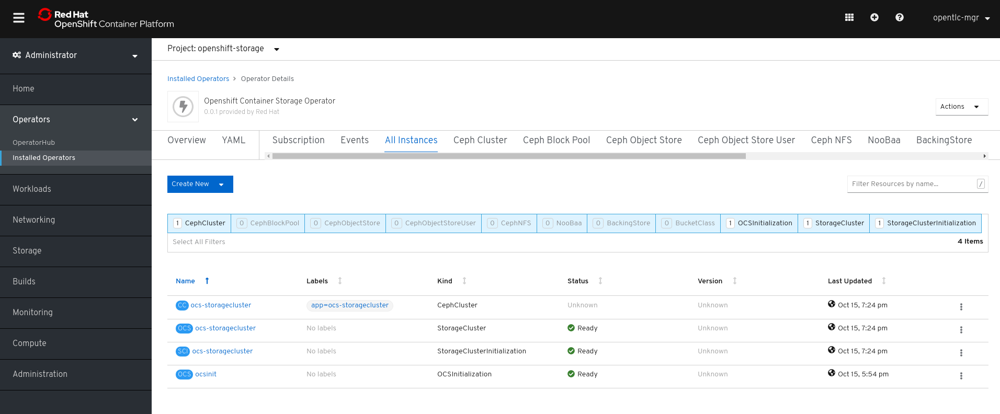
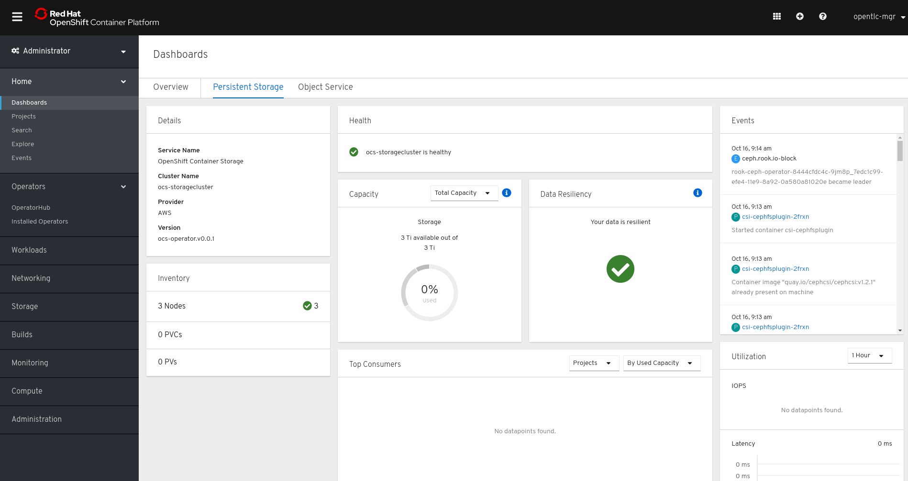

= Lab: Deploying and Managing OpenShift Container Storage with Rook-Ceph Operator

== Lab Overview

This hands-on workshop is for both system administrators and application developers interested in learning how to deploy and manage OpenShift Container Storage (OCS). In this lab you will be using OpenShift Container Platform (OCP) 4.x and the OCS operator to deploy Ceph and the Multi-Cloud-Gateway (MCG) as a persistent storage solution for OCP workloads.

=== In this lab you will learn how to

* Configure and deploy containerized Ceph and Noobaa
* Validate deployment of containerized Ceph Luminous and Noobbaa
* Deploy the Rook toolbox to run Ceph and RADOS commands
* Creating a Read-Write-Once (RWO) PVC that is based on Ceph RBDs
* Creating a Read-Write-Many (RWX) PVC that is based on CephFS
* Using the Noobaa console to generate a bucket that is replicated on multiple endpoints
// * Upgrade Ceph version from Mimic to Nautilus using the Rook operator
// * Add more storage to the Ceph cluster

.Rook and Kubernetes Architecture
image::rook_diagram_3.png[Showing the Rook architecture]

.Ceph deployed on OpenShift using Rook
image::Rook_diagram_4.png[Ceph on Openshift using Rook]

[[labexercises]]
:numbered:
:language: bash
// Activate experimental attribute for Keyboard Shortcut keys
:experimental:

== Deploy your storage backend using the OCS operator

=== Scale OCP cluster and add two new worker nodes

In this section, you will validate the OCP environment has three master and two worker nodes before adding two more worker nodes. The `NAME` of your OCP nodes will be different than shown below.

[source,role="execute"]
----
oc get nodes
----
----
NAME                                            STATUS   ROLES    AGE   VERSION
ip-10-0-134-228.eu-central-1.compute.internal   Ready    master   51m   v1.14.6+d3a139f63
ip-10-0-139-194.eu-central-1.compute.internal   Ready    worker   46m   v1.14.6+d3a139f63
ip-10-0-153-8.eu-central-1.compute.internal     Ready    master   51m   v1.14.6+d3a139f63
ip-10-0-157-160.eu-central-1.compute.internal   Ready    worker   46m   v1.14.6+d3a139f63
ip-10-0-174-74.eu-central-1.compute.internal    Ready    master   51m   v1.14.6+d3a139f63
----

Now you are going to add two more OCP worker nodes to the cluster by scaling the appropriate *machinesets*.

[source,role="execute"]
----
oc get machinesets -n openshift-machine-api
----

This will show you the existing *machinesets* used to create the two worker nodes that are in the cluster already. There is a *machineset* for each AWS availability zone (AZ) (eu-central-1a, eu-central-1b, eu-central-1c). Your *machinesets* `NAME` will be different than below.

----
NAME                                             DESIRED   CURRENT   READY   AVAILABLE   AGE
cluster-berlin-4c88-lvb7p-worker-eu-central-1a   1         1         1       1           53m
cluster-berlin-4c88-lvb7p-worker-eu-central-1b   1         1         1       1           53m
cluster-berlin-4c88-lvb7p-worker-eu-central-1c   0         0                             53m
----

To create two new worker nodes, we will scale up the number of machines on two of these machinesets:
[source]
----
oc scale -n openshift-machine-api --replicas=1 machinesets cluster-berlin-4c88-lvb7p-worker-eu-central-1c
oc scale -n openshift-machine-api --replicas=2 machinesets cluster-berlin-4c88-lvb7p-worker-eu-central-1b
----

Watch the machinesets until the `DESIRED` column matches the `AVAILABLE` column

[source,role="execute"]
----
watch oc get machinesets -n openshift-machine-api
----
----
NAME                                             DESIRED   CURRENT   READY   AVAILABLE   AGE
cluster-berlin-4c88-lvb7p-worker-eu-central-1a   1         1         1       1           59m
cluster-berlin-4c88-lvb7p-worker-eu-central-1b   2         2         2       2           59m
cluster-berlin-4c88-lvb7p-worker-eu-central-1c   1         1         1       1           59m
----

Next you can get some detailed information on your machines using this command:
[source,role="execute"]
----
oc get machines -n openshift-machine-api
----

At this point all machines should be in the `running` state. The `NAME` of your machines will be different than shown below.
You should see four workers now.

----
NAME                                                   STATE     TYPE         REGION         ZONE            AGE
cluster-berlin-4c88-lvb7p-master-0                     running   m4.xlarge    eu-central-1   eu-central-1a   62m
cluster-berlin-4c88-lvb7p-master-1                     running   m4.xlarge    eu-central-1   eu-central-1b   62m
cluster-berlin-4c88-lvb7p-master-2                     running   m4.xlarge    eu-central-1   eu-central-1c   62m
cluster-berlin-4c88-lvb7p-worker-eu-central-1a-zsfrs   running   m4.4xlarge   eu-central-1   eu-central-1a   60m
cluster-berlin-4c88-lvb7p-worker-eu-central-1b-cf27c   running   m4.4xlarge   eu-central-1   eu-central-1b   60m
cluster-berlin-4c88-lvb7p-worker-eu-central-1b-px8p8   running   m4.4xlarge   eu-central-1   eu-central-1b   4m25s
cluster-berlin-4c88-lvb7p-worker-eu-central-1c-tt4lb   running   m4.4xlarge   eu-central-1   eu-central-1c   4m48s
----

You can see that the workers are provisioned using the instance type `m4.4xlarge`. This instance type comes with 16 vCPU and 64GB RAM. This is the recomended size for OCS installations.
More information on instance type specifications can be found in the link:https://aws.amazon.com/ec2/instance-types/[AWS documentation].

Now check to see that you have two new OCP worker nodes. The `NAME` of your OCP nodes will be different than shown below.

[source,role="execute"]
----
oc get nodes -l node-role.kubernetes.io/worker
----
----
NAME                                            STATUS   ROLES    AGE     VERSION
ip-10-0-139-194.eu-central-1.compute.internal   Ready    worker   63m     v1.14.6+d3a139f63
ip-10-0-145-140.eu-central-1.compute.internal   Ready    worker   8m19s   v1.14.6+d3a139f63
ip-10-0-157-160.eu-central-1.compute.internal   Ready    worker   63m     v1.14.6+d3a139f63
ip-10-0-160-205.eu-central-1.compute.internal   Ready    worker   8m20s   v1.14.6+d3a139f63
----

=== Installing the OCS operator

In this section you will be using three of the worker OCP nodes to deploy OCS 4. For this you will be using a manifest file, which adds multiple items to your OCP cluster:

- The `openshift-storage` namespace
- The `local-storage` namespace
- Operator groups and sources for the OCS and local-storage operators
- An OCS subbscription

To apply this manifest, execute the following:

[source,role="execute"]
----
oc apply -f https://raw.githubusercontent.com/openshift/ocs-operator/release-4.2/deploy/deploy-with-olm.yaml
----

This will fetch the manifest from the `release-4.2` tag. After applying this, you should be able to list your new operators:

[source,role="execute"]
----
watch oc -n openshift-storage get csv
----
----
NAME                            DISPLAY                                VERSION   REPLACES   PHASE
local-storage-operator.v4.2.0   Local Storage                          4.2.0                Installing
ocs-operator.v0.0.1             Openshift Container Storage Operator   0.0.1                InstallReady
----

`Csv` is a shortened word for `clusterserviceversions.operators.coreos.com`. Please wait until the operator `PHASE` changes to `Suceeded` - this will mark that the installation of your operators was successful. Reaching this state can take several minutes.

You will now also see some new pods in the new `openshift-storage` namespace:

[source,role="execute"]
----
oc -n openshift-storage get pods
----
----
NAME                                     READY   STATUS    RESTARTS   AGE
local-storage-operator-bcfd5765f-7bd86   1/1     Running   0          3m33s
noobaa-operator-7c55776bf9-kbcjp         1/1     Running   0          3m16s
ocs-operator-967957d84-9lc76             1/1     Running   0          3m16s
rook-ceph-operator-8444cfdc4c-9jm8p      1/1     Running   0          3m16s
----

Now switch over to your Openshift Web console. For me, the URL is https://console-openshift-console.apps.cluster-berlin-4c88.berlin-4c88.example.opentlc.com for you this will be slightly different.

Once you are logged in, extend the `Operators` menu on the left and select `Installed Operators`. Make sure the selected project is set to `openshift-storage`.
What you see, should be similar to the following example picture:

.Installed operators - 1) Make sure you are in the right project 2) Check Operator status 3) Click on Openshift Container Storage Operator
image::OCP-installed-operators.jpg[Openshift showing the installed operators in namespace openshift-storage]

Click on `Openshift Container Storage Operator` to get to the OCS configuration screen.

.OCS configuration screen
image::OCS-config-screen.jpg[OCS configuration screen]

On the OCS configuration screen, scroll down to the box labelled `Storage cluster` and click on `Create Instance`.

.OCS create a new storage cluster
image:OCS-create-storage-cluster.jpg[OCS create storage cluster screen]

In this dialog, select three nodes that have the role `worker` and click on the button `Create` on the end of the page.

CAUTION: Make sure to select three workers in different availability zones. The OCS operator will automatically try to replicate data between those availability zones.

In the background this will start initiating a lot of new pods in the `openshift-storage` namespace, as can be seen on the CLI:

[source,role="execute"]
----
oc get po -n openshift-storage
----
.Example of a pending installation of the OCS storage cluster:
----
NAME                                            READY   STATUS                  RESTARTS   AGE
csi-cephfsplugin-2frxn                          3/3     Running                 0          57s
csi-cephfsplugin-6ghk7                          3/3     Running                 0          58s
csi-cephfsplugin-ds6zl                          3/3     Running                 0          58s
csi-cephfsplugin-j5ddw                          3/3     Running                 0          58s
csi-cephfsplugin-provisioner-57f65684f4-4sf4p   4/4     Running                 0          58s
csi-cephfsplugin-provisioner-57f65684f4-rl65b   4/4     Running                 0          58s
csi-rbdplugin-6z7qm                             3/3     Running                 0          58s
csi-rbdplugin-kxq99                             3/3     Running                 0          58s
csi-rbdplugin-provisioner-54985c744b-66fvc      5/5     Running                 0          58s
csi-rbdplugin-provisioner-54985c744b-pqwqp      5/5     Running                 0          58s
csi-rbdplugin-sdb56                             3/3     Running                 0          58s
csi-rbdplugin-t876t                             3/3     Running                 0          58s
local-storage-operator-bcfd5765f-7bd86          1/1     Running                 0          91m
noobaa-core-0                                   0/2     Pending                 0          57s
noobaa-operator-7c55776bf9-kbcjp                1/1     Running                 0          91m
ocs-operator-967957d84-9lc76                    0/1     Running                 0          91m
rook-ceph-detect-version-lh6jx                  0/1     Pending                 0          52s
rook-ceph-operator-8444cfdc4c-9jm8p             1/1     Running                 0          91m
----

You can also watch this inside of the Openshift Web Console by going back to the OCS configuration screen and selecting `All instances`.

Please wait until all Pods are marked as `Running` in the CLI or until you see all instances as `Ready` in the Web Console.

.OCS instance overview after cluster install is finished

[source,role="execute"]
----
oc -n openshift-storage get pods
----
.Output when the cluster installation is finished
----
NAME                                                              READY   STATUS      RESTARTS   AGE
csi-cephfsplugin-6975g                                            3/3     Running     0          24m
csi-cephfsplugin-ckpk4                                            3/3     Running     0          24m
csi-cephfsplugin-h6j7j                                            3/3     Running     0          24m
csi-cephfsplugin-provisioner-57f65684f4-dk5bv                     4/4     Running     0          24m
csi-cephfsplugin-provisioner-57f65684f4-nwsws                     4/4     Running     0          24m
csi-cephfsplugin-t9rvk                                            3/3     Running     0          24m
csi-rbdplugin-jhj8v                                               3/3     Running     0          24m
csi-rbdplugin-k6bs2                                               3/3     Running     0          24m
csi-rbdplugin-nqmbl                                               3/3     Running     0          24m
csi-rbdplugin-provisioner-54985c744b-4sxvv                        5/5     Running     0          24m
csi-rbdplugin-provisioner-54985c744b-xtlv9                        5/5     Running     0          24m
csi-rbdplugin-wwdkb                                               3/3     Running     0          24m
local-storage-operator-bcfd5765f-j6x7m                            1/1     Running     0          26m
noobaa-core-0                                                     2/2     Running     0          24m
noobaa-operator-7c55776bf9-89cxn                                  1/1     Running     0          26m
ocs-operator-967957d84-cmksd                                      1/1     Running     0          26m
rook-ceph-drain-canary-ip-10-0-131-104-5b49b94554-8wwjl           1/1     Running     0          21m
rook-ceph-drain-canary-ip-10-0-150-178-54f44b45fd-zxrhp           1/1     Running     0          21m
rook-ceph-drain-canary-ip-10-0-175-125-7bf8fc5d79-bg8lq           1/1     Running     0          21m
rook-ceph-mds-ocs-storagecluster-cephfilesystem-a-577b9f85xzlvj   1/1     Running     0          21m
rook-ceph-mds-ocs-storagecluster-cephfilesystem-b-55768bc8r6wsd   1/1     Running     0          20m
rook-ceph-mgr-a-6b9b8d4bf6-vhr9h                                  1/1     Running     0          22m
rook-ceph-mon-a-5846c784b-jzr6l                                   1/1     Running     0          24m
rook-ceph-mon-b-c8858957-4xcbq                                    1/1     Running     0          23m
rook-ceph-mon-c-54979d9856-llbsk                                  1/1     Running     0          22m
rook-ceph-operator-8444cfdc4c-nmr2q                               1/1     Running     0          26m
rook-ceph-osd-0-77d8884557-jwslr                                  1/1     Running     0          21m
rook-ceph-osd-1-54d6d78694-47ghl                                  1/1     Running     0          21m
rook-ceph-osd-2-796d848bd7-jb825                                  1/1     Running     0          21m
rook-ceph-osd-prepare-ocs-deviceset-0-0-8fls2-p7pd5               0/1     Completed   0          22m
rook-ceph-osd-prepare-ocs-deviceset-1-0-lbrls-ztgfs               0/1     Completed   0          22m
rook-ceph-osd-prepare-ocs-deviceset-2-0-4ktq4-zhgcr               0/1     Completed   0          22m
rook-ceph-rgw-ocs-storagecluster-cephobjectstore-a-66499c5gt8q4   1/1     Running     0          4m23s
rook-ceph-tools-56db68cc99-hh577                                  1/1     Running     0          14m
----

You can now also check the status of your storage cluster with the Dashboard that is included in your Openshift Web Console. You can reach this by clicking on `Home` on your left navigation bar, then selecting `Dashboards` and finally clicking on `Persistent Storage` on the top navigation bar of the content page.

.OCS Dashboard after successful backing storage installation

OCS ships with a Dashboard for the Object Store as well. From within the `Dashboard` menu click on the `Object Service` on the top navigation bar of the content page.

.OCS Multi-Cloud-Gateway Dashboard after successful installation
image:OCS-noobaa-dashboard-healthy.png[OCS Multi-Cloud-Gateway Dashboard after successful installation]

On the left side of the dashboard you see a blue link labelled `noobaa`, which will get you to the Noobaa Management Console. We will discuss this Management Console later in more detail.

Once this is all healthy, you will be able to use the three new StorageClasses:

- ocs-storagecluster-ceph-rbd
- ocs-storagecluster-cephfs
- openshift-storage.noobaa.io

You can see them in the Openshift Web Console by expanding the `Storage` menu in the left navigation bar and selecting `Storage Classes`. Please make sure the three storage classes are available in your cluster.

NOTE: The Noobaa pod is already using the `ocs-storagecluster-ceph-rbd` storage class for its internal database

=== Using the Ceph toolbox to check on the Ceph backing storage

Since the Ceph toolbox is not shipped with OCS, we need to deploy it manually. For this, we can leverage the upstream Rook toolbox, but we need to modify the namespace.
You can use this one-liner to deploy the toolbox directly:

[source,role="execute"]
----
curl -s https://raw.githubusercontent.com/rook/rook/release-1.1/cluster/examples/kubernetes/ceph/toolbox.yaml | sed 's/namespace: rook-ceph/namespace: openshift-storage/g'| oc apply -f -
----

Afterwards you can work inside of the toolbox like this:

[source,role="execute"]
----
TOOLS_POD=$(oc get pods -n openshift-storage -l app=rook-ceph-tools -o name)
oc rsh -n openshift-storage $TOOLS_POD
----

Once inside, try out the following commands:

----
ceph status
ceph osd status
ceph osd tree
ceph df
rados df
----

You can exit the toolbox by either pressing kbd:[Ctrl+D] or by executing `exit`

// sh-4.2# ceph status
//   cluster:
//     id:     f73cd30a-b37c-46e9-8b5f-37931f165857
//     health: HEALTH_OK
 
//   services:
//     mon: 3 daemons, quorum a,b,c (age 27m)
//     mgr: a(active, since 27m)
//     mds: ocs-storagecluster-cephfilesystem:1 {0=ocs-storagecluster-cephfilesystem-b=up:active} 1 up:standby-replay
//     osd: 3 osds: 3 up (since 26m), 3 in (since 26m)
//     rgw: 1 daemon active (ocs.storagecluster.cephobjectstore.a)
 
//   data:
//     pools:   9 pools, 72 pgs
//     objects: 321 objects, 192 MiB
//     usage:   3.4 GiB used, 3.0 TiB / 3.0 TiB avail
//     pgs:     72 active+clean
 
//   io:
//     client:   1.2 KiB/s rd, 19 KiB/s wr, 2 op/s rd, 2 op/s wr
 
// sh-4.2# ceph osd status
// +----+-----------------------------------------------+-------+-------+--------+---------+--------+---------+-----------+
// | id |                      host                     |  used | avail | wr ops | wr data | rd ops | rd data |   state   |
// +----+-----------------------------------------------+-------+-------+--------+---------+--------+---------+-----------+
// | 0  | ip-10-0-131-104.eu-central-1.compute.internal | 1161M | 1021G |    1   |  4915   |    3   |   106   | exists,up |
// | 1  | ip-10-0-175-125.eu-central-1.compute.internal | 1161M | 1021G |    0   |     0   |    0   |     0   | exists,up |
// | 2  | ip-10-0-150-178.eu-central-1.compute.internal | 1161M | 1021G |    0   |     0   |    0   |     0   | exists,up |
// +----+-----------------------------------------------+-------+-------+--------+---------+--------+---------+-----------+
// sh-4.2# ceph osd tree
// ID CLASS WEIGHT  TYPE NAME                        STATUS REWEIGHT PRI-AFF 
// -1       2.99698 root default                                             
// -7       0.99899     host ocs-deviceset-0-0-8fls2                         
//  2   ssd 0.99899         osd.2                        up  1.00000 1.00000 
// -5       0.99899     host ocs-deviceset-1-0-lbrls                         
//  1   ssd 0.99899         osd.1                        up  1.00000 1.00000 
// -3       0.99899     host ocs-deviceset-2-0-4ktq4                         
//  0   ssd 0.99899         osd.0                        up  1.00000 1.00000 
// sh-4.2# ceph df
// RAW STORAGE:
//     CLASS     SIZE        AVAIL       USED        RAW USED     %RAW USED 
//     ssd       3.0 TiB     3.0 TiB     412 MiB      3.4 GiB          0.11 
//     TOTAL     3.0 TiB     3.0 TiB     412 MiB      3.4 GiB          0.11 
 
// POOLS:
//     POOL                                                     ID     STORED      OBJECTS     USED        %USED     MAX AVAIL 
//     ocs-storagecluster-cephblockpool                          1     135 MiB          97     407 MiB      0.01       971 GiB 
//     ocs-storagecluster-cephobjectstore.rgw.control            2         0 B           8         0 B         0       971 GiB 
//     ocs-storagecluster-cephfilesystem-metadata                3     2.2 KiB          22     384 KiB         0       971 GiB 
//     ocs-storagecluster-cephfilesystem-data0                   4         0 B           0         0 B         0       971 GiB 
//     ocs-storagecluster-cephobjectstore.rgw.meta               5         0 B           0         0 B         0       971 GiB 
//     ocs-storagecluster-cephobjectstore.rgw.log                6        50 B         178      48 KiB         0       971 GiB 
//     ocs-storagecluster-cephobjectstore.rgw.buckets.index      7         0 B           0         0 B         0       971 GiB 
//     .rgw.root                                                 8     4.6 KiB          16     720 KiB         0       971 GiB 
//     ocs-storagecluster-cephobjectstore.rgw.buckets.data       9         0 B           0         0 B         0       971 GiB 
// sh-4.2# rados df
// POOL_NAME                                               USED OBJECTS CLONES COPIES MISSING_ON_PRIMARY UNFOUND DEGRADED RD_OPS      RD WR_OPS      WR USED COMPR UNDER COMPR 
// .rgw.root                                            720 KiB      16      0     48                  0       0        0     46  52 KiB     32  26 KiB        0 B         0 B 
// ocs-storagecluster-cephblockpool                     407 MiB      97      0    291                  0       0        0    143 1.3 MiB   1804 150 MiB        0 B         0 B 
// ocs-storagecluster-cephfilesystem-data0                  0 B       0      0      0                  0       0        0      0     0 B      0     0 B        0 B         0 B 
// ocs-storagecluster-cephfilesystem-metadata           384 KiB      22      0     66                  0       0        0   3116 1.5 MiB     45  13 KiB        0 B         0 B 
// ocs-storagecluster-cephobjectstore.rgw.buckets.data      0 B       0      0      0                  0       0        0      0     0 B      0     0 B        0 B         0 B 
// ocs-storagecluster-cephobjectstore.rgw.buckets.index     0 B       0      0      0                  0       0        0      0     0 B      0     0 B        0 B         0 B 
// ocs-storagecluster-cephobjectstore.rgw.control           0 B       8      0     24                  0       0        0      0     0 B      0     0 B        0 B         0 B 
// ocs-storagecluster-cephobjectstore.rgw.log            48 KiB     178      0    534                  0       0        0    544 368 KiB    389  37 KiB        0 B         0 B 
// ocs-storagecluster-cephobjectstore.rgw.meta              0 B       0      0      0                  0       0        0      0     0 B      0     0 B        0 B         0 B 

// total_objects    321
// total_used       3.4 GiB
// total_avail      3.0 TiB
// total_space      3.0 TiB

=== Change the default storage class to Ceph RBD

After installing OCS, it is best practice to change the default storage class from AWS gp2 to our new OCS-backed storage class `ocs-storagecluster-ceph-rbd`.
The easiest way to do this is using the Openshift Web Console. In there, expand the `Storage` item on the left navigation bar and select `Storage Classes`.

.OCP Storage classes after OCS installation - AWS gp2 is the default storage class
image:OCS-Storage-Classes-gp2-default.png[]

Now click on the three dots next to the gp2 storage class and select `Edit Annotations`:

image:OCS-edit-gp2-annotations.png[]

click on the stop sign on the right to delete the only one entry. Proceed by clicking on `Save`.

Now click on the three dots next to the ocs-storagecluster-ceph-rbd storage class and select `Edit Annotations`
In the new window enter `storageclass.kubernetes.io/is-default-class` as the Key and `true` as the value of the new annotation. Proceed by clicking on `Save`.

Now the `ocs-storagecluster-ceph-rbd` storage class should be marked as default, like in the below picture:

.OCP Storage classes after OCS installation - Ceph RBD is now the default storage class
image:OCS-Storage-Classes-rbd-default.png[]

WARNING: End of current refresh work

== Create new OCP deployment using Ceph RBD volume

In this section the `ocs-storagecluster-ceph-rbd` *storageclass* will be used by an OCP application + database deployment to create persistent storage. The persistent storage will be a Ceph RBD (RADOS Block Device) volume (object) in the Ceph pool `ocs-storagecluster-cephblockpool`.

Now you are ready to start the Rails + PostgreSQL deployment and monitor the deployment.

[source,role="execute"]
----
oc new-project my-database-app
oc new-app rails-pgsql-persistent -p VOLUME_CAPACITY=5Gi
----

After the deployment is started you can monitor with these commands.

[source,role="execute"]
----
oc status
oc get pvc -n my-database-app
watch oc get pods -n my-database-app
----

This step could take 5 or more minutes. Wait until there are 2 pods in `Running` STATUS and 4 pods in `Completed` STATUS as shown below.

[source,role="execute"]
----
oc get pods -n my-database-app
----
----
NAME                                READY   STATUS      RESTARTS   AGE
postgresql-1-deploy                 0/1     Completed   0          5m48s
postgresql-1-lf7qt                  1/1     Running     0          5m40s
rails-pgsql-persistent-1-build      0/1     Completed   0          5m49s
rails-pgsql-persistent-1-deploy     0/1     Completed   0          3m36s
rails-pgsql-persistent-1-hook-pre   0/1     Completed   0          3m28s
rails-pgsql-persistent-1-pjh6q      1/1     Running     0          3m14s
----

Once the deployment is complete you can now test the application and the persistent storage on Ceph. Your `HOST/PORT` will be different.

[source,role="execute"]
----
oc get route -n my-database-app
----
----
NAME                     HOST/PORT                                                                         PATH   SERVICES                 PORT    TERMINATION   WILDCARD
rails-pgsql-persistent   rails-pgsql-persistent-my-database-app.apps.cluster-a26e.sandbox449.opentlc.com          rails-pgsql-persistent
----

Copy your `HOST/PORT` to a browser window to create articles. You will need to append `/articles` to the end.

*Example link:*  http://rails-pgsql-persistent-my-database-app.apps.cluster-a26e.sandbox449.opentlc.com /articles

Enter the `username` and `password` below to create articles and comments. The articles and comments are saved in a PostgreSQL database which stores its table spaces on the Ceph RBD volume provisioned using the `rook-ceph-block` *storagclass* during the application deployment.

[source,ini]
----
username: openshift
password: secret
----

Lets now take another look at the Ceph `replicapool` created by the `rook-ceph-block` *storageclass*. Log into the *toolbox* pod again.

[source,role="execute"]
----
TOOLS_POD=$(oc get pods -n openshift-storage -l app=rook-ceph-tools -o name)
oc rsh -n openshift-storage $TOOLS_POD
----

Run the same Ceph commands as before the application deployment and compare to results in prior section. Notice the number of objects in `replicapool` now.

[source,role="execute"]
----
ceph df
rados df
rados -p replicapool ls | grep pvc
----

Make sure to `exit` the *toolbox*. Validate the OCP *PersistentVolume* (PV) name is the same name as the volume name in the Ceph `replicapool`.

[source,role="execute"]
----
oc get pvc -n my-database-app
----

== Using Rook to Upgrade Ceph

In this section you will upgrade the Ceph version from *Mimic* to *Nautilus* using the Rook operator. First verify the current version by logging into the *toolbox* pod.

[source,role="execute"]
----
TOOLS_POD=$(oc get pods -n openshift-storage -l app=rook-ceph-tools -o name)
oc rsh -n openshift-storage $TOOLS_POD
ceph version
----

Make sure to `exit` the *toolbox* before continuing.

The result should be `ceph version 13.2.5 (cbff874f9007f1869bfd3821b7e33b2a6ffd4988) mimic (stable)`.

The next thing you need to do is update the cluster CRD with a current *Nautilus* image name and version.

[source,role="execute"]
----
oc edit cephcluster rook-ceph -n rook-ceph
----

Modify the Ceph version in the cluster CRD. Using `oc edit` is the same as using editing tool `vi`.

[source,yaml]
----
spec:
  cephVersion:
    image: ceph/ceph:v13.2.5-20190410
----

To the version for Nautilus. Make sure to save your changes before exiting `:wq!`.

[source,yaml]
----
spec:
  cephVersion:
    image: ceph/ceph:v14.2.0-20190410
----

This could step take 5 minutes or more. Once the change to the Ceph version is edited as shown above, the *MONs*, *MGR*, and *OSD* pods will be restarted. You can tell that they have been restarted when their `AGE` is seconds or just a few minutes.

[source,role="execute"]
----
watch oc get pods -n rook-ceph
----
----
NAME                                         READY   STATUS      RESTARTS   AGE
...
rook-ceph-mgr-a-777d64fb8f-q7tcz             1/1     Running     0          2m55s
rook-ceph-mon-a-5c7fcdfcc4-zwzb7             1/1     Running     0          3m18s
rook-ceph-mon-b-5597dbd64d-cdvjf             1/1     Running     0          4m33s
rook-ceph-mon-c-779cbf9bc-2rfl5              1/1     Running     0          3m58s
rook-ceph-operator-5f7967846f-zqqjl          1/1     Running     0          27h
rook-ceph-osd-0-855bc669cd-45sk7             1/1     Running     0          2m8s
rook-ceph-osd-1-7cc9cd8c8c-j9ffl             1/1     Running     0          115s
rook-ceph-osd-2-5977cd8bff-9x85n             1/1     Running     0          98s
...

----

Now let's check the version of Ceph to see if it is upgraded. First you need to login to the *toolbox* pod again.

[source,role="execute"]
----
TOOLS_POD=$(oc get pods -n openshift-storage -l app=rook-ceph-tools -o name)
oc rsh -n openshift-storage $TOOLS_POD
----

Running the `ceph versions` command shows each of the Ceph daemons (*MONs*, *MGR*, and *OSD*) have been upgraded to *Nautilus*. Run other Ceph commands to satisfy yourself (e.g., ceph status) the system is healthy after the Ceph upgrade from *Mimic* to *Nautilus*. You might even want to go back to the Rails + PostgreSQL application and save a few more articles to make sure Ceph storage is still working.

[source,role="execute"]
----
ceph versions
----
----
{
    "mon": {
        "ceph version 14.2.0 (3a54b2b6d167d4a2a19e003a705696d4fe619afc) nautilus (stable)": 3
    },
    "mgr": {
        "ceph version 14.2.0 (3a54b2b6d167d4a2a19e003a705696d4fe619afc) nautilus (stable)": 1
    },
    "osd": {
        "ceph version 14.2.0 (3a54b2b6d167d4a2a19e003a705696d4fe619afc) nautilus (stable)": 3
    },
    "mds": {},
    "overall": {
        "ceph version 14.2.0 (3a54b2b6d167d4a2a19e003a705696d4fe619afc) nautilus (stable)": 7
    }
}
----

Make sure to `exit` the *toolbox* before continuing.

You can also execute this command to easily look at both the Rook and Ceph versions currently running for the *MONs*, *MGR* and *OSDs*.

[source,role="execute"]
----
oc -n rook-ceph get deployments -o jsonpath='{range .items[*]}{.metadata.name}{" \trook="}{.metadata.labels.rook-version}{" \tceph="}{.metadata.labels.ceph-version}{"\n"}{end}' | sed s/v0.9.0-557.g48380dd/v1.0.0/g
----
----
rook-ceph-mgr-a 	rook=v1.0.0 	ceph=14.2.0
rook-ceph-mon-a 	rook=v1.0.0 	ceph=14.2.0
rook-ceph-mon-b 	rook=v1.0.0 	ceph=14.2.0
rook-ceph-mon-c 	rook=v1.0.0 	ceph=14.2.0
rook-ceph-osd-0 	rook=v1.0.0 	ceph=14.2.0
rook-ceph-osd-1 	rook=v1.0.0 	ceph=14.2.0
rook-ceph-osd-2 	rook=v1.0.0 	ceph=14.2.0
rook-ceph-osd-3 	rook=v1.0.0 	ceph=14.2.0
----

== Adding storage to the Ceph Cluster

In this section you will add more storage to the cluster by increasing the number of OCP workerocs *machines* and worker nodes from 3 to 4 using one of the *machinesets* you already used. The new *machine* will also be an EC2 instance `m5d.large` and have an available 75 GB NVMe SSD. The Rook operator will `observe` when the new OCP node is added to the cluster and will then create a new *OSD* pod on this new worker node and the 75 GB SSD will be added to the Ceph cluster with no additional manual effort from the user.

To increase the number of *machines* and the OCP nodes you will again use a *machineset*. Each of the *machinesets* you used earlier created just one machine because of `replicas: 1` in the configuration file. Your `cluster-api-cluster` and `name` is different than example shown below.

[source,role="execute"]
----
cat machineset cluster-workerocs-us-east-2a.yaml | more
----
----
apiVersion: machine.openshift.io/v1beta1
kind: MachineSet
metadata:
  labels:
    machine.openshift.io/cluster-api-cluster: cluster-a26e-rx8bk
    machine.openshift.io/cluster-api-machine-role: workerocs
    machine.openshift.io/cluster-api-machine-type: workerocs
  name: cluster-a26e-rx8bk-workerocs-us-east-2a
  namespace: openshift-machine-api
spec:
  replicas: 1
...

----

Verify your `cluster-api-cluster` again by using the command below.

[source,role="execute"]
----
echo $CLUSTERID
----

You can easily create a new *machine* and OCP worker node in AWS AZ us-east-2a by just increasing the `replicas` count in one of the machinesets. Edit your machineset for us-east-2a to increase from `replicas: 1` to `replicas: 2`. Make sure to save your changes before exiting `:wq!`.

[source,role="execute"]
----
oc edit machineset $CLUSTERID-workerocs-us-east-2a -n openshift-machine-api
----

Verify you now have 4 workerocs *machines*. One of the *machines* should have just been created in us-east-2a AZ so there are two in this AZ now. The `NAME` of your *machines* will be different than shown below.

[source,role="execute"]
----
oc get machines -n openshift-machine-api
----
----
NAME                                            INSTANCE              STATE     TYPE         REGION      ZONE         AGE

cluster-a26e-rx8bk-workerocs-us-east-2a-8pnf4   i-0a497998c19a59ba3   running   m5d.large    us-east-2   us-east-2a   2d
cluster-a26e-rx8bk-workerocs-us-east-2a-l4v5l   i-0e22f1078f1228086   running   m5d.large    us-east-2   us-east-2a   33s
cluster-a26e-rx8bk-workerocs-us-east-2b-wwcmd   i-0c25eb473e452645d   running   m5d.large    us-east-2   us-east-2b   47h
cluster-a26e-rx8bk-workerocs-us-east-2c-8456v   i-0e0d311e4590fa7e3   running   m5d.large    us-east-2   us-east-2c   47h
----

Now you need to verify that this new *machine* is added to the OCP cluster.

This step could take more than 5 minutes. You can see now that one of the *machinesets* has 2 machines, this is because you increased the replica count in the prior step. The *machineset* for us-east-2a should have an integer, in this case `2`, filled out for the entire row before you proceed to the next step. The `NAME` of your machinesets will be different than shown below.

[source,role="execute"]
----
watch oc get machinesets -n openshift-machine-api
----
----
NAME                                      DESIRED   CURRENT   READY   AVAILABLE   AGE
...
cluster-a26e-rx8bk-workerocs-us-east-2a   2         2         2       2           2d
cluster-a26e-rx8bk-workerocs-us-east-2b   1         1         1       1           2d
cluster-a26e-rx8bk-workerocs-us-east-2c   1         1         1       1           2d
----

Now verify that you have a new OCP worker node. You should now have 7 worker nodes.

[source,role="execute"]
----
oc get nodes -l node-role.kubernetes.io/worker
----
----
NAME                                         STATUS   ROLES    AGE     VERSION
ip-10-0-135-6.us-east-2.compute.internal     Ready    worker   2d      v1.13.4+da48e8391
ip-10-0-135-64.us-east-2.compute.internal    Ready    worker   2d2h    v1.13.4+da48e8391
ip-10-0-137-156.us-east-2.compute.internal   Ready    worker   4m28s   v1.13.4+da48e8391
ip-10-0-146-50.us-east-2.compute.internal    Ready    worker   2d2h    v1.13.4+da48e8391
ip-10-0-156-83.us-east-2.compute.internal    Ready    worker   2d      v1.13.4+da48e8391
ip-10-0-160-232.us-east-2.compute.internal   Ready    worker   2d2h    v1.13.4+da48e8391
ip-10-0-164-65.us-east-2.compute.internal    Ready    worker   2d      v1.13.4+da48e8391
----

Until Openshift Container Platform 4.2 rolls out, we will need to restart (delete) the operator pod to see OSD pod added.
[source,bash,role="execute"]
----
oc delete pod -l app=rook-ceph-operator -n rook-ceph
----

This step could take 5 minutes or more for the forth *OSD* pod to be in a `Running` STATUS. Eventually your will see a new *OSD* pod, `rook-ceph-osd-3`, that has just been created.

[source,role="execute"]
----
watch oc get pods -n rook-ceph
----
----
NAME                                          READY   STATUS      RESTARTS   AGE

...
rook-ceph-osd-0-855bc669cd-45sk7              1/1     Running     0          55m
rook-ceph-osd-1-7cc9cd8c8c-j9ffl              1/1     Running     0          55m
rook-ceph-osd-2-5977cd8bff-9x85n              1/1     Running     0          55m
rook-ceph-osd-3-56b6c4f459-q7mhz              1/1     Running     0          114s
...

----

Now you can validate that Ceph is healthy and has the additional storage. You again login to the *toolbox* pod.

[source,role="execute"]
----
TOOLS_POD=$(oc get pods -n openshift-storage -l app=rook-ceph-tools -o name)
oc rsh -n openshift-storage $TOOLS_POD
----

And run Ceph commands to see the new OSDs.

[source,role="execute"]
----
ceph osd status
----
----
+----+--------------------------------------------+-------+-------+--------+---------+--------+---------+-----------+
| id |                    host                    |  used | avail | wr ops | wr data | rd ops | rd data |   state   |
+----+--------------------------------------------+-------+-------+--------+---------+--------+---------+-----------+
| 0  |  ip-10-0-135-6.us-east-2.compute.internal  | 1051M | 68.8G |    0   |     0   |    0   |     0   | exists,up |
| 1  | ip-10-0-156-83.us-east-2.compute.internal  | 1060M | 68.8G |    0   |     0   |    0   |     0   | exists,up |
| 2  | ip-10-0-164-65.us-east-2.compute.internal  | 1062M | 68.8G |    0   |     0   |    0   |     0   | exists,up |
| 3  | ip-10-0-137-156.us-east-2.compute.internal | 1061M | 67.9G |    0   |     0   |    0   |     0   | exists,up |
+----+--------------------------------------------+-------+-------+--------+---------+--------+---------+-----------+
----

And you can see that Ceph is healthy and happy! There are now 4 *OSDs* `up` and `in`. You might even want to go back to the the Rails + PostgreSQL application and save a few more articles to make sure applications using Ceph storage are still working.

[source,role="execute"]
----
ceph status
----
----
  cluster:
    id:     90306026-6e42-4877-9d4e-26eca2ecf6ef
    health: HEALTH_OK

  services:
    mon: 3 daemons, quorum b,a,c (age 59m)
    mgr: a(active, since 5m)
    osd: 4 osds: 4 up, 4 in

  data:
    pools:   1 pools, 100 pgs
    objects: 36 objects, 73 MiB
    usage:   4.1 GiB used, 274 GiB / 279 GiB avail
    pgs:     100 active+clean
----

Make sure to `exit` the *toolbox*.

== Using the MCG Management Console

Some unsorted notes:

Get the Noobaa Management Console access credentials:

[source,role="execute"]
----
oc get secret noobaa-admin -n openshift-storage -o json | jq '.data|map_values(@base64d)'
----
[source,json,indent=5]
----
{
  "AWS_ACCESS_KEY_ID": "5LqXmAljVYdcX6KVOOc5",
  "AWS_SECRET_ACCESS_KEY": "7x9R895zSk7xhD+CP+w1ePvc4m6018F7aD4/W156",
  "email": "admin@noobaa.io",
  "password": "wLg04tfKYnUvC66WFd0p8Q==",
  "system": "noobaa"
}
----

* By default there is no OCP backing storage for Noobaa, but an AWS bucket
* Creating Noobaa storage on OCP works, creates new Pods with default storage class
* Noobaa dashboard reports "Multi cloud gateway is not running" after adding OCP backend storage...
* Noobaa uses self-signed certificate even though OCP uses LetsEncrypt
* OCP backing storage should be > 30GB to not trigger warning
