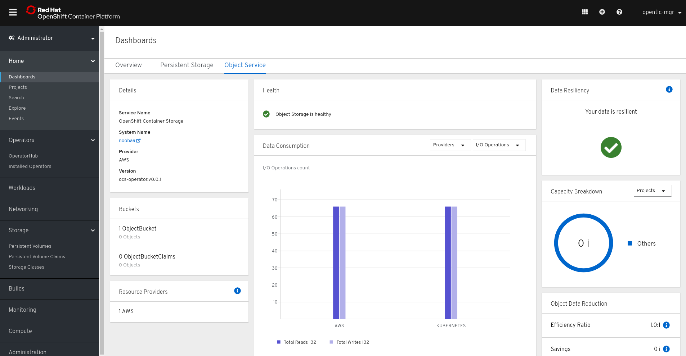

= Lab: Deploying and Managing OpenShift Container Storage
:toc: right
:toclevels: 2
:icons: font
:language: bash
:numbered:
// Activate experimental attribute for Keyboard Shortcut keys
:experimental:

== Lab Overview

This hands-on workshop is for both system administrators and application developers interested in learning how to deploy and manage OpenShift Container Storage (OCS). In this lab you will be using OpenShift Container Platform (OCP) 4.x and the OCS operator to deploy Ceph and the Multi-Cloud-Gateway (MCG) as a persistent storage solution for OCP workloads. This instruction was developed using the RHPDS `OpenShift 4.2 Workshop`.

=== In this lab you will learn how to

* Configure and deploy containerized Ceph and Noobaa
* Validate deployment of containerized Ceph Nautilus and Noobaa
* Deploy the Rook toolbox to run Ceph and RADOS commands
* Creating a Read-Write-Once (RWO) PVC that is based on Ceph RBDs
* Creating a Read-Write-Many (RWX) PVC that is based on CephFS
* Using the MCG to create a bucket
* Add more storage to the Ceph cluster
* Use must-gather to collect support information

.OpenShift Container Storage components
image::imgs/OCS-Pods-Diagram.png[Showing OCS4 pods]

[[labexercises]]

== Deploy your storage backend using the OCS operator

=== Scale OCP cluster and add 3 new nodes

In this section, you will first validate the OCP environment has 3 master and 2 worker nodes (or 3 worker nodes) before increasing the cluster size by additional 3 worker nodes for OCS resources. The `NAME` of your OCP nodes will be different than shown below.

[source,role="execute"]
----
oc get nodes
----
.Example output:
----
NAME                           STATUS   ROLES    AGE   VERSION
ip-10-0-135-157.ec2.internal   Ready    worker   38m   v1.14.6+c07e432da
ip-10-0-138-253.ec2.internal   Ready    master   42m   v1.14.6+c07e432da
ip-10-0-157-189.ec2.internal   Ready    master   42m   v1.14.6+c07e432da
ip-10-0-159-240.ec2.internal   Ready    worker   38m   v1.14.6+c07e432da
ip-10-0-164-70.ec2.internal    Ready    master   42m   v1.14.6+c07e432da
----

Now you are going to add 3 more OCP compute nodes to cluster using *machinesets*.

[source,role="execute"]
----
oc get machinesets -n openshift-machine-api
----

This will show you the existing *machinesets* used to create the 3 worker nodes in the cluster already. There is a *machineset* for each AWS AZ (us-east-1a, us-east-1b, us-east-1c). Your *machinesets* `NAME` will be different than below.

----
NAME                                       DESIRED   CURRENT   READY   AVAILABLE   AGE
cluster-ocs-79cf-lj8wq-worker-us-east-1a   1         1         1       1           43m
cluster-ocs-79cf-lj8wq-worker-us-east-1b   1         1         1       1           43m
cluster-ocs-79cf-lj8wq-worker-us-east-1c   0         0                             43m
cluster-ocs-79cf-lj8wq-worker-us-east-1d   0         0                             43m
cluster-ocs-79cf-lj8wq-worker-us-east-1e   0         0                             43m
cluster-ocs-79cf-lj8wq-worker-us-east-1f   0         0                             43m
----

To create the 3 new worker nodes with available storage you will download 3 more *machineset* definition files.

[source,role="execute"]
----
curl -O https://raw.githubusercontent.com/red-hat-storage/ocs-training/master/ocp4ocs4/cluster-workerocs-us-east-1a.yaml
curl -O https://raw.githubusercontent.com/red-hat-storage/ocs-training/master/ocp4ocs4/cluster-workerocs-us-east-1b.yaml
curl -O https://raw.githubusercontent.com/red-hat-storage/ocs-training/master/ocp4ocs4/cluster-workerocs-us-east-1c.yaml
----

The files just downloaded do not have the correct `cluster-api-cluster` label for your lab because every environment is unique.

WARNING: *Make sure you do the next step for finding your CLUSTERID*

[source,role="execute"]
----
CLUSTERID=$(oc get machineset -n openshift-machine-api -o jsonpath='{.items[0].metadata.labels.machine\.openshift\.io/cluster-api-cluster}')
echo $CLUSTERID
----

Using this correct `cluster-api-cluster` label for your lab environment modify each of the 3 *machinesets* downloaded earlier using the variable `$CLUSTERID`.

[source,role="execute"]
----
sed -i "s/cluster-28cf-t22gs/$CLUSTERID/g" cluster-workerocs-us-east-1a.yaml
sed -i "s/cluster-28cf-t22gs/$CLUSTERID/g" cluster-workerocs-us-east-1b.yaml
sed -i "s/cluster-28cf-t22gs/$CLUSTERID/g" cluster-workerocs-us-east-1c.yaml
----

Check that `cluster-api-cluster` label has been changed to `$CLUSTERID`.

[source,role="execute"]
----
grep cluster-api-cluster cluster-workerocs-us-east-1*
----

The label for `cluster-api-cluster` should now match the results of `echo $CLUSTERID` from above for all occurrences.

Now you are ready to create your 3 new OCP worker nodes using these modified *machinesets*.

[source,role="execute"]
----
oc create -f cluster-workerocs-us-east-1a.yaml
oc create -f cluster-workerocs-us-east-1b.yaml
oc create -f cluster-workerocs-us-east-1c.yaml
----

Check that you have new *machines* created.

[source,role="execute"]
----
oc get machines -n openshift-machine-api
----

They may be in `pending` for sometime so repeat command above until they are in a `running` STATE. The `NAME` of your machines will be different than shown below.

----
NAME                                                STATE     TYPE         REGION      ZONE         AGE
cluster-ocs-79cf-lj8wq-master-0                     running   m4.xlarge    us-east-1   us-east-1a   54m
cluster-ocs-79cf-lj8wq-master-1                     running   m4.xlarge    us-east-1   us-east-1b   54m
cluster-ocs-79cf-lj8wq-master-2                     running   m4.xlarge    us-east-1   us-east-1c   54m
cluster-ocs-79cf-lj8wq-worker-us-east-1a-xscbs      running   m4.4xlarge   us-east-1   us-east-1a   54m
cluster-ocs-79cf-lj8wq-worker-us-east-1b-qcmrl      running   m4.4xlarge   us-east-1   us-east-1b   54m
cluster-ocs-79cf-lj8wq-workerocs-us-east-1a-xmd9q   running   m4.4xlarge   us-east-1   us-east-1a   46s
cluster-ocs-79cf-lj8wq-workerocs-us-east-1b-jh6k4   running   m4.4xlarge   us-east-1   us-east-1b   46s
cluster-ocs-79cf-lj8wq-workerocs-us-east-1c-649kq   running   m4.4xlarge   us-east-1   us-east-1c   45s
----

You can see that the workerocs *machines* are using a different AWS EC2 instance type `m4.4xlarge`. The `m4.4xlarge` instance type follows our recommended instance sizing for OCS and provides the best performance/price ratio. Now you want to see if our new *machines* are added to the OCP cluster.

[source,role="execute"]
----
watch oc get machinesets -n openshift-machine-api
----

This step could take more than 5 minutes. The result of this command needs to look like below before you proceed. All new workerocs *machinesets* should have an integer, in this case `1`, filled out for all rows and under columns `READY` and `AVAILABLE`. The `NAME` of your *machinesets* will be different than shown below.

----
NAME                                          DESIRED   CURRENT   READY   AVAILABLE   AGE
cluster-ocs-79cf-lj8wq-worker-us-east-1a      1         1         1	      1           62m
cluster-ocs-79cf-lj8wq-worker-us-east-1b      1         1         1	      1           62m
cluster-ocs-79cf-lj8wq-worker-us-east-1c      0         0                             62m
cluster-ocs-79cf-lj8wq-worker-us-east-1d      0         0                             62m
cluster-ocs-79cf-lj8wq-worker-us-east-1e      0         0                             62m
cluster-ocs-79cf-lj8wq-worker-us-east-1f      0         0                             62m
cluster-ocs-79cf-lj8wq-workerocs-us-east-1a   1         1         1       1           8m26s
cluster-ocs-79cf-lj8wq-workerocs-us-east-1b   1         1         1       1           8m26s
cluster-ocs-79cf-lj8wq-workerocs-us-east-1c   1         1         1       1           8m25s
----

Now check to see that you have 3 new OCP worker nodes. The `NAME` of your OCP nodes will be different than shown below.

[source,role="execute"]
----
oc get nodes -l node-role.kubernetes.io/worker
----
.Example output:
----
NAME                           STATUS   ROLES    AGE     VERSION
ip-10-0-131-236.ec2.internal   Ready    worker   4m32s   v1.14.6+c07e432da
ip-10-0-135-157.ec2.internal   Ready    worker   60m     v1.14.6+c07e432da
ip-10-0-145-58.ec2.internal    Ready    worker   4m28s   v1.14.6+c07e432da
ip-10-0-159-240.ec2.internal   Ready    worker   60m     v1.14.6+c07e432da
ip-10-0-164-216.ec2.internal   Ready    worker   4m35s   v1.14.6+c07e432da
----

=== Installing the OCS operator

In this section you will be using three of the worker OCP nodes to deploy OCS 4. For this you will be using a manifest file, which adds multiple items to your OCP cluster as shown below. Using the manifest for deployment is temporary until OCS 4 is generally available (GA). At that time the OCS will be installed from OperatorHub in OCP 4 instead of using this manifest.

- The `openshift-storage` namespace
- The `local-storage` namespace
- Operator groups and sources for the OCS and local-storage operators
- An OCS subscription

To apply this manifest, execute the following:

[source,role="execute"]
----
oc apply -f https://raw.githubusercontent.com/openshift/ocs-operator/release-4.2/deploy/deploy-with-olm.yaml
----

This will fetch the manifest from the `release-4.2` tag. After applying this, you should be able to list your new operators:

[source,role="execute"]
----
watch oc -n openshift-storage get csv
----
.Example output:
----
NAME                            DISPLAY                                VERSION   REPLACES   PHASE
local-storage-operator.v4.2.0   Local Storage                          4.2.0                Installing
ocs-operator.v0.0.1             Openshift Container Storage Operator   0.0.1                InstallReady
----

The resource `csv` is a shortened word for `clusterserviceversions.operators.coreos.com`. 

.Please wait until the operator `PHASE` changes to `Succeeded`
CAUTION: This will mark that the installation of your operators was successful. Reaching this state can take several minutes.

You will now also see some new operator pods in the new `openshift-storage` namespace:

[source,role="execute"]
----
oc -n openshift-storage get pods
----
.Example output:
----
NAME                                     READY   STATUS    RESTARTS   AGE
local-storage-operator-bcfd5765f-7bd86   1/1     Running   0          3m33s
noobaa-operator-7c55776bf9-kbcjp         1/1     Running   0          3m16s
ocs-operator-967957d84-9lc76             1/1     Running   0          3m16s
rook-ceph-operator-8444cfdc4c-9jm8p      1/1     Running   0          3m16s
----

Now switch over to your Openshift Web console. You can get your URL by issuing command below to get the `console` route. Put this URL in a browser tab. You will use the same username and password you used to login and use the oc CLI to login to the OCP `console`.

[source,role="execute"]
----
oc get -n openshift-console route console
----

Once you are logged in, navigate to the `Operators` menu on the left and select `Installed Operators`. Make sure the selected project is set to `openshift-storage`.
What you see, should be similar to the following example picture:

.Installed operators:  1) Make sure you are in the right project; 2) Check Operator status; 3) Click on Openshift Container Storage Operator
image::imgs/OCP-installed-operators.jpg[Openshift showing the installed operators in namespace openshift-storage]

Click on `Openshift Container Storage Operator` to get to the OCS configuration screen.

.OCS configuration screen
image::imgs/OCS-config-screen.jpg[OCS configuration screen]

On the OCS configuration screen, scroll down to the box labelled `Storage cluster` and click on `Create Instance`.

.OCS create a new storage cluster
image::imgs/OCS-config-screen-new.png[OCS create a new storage cluster]

To select the worker nodes using the m4.4xlarge EC2 instance type that you created earlier in the lab, you can find them by searching for `role=storage-node`. It would be a good practice to add a unique label to OCP nodes (i.e., role=storage-node) that are to be used for creating the `Storage Cluster` so they are easy to find in list of OCP nodes.

[source,role="execute"]
----
oc get nodes --show-labels | grep storage-node
----

In this dialog, select these three nodes that have the role `storage-node` and `worker` and click on the button `Create` below the dialog box.

CAUTION: Make sure to select three workers in different availability zones.

In the background this will start initiating a lot of new pods in the `openshift-storage` namespace, as can be seen on the CLI:

[source,role="execute"]
----
oc -n openshift-storage get pods
----
.Example of a in process installation of the OCS storage cluster:
----
NAME                                            READY   STATUS                  RESTARTS   AGE
csi-cephfsplugin-2frxn                          3/3     Running                 0          57s
csi-cephfsplugin-6ghk7                          3/3     Running                 0          58s
csi-cephfsplugin-ds6zl                          3/3     Running                 0          58s
csi-cephfsplugin-j5ddw                          3/3     Running                 0          58s
csi-cephfsplugin-provisioner-57f65684f4-4sf4p   4/4     Running                 0          58s
csi-cephfsplugin-provisioner-57f65684f4-rl65b   4/4     Running                 0          58s
csi-rbdplugin-6z7qm                             3/3     Running                 0          58s
csi-rbdplugin-kxq99                             3/3     Running                 0          58s
csi-rbdplugin-provisioner-54985c744b-66fvc      5/5     Running                 0          58s
csi-rbdplugin-provisioner-54985c744b-pqwqp      5/5     Running                 0          58s
csi-rbdplugin-sdb56                             3/3     Running                 0          58s
csi-rbdplugin-t876t                             3/3     Running                 0          58s
local-storage-operator-bcfd5765f-7bd86          1/1     Running                 0          91m
noobaa-core-0                                   0/2     Pending                 0          57s
noobaa-operator-7c55776bf9-kbcjp                1/1     Running                 0          91m
ocs-operator-967957d84-9lc76                    0/1     Running                 0          91m
rook-ceph-detect-version-lh6jx                  0/1     Pending                 0          52s
rook-ceph-operator-8444cfdc4c-9jm8p             1/1     Running                 0          91m
----

You can also watch the deployment using the Openshift Web Console by going back to the `Openshift Container Storage Operator` screen and selecting `All instances`.

Please wait until all *Pods* are marked as `Running` in the CLI or until you see all instances shown below as `Ready` Status in the Web Console. Some instances may stay in `Unknown` Status.

#### .Fix `noobaa-core-0` stuck in `Pending` state

----
If you observe the following:

- The `noobaa-core-0` pod is stuck in `Pending`
  * If you do `oc describe po noobaa-core-0 -n openshift-storage` it is waiting to get its PVC bound
- RWO PVCs cannot be generated with the rbd-based storage class
- The Rook toolbox shows in `ceph status` that 64 pgs are stuck in "unknown" state

This can be resolved by setting all pool crush rules to the default crush rule:

- Enter the Rook toolbox
- Execute this: 
    ceph osd lspools | awk '{print $2}' | xargs -n1 -t -I {} ceph osd pool set {} crush_rule replicated_rule
- Still inside the toolbox: 
    watch ceph status
  and check that the pgs all become active+clean

Bugzilla link: https://bugzilla.redhat.com/show_bug.cgi?id=1760929
----

.OCS instance overview after cluster install is finished
image::imgs/OCS-finished-cluster-install.png[OCS instance overview after cluster install is finished]

[source,role="execute"]
----
oc -n openshift-storage get pods
----
.Output when the cluster installation is finished
----
NAME                                                              READY   STATUS      RESTARTS   AGE
csi-cephfsplugin-6975g                                            3/3     Running     0          24m
csi-cephfsplugin-ckpk4                                            3/3     Running     0          24m
csi-cephfsplugin-h6j7j                                            3/3     Running     0          24m
csi-cephfsplugin-provisioner-57f65684f4-dk5bv                     4/4     Running     0          24m
csi-cephfsplugin-provisioner-57f65684f4-nwsws                     4/4     Running     0          24m
csi-cephfsplugin-t9rvk                                            3/3     Running     0          24m
csi-rbdplugin-jhj8v                                               3/3     Running     0          24m
csi-rbdplugin-k6bs2                                               3/3     Running     0          24m
csi-rbdplugin-nqmbl                                               3/3     Running     0          24m
csi-rbdplugin-provisioner-54985c744b-4sxvv                        5/5     Running     0          24m
csi-rbdplugin-provisioner-54985c744b-xtlv9                        5/5     Running     0          24m
csi-rbdplugin-wwdkb                                               3/3     Running     0          24m
local-storage-operator-bcfd5765f-j6x7m                            1/1     Running     0          26m
noobaa-core-0                                                     2/2     Running     0          24m
noobaa-operator-7c55776bf9-89cxn                                  1/1     Running     0          26m
ocs-operator-967957d84-cmksd                                      1/1     Running     0          26m
rook-ceph-drain-canary-ip-10-0-131-104-5b49b94554-8wwjl           1/1     Running     0          21m
rook-ceph-drain-canary-ip-10-0-150-178-54f44b45fd-zxrhp           1/1     Running     0          21m
rook-ceph-drain-canary-ip-10-0-175-125-7bf8fc5d79-bg8lq           1/1     Running     0          21m
rook-ceph-mds-ocs-storagecluster-cephfilesystem-a-577b9f85xzlvj   1/1     Running     0          21m
rook-ceph-mds-ocs-storagecluster-cephfilesystem-b-55768bc8r6wsd   1/1     Running     0          20m
rook-ceph-mgr-a-6b9b8d4bf6-vhr9h                                  1/1     Running     0          22m
rook-ceph-mon-a-5846c784b-jzr6l                                   1/1     Running     0          24m
rook-ceph-mon-b-c8858957-4xcbq                                    1/1     Running     0          23m
rook-ceph-mon-c-54979d9856-llbsk                                  1/1     Running     0          22m
rook-ceph-operator-8444cfdc4c-nmr2q                               1/1     Running     0          26m
rook-ceph-osd-0-77d8884557-jwslr                                  1/1     Running     0          21m
rook-ceph-osd-1-54d6d78694-47ghl                                  1/1     Running     0          21m
rook-ceph-osd-2-796d848bd7-jb825                                  1/1     Running     0          21m
rook-ceph-osd-prepare-ocs-deviceset-0-0-8fls2-p7pd5               0/1     Completed   0          22m
rook-ceph-osd-prepare-ocs-deviceset-1-0-lbrls-ztgfs               0/1     Completed   0          22m
rook-ceph-osd-prepare-ocs-deviceset-2-0-4ktq4-zhgcr               0/1     Completed   0          22m
rook-ceph-rgw-ocs-storagecluster-cephobjectstore-a-66499c5gt8q4   1/1     Running     0          4m23s
----

You can now also check the status of your storage cluster with the OCS specific *Dashboards* that are included in your Openshift Web Console. You can reach this by clicking on `Home` on your left navigation bar, then selecting `Dashboards` and finally clicking on `Persistent Storage` on the top navigation bar of the content page.

.OCS Dashboard after successful backing storage installation
image::imgs/OCS-dashboard-healthy.png[OCS Dashboard after successful backing storage installation]

OCS ships with a *Dashboard* for the Object Store service as well. From within the *Dashboard* menu click on the `Object Service` on the top navigation bar of the content page.

.OCS Multi-Cloud-Gateway Dashboard after successful installation

On the left side of this *Dashboard* you see a blue link labelled `noobaa`, which will get you to the Noobaa Management Console. We will discuss this Management Console later in more detail.

Once this is all healthy, you will be able to use the three new `StorageClasses` created during the OCS 4 Install:

- ocs-storagecluster-ceph-rbd
- ocs-storagecluster-cephfs
- openshift-storage.noobaa.io

You can see these three `StorageClasses` from the Openshift Web Console by expanding the `Storage` menu in the left navigation bar and selecting `Storage Classes`. You can also run the command below:

[source,role="execute"]
----
oc get sc -n openshift-storage
----

Please make sure the three storage classes are available in your cluster before proceeding.

NOTE: The Noobaa pod used the `ocs-storagecluster-ceph-rbd` storage class for creating a PVC for mounting to it's `db` container.

=== Using the Rook-Ceph toolbox to check on the Ceph backing storage

Since the Rook-Ceph *toolbox* is not shipped with OCS, we need to deploy it manually. For this, we can leverage the upstream `toolbox.yaml` file, but we need to modify the namespace as shown below.

[source,role="execute"]
----
curl -s https://raw.githubusercontent.com/rook/rook/release-1.1/cluster/examples/kubernetes/ceph/toolbox.yaml | sed 's/namespace: rook-ceph/namespace: openshift-storage/g'| oc apply -f -
----

After the `rook-ceph-tools` *Pod* is `Running` you can access the toolbox like this:

[source,role="execute"]
----
TOOLS_POD=$(oc get pods -n openshift-storage -l app=rook-ceph-tools -o name)
oc rsh -n openshift-storage $TOOLS_POD
----

Once inside the toolbox, try out the following Ceph commands:

[source,role="execute"]
----
ceph status
ceph osd status
ceph osd tree
ceph df
rados df
ceph versions
----
.Example output:
----
sh-4.2# ceph status
  cluster:
    id:     ce04255f-ca4c-499f-8819-58fb38095105
    health: HEALTH_OK

  services:
    mon: 3 daemons, quorum a,b,c (age 43m)
    mgr: a(active, since 42m)
    mds: ocs-storagecluster-cephfilesystem:1 {0=ocs-storagecluster-cephfilesystem-a=up:active} 1 up:standby-replay
    osd: 3 osds: 3 up (since 41m), 3 in (since 41m)
    rgw: 1 daemon active (ocs.storagecluster.cephobjectstore.a)

  task status:
    scrub status:
        mds.0: idle

  data:
    pools:   10 pools, 80 pgs
    objects: 326 objects, 80 MiB
    usage:   3.1 GiB used, 3.0 TiB / 3.0 TiB avail
    pgs:     80 active+clean

  io:
    client:   938 B/s rd, 6.8 KiB/s wr, 1 op/s rd, 0 op/s wr
----

You can exit the toolbox by either pressing kbd:[Ctrl+D] or by executing `exit`.

=== Change the default storage class to Ceph RBD

After installing OCS, it is best practice to change the default *storage class* from AWS gp2 to our new OCS-backed storage class `ocs-storagecluster-ceph-rbd`.
The easiest way to do this is using the *Openshift Web Console*. In the Console expand the `Storage` item on the left navigation bar and select `Storage Classes`.

.OCP storage classes after OCS installation - AWS gp2 is the default storage class
image::imgs/OCS-Storage-Classes-gp2-default.png[]

Now click on the three dots next to the gp2 *storage class* and select `Edit Annotations`:

image::imgs/OCS-edit-gp2-annotations.png[]

Click on the stop sign on the right to delete the only entry, `storageclass.kubernetes.io/is-default-class`. Proceed by clicking on `Save`.

Now click on the three dots next to the ocs-storagecluster-ceph-rbd *storage class* and select `Edit Annotations`
In the new window enter `storageclass.kubernetes.io/is-default-class` as the Key and `true` as the value of the new annotation. Proceed by clicking on `Save`.

Now the `ocs-storagecluster-ceph-rbd` *storage class* should be marked as default, as shown below:

.OCP storage classes after changing the default storage class
image::imgs/OCS-Storage-Classes-rbd-default.png[]

== Create a new OCP deployment using Ceph RBD volume

In this section the `ocs-storagecluster-ceph-rbd` *storage class* will be used by an OCP application + database *deployment* to create RWO (ReadWriteOnce) persistent storage. The persistent storage will be a Ceph RBD (RADOS Block Device) volume (object) in the Ceph pool `ocs-storagecluster-cephblockpool`.

Make sure that you completed all previous sections so that you are ready to start the Rails + PostgreSQL deployment.

[source,role="execute"]
----
oc new-project my-database-app
oc new-app rails-pgsql-persistent -p VOLUME_CAPACITY=5Gi
----

After the deployment is started you can monitor with these commands.

[source,role="execute"]
----
oc status
oc get pvc -n my-database-app
watch oc get pods -n my-database-app
----

This step could take 5 or more minutes. Wait until there are 2 pods in `Running` STATUS and 4 pods in `Completed` STATUS as shown below.

[source,role="execute"]
----
watch oc get pods -n my-database-app
----
.Example output:
----
NAME                                READY   STATUS      RESTARTS   AGE
postgresql-1-deploy                 0/1     Completed   0          5m48s
postgresql-1-lf7qt                  1/1     Running     0          5m40s
rails-pgsql-persistent-1-build      0/1     Completed   0          5m49s
rails-pgsql-persistent-1-deploy     0/1     Completed   0          3m36s
rails-pgsql-persistent-1-hook-pre   0/1     Completed   0          3m28s
rails-pgsql-persistent-1-pjh6q      1/1     Running     0          3m14s
----

Once the deployment is complete you can now test the application and the persistent storage on Ceph. Your `HOST/PORT` will be different.

[source,role="execute"]
----
oc get route -n my-database-app
----
.Example output:
----
NAME                     HOST/PORT                                                                         PATH   SERVICES                 PORT    TERMINATION   WILDCARD
rails-pgsql-persistent   rails-pgsql-persistent-my-database-app.apps.cluster-a26e.sandbox449.opentlc.com          rails-pgsql-persistent
----

Copy your `rails-pgsql-persistent` route (different than above) to a browser window to create articles. You will need to append `/articles` to the end.

*Example*  http://<your_route>/articles

Enter the `username` and `password` below to create articles and comments. The articles and comments are saved in a PostgreSQL database which stores its table spaces on the Ceph RBD volume provisioned using the `ocs-storagecluster-ceph-rbd` *storagclass* during the application deployment.

[source,ini]
----
username: openshift
password: secret
----

Lets now take another look at the Ceph `ocs-storagecluster-cephblockpool` created by the `ocs-storagecluster-ceph-rbd` *storageclass*. Log into the *toolbox* pod again.

[source,role="execute"]
----
TOOLS_POD=$(oc get pods -n openshift-storage -l app=rook-ceph-tools -o name)
oc rsh -n openshift-storage $TOOLS_POD
----

Run the same Ceph commands as before the application deployment and compare to results in prior section. Notice the number of objects in `ocs-storagecluster-cephblockpool` now.

[source,role="execute"]
----
ceph df
rados df
rbd -p ocs-storagecluster-cephblockpool ls | grep vol
----

You can exit the toolbox by either pressing kbd:[Ctrl+D] or by executing `exit`.

== Create a new OCP deployment using CephFS

In this section the `ocs-storagecluster-cephfs` will be used to create a RWX (ReadWriteMany) PVC that can be used by multiple pods at the same time. As an example we will be running a highly-available container image registry. The persistent storage will be based on a CephFS volume in the Ceph pool `ocs-storagecluster-cephfilesystem-data0`.

Deploy the registry like this:

[source,role="execute"]
----
curl -s https://raw.githubusercontent.com/rook/rook/master/cluster/examples/kubernetes/ceph/csi/cephfs/kube-registry.yaml | sed 's/storageClassName: csi-cephfs/storageClassName: ocs-storagecluster-cephfs/g'| oc apply -f -
----

This will create a PVC in the `kube-system` namespace:

[source,role="execute"]
----
oc get pvc -n kube-system
----
.Example output:
----
NAME         STATUS   VOLUME                                     CAPACITY   ACCESS MODES   STORAGECLASS                AGE
cephfs-pvc   Bound    pvc-a7015af1-f0dd-11e9-8812-06aa2fd1035a   1Gi        RWX            ocs-storagecluster-cephfs   55s
----

As well as a deployment for our registry:

[source,role="execute"]
----
oc get -n kube-system deployment
----
.Example output:
----
NAME            READY   UP-TO-DATE   AVAILABLE   AGE
kube-registry   3/3     3            3           100s
----

.The `kube-registry` deployment consists of more than one replica
NOTE: Since our deployment consists of three containers, we need a RWX PVC, so that all replicas can access the persistent volume in parallel.

There are also 3 *Pods* sharing the same Ceph FS PVC for read/write operations.

[source,role="execute"]
----
oc get -n kube-system pods
----
.Example output:
----
$ oc get pods -n kube-system
NAME                             READY   STATUS    RESTARTS   AGE
kube-registry-5b9c9854c5-45w9m   1/1     Running   0          9m47s
kube-registry-5b9c9854c5-cjtqc   1/1     Running   0          9m47s
kube-registry-5b9c9854c5-jfpkl   1/1     Running   0          9m47s
----

Let's make our deployment accessible. First we create a service with an internal Cluster IP:

[source,role="execute"]
----
oc expose -n kube-system deployment kube-registry
----

Then we create a route with a edge termination so that it serves our registry with tls:

[source,role="execute"]
----
oc create route edge -n kube-system --service=kube-registry
----

There is now a route to get the URL for our new registry:

[source,role="execute"]
----
oc get route -n kube-system
----
.Example output:
----
NAME            HOST/PORT                                                                            PATH   SERVICES        PORT    TERMINATION   WILDCARD
kube-registry   kube-registry-kube-system.apps.cluster-berlin-fc41.berlin-fc41.example.opentlc.com          kube-registry   <all>   edge          None
----

To continue you will need to install Podman. Installation steps for various operating systems can be found here: https://github.com/containers/libpod/blob/master/install.md

For RHEL-based systems, it is as easy as:

[source,role="execute"]
----
sudo yum -y install podman
----

Now that podman is installed we can now download the alpine container image as an example and upload it to our new registry:

[source,role="execute"]
----
sudo podman pull docker.io/library/alpine
----

[source,role="edit"]
----
sudo podman push docker.io/library/alpine --tls-verify=false <KUBE_REGISTRY_ROUTE>/alpine
----
.Example command:
----
sudo podman push docker.io/library/alpine --tls-verify=false kube-registry-kube-system.apps.cluster-ocs-3ed9.ocs-3ed9.example.opentlc.com/alpine
----

CAUTION: Make sure to replace the URL in the push command with the URL of your route

Next we use the `toolbox` *Pod* to check on our underlying CephFS volume:

[source,role="execute"]
----
TOOLS_POD=$(oc get pods -n openshift-storage -l app=rook-ceph-tools -o name)
oc rsh -n openshift-storage $TOOLS_POD
----

These steps should be done in the `toolbox` pod.

----
# Create the directory
mkdir /tmp/registry

# Detect the mon endpoints and the user secret for the connection
mon_endpoints=$(grep mon_host /etc/ceph/ceph.conf | awk '{print $3}')
my_secret=$(grep key /etc/ceph/keyring | awk '{print $3}')

# Mount the file system
mount -t ceph -o mds_namespace=ocs-storagecluster-cephfilesystem,name=admin,secret=$my_secret $mon_endpoints:/ /tmp/registry

# See your mounted file system
df -h /tmp/registry

# Find our uploaded container image
ls /tmp/registry/volumes/csi/csi-vol-*/docker/registry/v2/repositories/alpine/
----

Once you finished these steps, you can see that we successfully mounted the *RWX PVC* inside of our toolbox *Pod*, while it is also still mounted on the registry *Pods*. The `ls` shows the content of the alpine folder, which should now show our uploaded alpine container image.
Changes to this filesystem is immediately affecting the registry *Pods* and this procedure is great to debug issues that your *Pods* have with persistent files.

== Using the Multi-Cloud-Gateway

This section discusses the usage of the Multi-Cloud-Gateway (MCG). It is expected that the installation of MCG has been finished successfully and the local `oc` client is configured correctly to connect to the Openshift cluster.
Currently the best way to configure the MCG is to use the CLI.
To install the CLI, follow these steps on your workstation:

.Mac steps
[source]
----
brew install noobaa/noobaa/noobaa
----
.Mac steps without Homebrew
[source]
----
curl -s https://api.github.com/repos/noobaa/noobaa-operator/releases/latest | grep "mac" | cut -d : -f 2,3 | tr -d \" | wget -qi - ; mv noobaa-linux-* noobaa ; chmod +x noobaa; sudo mv noobaa /usr/bin/
----

.Linux steps
[source]
----
curl -s https://api.github.com/repos/noobaa/noobaa-operator/releases/latest | grep "linux" | cut -d : -f 2,3 | tr -d \" | wget -qi - ; mv noobaa-linux-* noobaa ; chmod +x noobaa; sudo mv noobaa /usr/bin/
----

NOTE: While the Noobaa Web Management Console is accessible, it should not be used to create any resources, since they are currently not syncronised back to the Openshift cluster.

=== Checking on the MCG status

The MCG status can be checked with the Noobaa CLI:

[source,role="execute"]
----
noobaa status
----
.Example output:
----
INFO[0000] CLI version: 2.0.3                           
INFO[0000] noobaa-image: noobaa/noobaa-core:5           
INFO[0000] operator-image: noobaa/noobaa-operator:2.0.3 
INFO[0000] Namespace: openshift-storage                 
INFO[0000]                                              
INFO[0000] CRD Status:                                  
INFO[0001] ✅ Exists: CustomResourceDefinition "noobaas.noobaa.io" 
INFO[0001] ✅ Exists: CustomResourceDefinition "backingstores.noobaa.io" 
INFO[0001] ✅ Exists: CustomResourceDefinition "bucketclasses.noobaa.io" 
INFO[0001] ✅ Exists: CustomResourceDefinition "objectbucketclaims.objectbucket.io" 
INFO[0001] ✅ Exists: CustomResourceDefinition "objectbuckets.objectbucket.io" 
INFO[0001]                                              
INFO[0001] Operator Status:                             
INFO[0001] ✅ Exists: Namespace "openshift-storage"      
INFO[0001] ✅ Exists: ServiceAccount "noobaa"            
INFO[0002] ❌ Not Found: Role "noobaa"                   
INFO[0002] ❌ Not Found: RoleBinding "noobaa"            
INFO[0002] ❌ Not Found: ClusterRole "openshift-storage.noobaa.io" 
INFO[0002] ❌ Not Found: ClusterRoleBinding "openshift-storage.noobaa.io" 
INFO[0002] ✅ Exists: Deployment "noobaa-operator"       
INFO[0002]                                              
INFO[0002] System Status:                               
INFO[0002] ✅ Exists: NooBaa "noobaa"                    
INFO[0002] ✅ Exists: StatefulSet "noobaa-core"          
INFO[0002] ✅ Exists: Service "noobaa-mgmt"              
INFO[0002] ✅ Exists: Service "s3"                       
INFO[0003] ✅ Exists: Secret "noobaa-server"             
INFO[0003] ✅ Exists: Secret "noobaa-operator"           
INFO[0003] ✅ Exists: Secret "noobaa-admin"              
INFO[0003] ✅ Exists: StorageClass "openshift-storage.noobaa.io" 
INFO[0003] ✅ Exists: BucketClass "noobaa-default-bucket-class" 
INFO[0003] ✅ (Optional) Exists: BackingStore "noobaa-default-backing-store" 
INFO[0003] ✅ (Optional) Exists: CredentialsRequest "noobaa-cloud-creds" 
INFO[0003] ✅ (Optional) Exists: PrometheusRule "noobaa-prometheus-rules" 
INFO[0003] ✅ (Optional) Exists: ServiceMonitor "noobaa-service-monitor" 
INFO[0004] ✅ Exists: PersistentVolumeClaim "db-noobaa-core-0" 
INFO[0004] ✅ System Phase is "Ready"                    
INFO[0004] ✅ Exists: Secret "noobaa-admin"              

#------------------#
#- Mgmt Addresses -#
#------------------#

ExternalDNS : [https://a2cda7307f66011e990940a5305de57b-1618762379.us-east-1.elb.amazonaws.com:443]
ExternalIP  : []
NodePorts   : [https://10.0.171.35:32253]
InternalDNS : [https://noobaa-mgmt.openshift-storage:443]
InternalIP  : [https://172.30.50.123:443]
PodPorts    : [https://10.129.2.26:8443]

#--------------------#
#- Mgmt Credentials -#
#--------------------#

system: noobaa
email: admin@noobaa.io
password: O9qBQf8eJZy6cN5yqaughA==

#----------------#
#- S3 Addresses -#
#----------------#

ExternalDNS : [https://a2cdff448f66011e990940a5305de57b-1965616628.us-east-1.elb.amazonaws.com:443]
ExternalIP  : []
NodePorts   : [https://10.0.171.35:31242]
InternalDNS : [https://s3.openshift-storage:443]
InternalIP  : [https://172.30.145.183:443]
PodPorts    : [https://10.129.2.26:6443]

#------------------#
#- S3 Credentials -#
#------------------#

AWS_ACCESS_KEY_ID: <Noobaa_ACCESS_KEY_ID>
AWS_SECRET_ACCESS_KEY:<Noobaa_SECRET_ACCESS_KEY_ID>

#------------------#
#- Backing Stores -#
#------------------#

NAME                           TYPE     TARGET-BUCKET                                               PHASE   AGE     
noobaa-default-backing-store   aws-s3   noobaa-backing-store-8a7f9c1b-2616-41fa-bd9e-dbf7334f4768   Ready   2m24s   

#------------------#
#- Bucket Classes -#
#------------------#

NAME                          PLACEMENT                                                             PHASE   AGE     
noobaa-default-bucket-class   {Tiers:[{Placement: BackingStores:[noobaa-default-backing-store]}]}   Ready   2m24s   

#-----------------#
#- Bucket Claims -#
#-----------------#

No OBC's found. 
----

As you can see - the Noobaa CLI will first check on the environment and will then print all the information about the environment.
Besides the status of the MCG, the second most intersting information for us are the available S3 addresses that we can use to connect to our MCG buckets. We can chose between using the external DNS which incurs DNS traffic cost, or route internally inside of our Openshift cluster.

You can get a more basic overview of the MCG status using the Object Storage dashboard. To reach this, log into the Openshift Web Console, click on `Home` and select the `Dashboards` item. In the main view, select `Object Service` in the top navigation bar.
This dashboard does not give you connection information for your S3 endpoint, but offers Graphs and runtime information about the usage of your S3 backend.

=== Creating an Object Bucket Claim

An Object Bucket Claim (OBC) can be used to request a S3 compatible bucket backend for your workloads. When creating an OBC you get a ConfigMap (CM) and a Secret that together contain all the information your application needs to use the object storage service.

Creating an OBC is as simple as using the Noobaa CLI:

[source,role="execute"]
----
noobaa obc create test21obc
----
.Example output:
----
INFO[0001] ✅ Created: ObjectBucketClaim "test21obc"
----

The Noobaa CLI has created the necessary configuration inside of Noobaa and has informed Openshift about the new OBC:

[source,role="execute"]
----
oc get obc
----
.Example output:
----
NAME        STORAGE-CLASS                 PHASE   AGE
test21obc   openshift-storage.noobaa.io   Bound   38s
----

[source,role="execute"]
----
oc get obc test21obc -o yaml
----
.Example output:
[source,yaml]
----
apiVersion: objectbucket.io/v1alpha1
kind: ObjectBucketClaim
metadata:
  creationTimestamp: "2019-10-24T13:30:07Z"
  finalizers:
  - objectbucket.io/finalizer
  generation: 2
  labels:
    app: noobaa
    bucket-provisioner: openshift-storage.noobaa.io-obc
    noobaa-domain: openshift-storage.noobaa.io
  name: test21obc
  namespace: openshift-storage
  resourceVersion: "40756"
  selfLink: /apis/objectbucket.io/v1alpha1/namespaces/openshift-storage/objectbucketclaims/test21obc
  uid: 64f04cba-f662-11e9-bc3c-0295250841af
spec:
  ObjectBucketName: obc-openshift-storage-test21obc
  bucketName: test21obc-933348a6-e267-4f82-82f1-e59bf4fe3bb4
  generateBucketName: test21obc
  storageClassName: openshift-storage.noobaa.io
status:
  phase: Bound
----

Inside of your `openshift-storage` namespace, you will now find the CM and the secret to use this OBC. The CM and the secret have the same name as the OBC:

[source,role="execute"]
----
oc get -n openshift-storage secret test21obc -o yaml
----
.Example output:
[source,yaml]
----
apiVersion: v1
data:
  AWS_ACCESS_KEY_ID: c0M0R2xVanF3ODR3bHBkVW94cmY=
  AWS_SECRET_ACCESS_KEY: Wi9kcFluSWxHRzlWaFlzNk1hc0xma2JXcjM1MVhqa051SlBleXpmOQ==
kind: Secret
metadata:
  creationTimestamp: "2019-10-24T13:30:07Z"
  finalizers:
  - objectbucket.io/finalizer
  labels:
    app: noobaa
    bucket-provisioner: openshift-storage.noobaa.io-obc
    noobaa-domain: openshift-storage.noobaa.io
  name: test21obc
  namespace: openshift-storage
  ownerReferences:
  - apiVersion: objectbucket.io/v1alpha1
    blockOwnerDeletion: true
    controller: true
    kind: ObjectBucketClaim
    name: test21obc
    uid: 64f04cba-f662-11e9-bc3c-0295250841af
  resourceVersion: "40751"
  selfLink: /api/v1/namespaces/openshift-storage/secrets/test21obc
  uid: 65117c1c-f662-11e9-9094-0a5305de57bb
type: Opaque
----

[source,role="execute"]
----
oc get -n openshift-storage cm test21obc -o yaml
----
.Example output:
[source,yaml]
----
apiVersion: v1
data:
  BUCKET_HOST: 10.0.171.35
  BUCKET_NAME: test21obc-933348a6-e267-4f82-82f1-e59bf4fe3bb4
  BUCKET_PORT: "31242"
  BUCKET_REGION: ""
  BUCKET_SUBREGION: ""
kind: ConfigMap
metadata:
  creationTimestamp: "2019-10-24T13:30:07Z"
  finalizers:
  - objectbucket.io/finalizer
  labels:
    app: noobaa
    bucket-provisioner: openshift-storage.noobaa.io-obc
    noobaa-domain: openshift-storage.noobaa.io
  name: test21obc
  namespace: openshift-storage
  ownerReferences:
  - apiVersion: objectbucket.io/v1alpha1
    blockOwnerDeletion: true
    controller: true
    kind: ObjectBucketClaim
    name: test21obc
    uid: 64f04cba-f662-11e9-bc3c-0295250841af
  resourceVersion: "40752"
  selfLink: /api/v1/namespaces/openshift-storage/configmaps/test21obc
  uid: 651c6501-f662-11e9-9094-0a5305de57bb
----

As you can see, the secret gives us the S3 access credentials, while the CM contains the S3 endpoint information for our application.

== Adding storage to the Ceph Cluster

Adding storage to OCS adds capacity and performance to your already present cluster. For this you can select to either add more storage worker nodes, or leverage the already present nodes to add more storage capacity.

=== Add storage worker nodes

This section will explain how one can add more worker nodes to the present storage cluster. Afterwards follow the next sub-section on how to extend the OCS cluster to provision storage on these new nodes.

To add more nodes, we could either add more machinesets like we did before, or scale the already present OCS machinesets. For this training, we will spawn more workers by scaling the already present OCS worker instances up:

.Check on our present machinesets
[source,role="execute"]
----
oc get machinesets -n openshift-machine-api
----
Example output:
----
NAME                                          DESIRED   CURRENT   READY   AVAILABLE   AGE
cluster-ocs-89db-brbwq-worker-us-east-1a      1         1         1       1           7h19m
cluster-ocs-89db-brbwq-worker-us-east-1b      1         1         1       1           7h19m
cluster-ocs-89db-brbwq-worker-us-east-1c      1         1         1       1           7h19m
cluster-ocs-89db-brbwq-worker-us-east-1d      0         0                             7h19m
cluster-ocs-89db-brbwq-worker-us-east-1e      0         0                             7h19m
cluster-ocs-89db-brbwq-worker-us-east-1f      0         0                             7h19m
cluster-ocs-89db-brbwq-workerocs-us-east-1a   1         1         1       1           6h50m
cluster-ocs-89db-brbwq-workerocs-us-east-1b   1         1         1       1           6h50m
cluster-ocs-89db-brbwq-workerocs-us-east-1c   1         1         1       1           6h50m
----

Let's scale the workerocs machinesets up with this command:

[source,role="execute"]
----
oc get machinesets -n openshift-machine-api -o name | grep workerocs | xargs -n1 -t oc scale -n openshift-machine-api --replicas=2
----
.Example output:
----
oc scale -n openshift-machine-api --replicas=2 machineset.machine.openshift.io/cluster-ocs-89db-brbwq-workerocs-us-east-1a
machineset.machine.openshift.io/cluster-ocs-89db-brbwq-workerocs-us-east-1a scaled
oc scale -n openshift-machine-api --replicas=2 machineset.machine.openshift.io/cluster-ocs-89db-brbwq-workerocs-us-east-1b
machineset.machine.openshift.io/cluster-ocs-89db-brbwq-workerocs-us-east-1b scaled
oc scale -n openshift-machine-api --replicas=2 machineset.machine.openshift.io/cluster-ocs-89db-brbwq-workerocs-us-east-1c
machineset.machine.openshift.io/cluster-ocs-89db-brbwq-workerocs-us-east-1c scaled
----

Wait until the new workers are available.
[source,role="execute"]
----
watch oc get machinesets -n openshift-machine-api
----

Once they are available, we can check on their labels like this:

[source,role="execute"]
----
oc get nodes -o json | jq '.items[] | select(.metadata.labels.role == "storage-node") | .metadata.name,.metadata.labels'
----
.Example output:
----
"ip-10-0-132-94.ec2.internal"
{
  "beta.kubernetes.io/arch": "amd64",
  "beta.kubernetes.io/instance-type": "m4.4xlarge",
  "beta.kubernetes.io/os": "linux",
  "failure-domain.beta.kubernetes.io/region": "us-east-1",
  "failure-domain.beta.kubernetes.io/zone": "us-east-1a",
  "kubernetes.io/arch": "amd64",
  "kubernetes.io/hostname": "ip-10-0-132-94",
  "kubernetes.io/os": "linux",
  "node-role.kubernetes.io/worker": "",
  "node.openshift.io/os_id": "rhcos",
  "role": "storage-node"
}
"ip-10-0-141-58.ec2.internal"
{
  "beta.kubernetes.io/arch": "amd64",
  "beta.kubernetes.io/instance-type": "m4.4xlarge",
  "beta.kubernetes.io/os": "linux",
  "cluster.ocs.openshift.io/openshift-storage": "",
  "failure-domain.beta.kubernetes.io/region": "us-east-1",
  "failure-domain.beta.kubernetes.io/zone": "us-east-1a",
  "kubernetes.io/arch": "amd64",
  "kubernetes.io/hostname": "ip-10-0-141-58",
  "kubernetes.io/os": "linux",
  "node-role.kubernetes.io/worker": "",
  "node.openshift.io/os_id": "rhcos",
  "role": "storage-node"
}
[...]
----

We can see that there are three new nodes, which do not yet have the `cluster.ocs.openshift.io/openshift-storage` label applied yet. We will apply this now:

[source,role="execute"]
----
oc get nodes -o json | jq '.items[] | select(.metadata.labels.role == "storage-node") | .metadata.name' | xargs -n1 -t -I {} oc label nodes {} cluster.ocs.openshift.io/openshift-storage=""
----
.Example output:
----
oc label nodes ip-10-0-132-94.ec2.internal cluster.ocs.openshift.io/openshift-storage=
node/ip-10-0-132-94.ec2.internal labeled
oc label nodes ip-10-0-141-58.ec2.internal cluster.ocs.openshift.io/openshift-storage=
error: 'cluster.ocs.openshift.io/openshift-storage' already has a value (), and --overwrite is false
oc label nodes ip-10-0-146-221.ec2.internal cluster.ocs.openshift.io/openshift-storage=
error: 'cluster.ocs.openshift.io/openshift-storage' already has a value (), and --overwrite is false
oc label nodes ip-10-0-148-151.ec2.internal cluster.ocs.openshift.io/openshift-storage=
node/ip-10-0-148-151.ec2.internal labeled
oc label nodes ip-10-0-165-118.ec2.internal cluster.ocs.openshift.io/openshift-storage=
node/ip-10-0-165-118.ec2.internal labeled
oc label nodes ip-10-0-171-221.ec2.internal cluster.ocs.openshift.io/openshift-storage=
error: 'cluster.ocs.openshift.io/openshift-storage' already has a value (), and --overwrite is false
----

We get errors for the nodes which already had the label applied, which is fine.
Now we have the new instances prepared for extending the cluster, proceed to the next chapter to provision storage on these empty instances, the OCS operator will pick prefer the empty instances for new storage.

=== Add storage capacity

In this section we will add storage capacity and performance to the configured OCS worker nodes. If you have followed the previous section you should now have 6 OCS nodes, otherwise you have three worker nodes, which is fine too.

To add storage, go to the Openshift Web Console and follow the steps to reach the OCS storage cluster overview:

 - Click on `Operators` on the left navigation bar
 - Select `Installed Operators`
 - Click on `Openshift Container Storage Operator`
 - In the top navigation bar, scroll right to find the item `Storage Cluster` and click on it

image::imgs/OCS-Storage-Cluster-overview-reachit.png[]

 - The visible list should list only one item - click on the three dots on the far right to extend the options menu
 - Select `Add Capacity` from the options menu

.Add capacity dialog
image::imgs/OCS-add-capacity.png[]

In the new dialog you can set the requested additional (usable) capacity and the storage class. On AWS, the storage class should be set to `gp2`.

NOTE: The effectivly provisioned capacity will be three times as much as you put into the `Requested Capacity` field, because OCS uses a replica count of 3.

Once you are done with your setting, proceed by clicking on `Add`. You will see the Status of the Storage Cluster change until it reaches `Ready` again.

You can now see that there are new OSD pods and if you previously added new ndoes that they use the new OCS worker nodes:

[source,role="execute"]
----
oc get pod -o=custom-columns=NAME:.metadata.name,STATUS:.status.phase,NODE:.spec.nodeName -n openshift-storage
----
.Example output:
----
NAME                                                              STATUS      NODE
csi-cephfsplugin-27cvk                                            Running     ip-10-0-137-169.ec2.internal
csi-cephfsplugin-2f97f                                            Running     ip-10-0-148-151.ec2.internal
csi-cephfsplugin-9mkx7                                            Running     ip-10-0-161-77.ec2.internal
csi-cephfsplugin-cm62v                                            Running     ip-10-0-132-94.ec2.internal
csi-cephfsplugin-jkbms                                            Running     ip-10-0-165-118.ec2.internal
csi-cephfsplugin-nshzq                                            Running     ip-10-0-141-58.ec2.internal
csi-cephfsplugin-provisioner-57f65684f4-rrjml                     Running     ip-10-0-141-58.ec2.internal
csi-cephfsplugin-provisioner-57f65684f4-x825t                     Running     ip-10-0-171-221.ec2.internal
csi-cephfsplugin-rhclm                                            Running     ip-10-0-171-221.ec2.internal
csi-cephfsplugin-wdgvj                                            Running     ip-10-0-146-221.ec2.internal
csi-cephfsplugin-zqzxj                                            Running     ip-10-0-150-114.ec2.internal
csi-rbdplugin-624xz                                               Running     ip-10-0-132-94.ec2.internal
csi-rbdplugin-6g8xw                                               Running     ip-10-0-141-58.ec2.internal
csi-rbdplugin-fkxrn                                               Running     ip-10-0-161-77.ec2.internal
csi-rbdplugin-jb56g                                               Running     ip-10-0-148-151.ec2.internal
csi-rbdplugin-lmcrj                                               Running     ip-10-0-150-114.ec2.internal
csi-rbdplugin-m6fpm                                               Running     ip-10-0-165-118.ec2.internal
csi-rbdplugin-provisioner-54985c744b-9rlfk                        Running     ip-10-0-146-221.ec2.internal
csi-rbdplugin-provisioner-54985c744b-bkqj7                        Running     ip-10-0-171-221.ec2.internal
csi-rbdplugin-q7585                                               Running     ip-10-0-146-221.ec2.internal
csi-rbdplugin-rfhqs                                               Running     ip-10-0-137-169.ec2.internal
csi-rbdplugin-zpzx7                                               Running     ip-10-0-171-221.ec2.internal
local-storage-operator-bcfd5765f-9nbjc                            Running     ip-10-0-161-77.ec2.internal
noobaa-core-0                                                     Running     ip-10-0-137-169.ec2.internal
noobaa-operator-7c55776bf9-h8lpx                                  Running     ip-10-0-161-77.ec2.internal
ocs-operator-967957d84-hq5fg                                      Running     ip-10-0-161-77.ec2.internal
rook-ceph-drain-canary-ip-10-0-132-94-6f784866c8-9qjm9            Running     ip-10-0-132-94.ec2.internal
rook-ceph-drain-canary-ip-10-0-141-58-7f96db6f5b-hjkcr            Running     ip-10-0-141-58.ec2.internal
rook-ceph-drain-canary-ip-10-0-146-221-754bbd5779-gmw4b           Running     ip-10-0-146-221.ec2.internal
rook-ceph-drain-canary-ip-10-0-148-151-5f86d55f67-4drxf           Running     ip-10-0-148-151.ec2.internal
rook-ceph-drain-canary-ip-10-0-165-118-6b97f754fc-dz4s5           Running     ip-10-0-165-118.ec2.internal
rook-ceph-drain-canary-ip-10-0-171-221-7648cfd899-9p2xr           Running     ip-10-0-171-221.ec2.internal
rook-ceph-mds-ocs-storagecluster-cephfilesystem-a-d9dc486cdwgml   Running     ip-10-0-146-221.ec2.internal
rook-ceph-mds-ocs-storagecluster-cephfilesystem-b-64d7dcd6gq2g5   Running     ip-10-0-141-58.ec2.internal
rook-ceph-mgr-a-6586d7b847-fb8h5                                  Running     ip-10-0-141-58.ec2.internal
rook-ceph-mon-a-764f55d988-r42fj                                  Running     ip-10-0-146-221.ec2.internal
rook-ceph-mon-b-55c685f8f9-fnw72                                  Running     ip-10-0-171-221.ec2.internal
rook-ceph-mon-c-6885798786-4l87g                                  Running     ip-10-0-141-58.ec2.internal
rook-ceph-operator-8444cfdc4c-6854h                               Running     ip-10-0-161-77.ec2.internal
rook-ceph-osd-0-6b844f6854-xvljm                                  Running     ip-10-0-141-58.ec2.internal
rook-ceph-osd-1-7c6965fd8-qrk87                                   Running     ip-10-0-146-221.ec2.internal
rook-ceph-osd-2-676499557-fzv9p                                   Running     ip-10-0-171-221.ec2.internal
rook-ceph-osd-3-7bc65566fc-m9qgn                                  Running     ip-10-0-165-118.ec2.internal
rook-ceph-osd-4-6999f4f67f-t9mss                                  Running     ip-10-0-148-151.ec2.internal
rook-ceph-osd-5-5f8f6484f8-mm9hs                                  Running     ip-10-0-132-94.ec2.internal
rook-ceph-osd-prepare-ocs-deviceset-0-0-2wdvc-m4ghk               Succeeded   ip-10-0-146-221.ec2.internal
rook-ceph-osd-prepare-ocs-deviceset-0-1-qwvxs-ccvq2               Succeeded   ip-10-0-148-151.ec2.internal
rook-ceph-osd-prepare-ocs-deviceset-1-0-fzl92-wksmh               Succeeded   ip-10-0-141-58.ec2.internal
rook-ceph-osd-prepare-ocs-deviceset-1-1-c8htt-nrxkv               Succeeded   ip-10-0-132-94.ec2.internal
rook-ceph-osd-prepare-ocs-deviceset-2-0-m56kt-qmlbm               Succeeded   ip-10-0-171-221.ec2.internal
rook-ceph-osd-prepare-ocs-deviceset-2-1-hmhmv-j4nwk               Succeeded   ip-10-0-165-118.ec2.internal
rook-ceph-rgw-ocs-storagecluster-cephobjectstore-a-84cbdcfgl82z   Running     ip-10-0-171-221.ec2.internal
rook-ceph-tools-56db68cc99-bhzv7                                  Running     ip-10-0-137-169.ec2.internal
----

This is everything that you need to do to extend the OCS storage.

== Using must-gather

Must-gather is a tool for collecting data about the current'y running Openshift cluster. It loads a predefined set of containers that execute multiple programs and dump it on the local workstations filesystem.
The local files can then be used by a remote support engineer to debug a problem more easily without needing direct cluster access. This is similar to sosreports for RHEL hosts.

The OCS team has released its own image for the must-gather tool that runs storage specific commands.

You can run this diagnostic tool like this for generic Openshift debugging:

----
oc adm must-gather
----

Or like this for OCS specific insights:

----
oc adm must-gather --image=quay.io/ocs-dev/ocs-must-gather
----

The output will then be saved in the current directory inside of a new folder called `must-gather.local.(random)`

More runtime options can be displayed with

----
oc adm must-gather -h
----
.Example output:
----
Launch a pod to gather debugging information

 This command will launch a pod in a temporary namespace on your cluster that gathers debugging information and then
downloads the gathered information.

 Experimental: This command is under active development and may change without notice.

Usage:
  oc adm must-gather [flags]

Examples:
  # gather information using the default plug-in image and command, writing into ./must-gather.local.<rand>
  oc adm must-gather

  # gather information with a specific local folder to copy to
  oc adm must-gather --dest-dir=/local/directory

  # gather information using multiple plug-in images
  oc adm must-gather --image=quay.io/kubevirt/must-gather --image=quay.io/openshift/origin-must-gather

  # gather information using a specific image stream plug-in
  oc adm must-gather --image-stream=openshift/must-gather:latest

  # gather information using a specific image, command, and pod-dir
  oc adm must-gather --image=my/image:tag --source-dir=/pod/directory -- myspecial-command.sh

Options:
      --dest-dir='': Set a specific directory on the local machine to write gathered data to.
      --image=[]: Specify a must-gather plugin image to run. If not specified, OpenShift's default must-gather image
will be used.
      --image-stream=[]: Specify an image stream (namespace/name:tag) containing a must-gather plugin image to run.
      --node-name='': Set a specific node to use - by default a random master will be used
      --source-dir='/must-gather/': Set the specific directory on the pod copy the gathered data from.

Use "oc adm options" for a list of global command-line options (applies to all commands).
----

// On the Openshift side must-gather has nowadays been replaced by `oc adm inspect`.

[appendix]
== Configuring the local oc client

This section will explain how you set up your workstation with the Openshift CLI.

To get the latest Openshift CLI client run the following commands:

.Mac steps
[source]
----
wget https://mirror.openshift.com/pub/openshift-v4/clients/ocp/latest/ --no-directories --accept="*client-mac*" --quiet --recursive --level=1
ls -1 openshift-client-linux-*.tar.gz | tail -n1 | xargs -I {} tar xzvf {} oc
sudo mv oc /usr/bin
----

.Linux steps
[source]
----
wget https://mirror.openshift.com/pub/openshift-v4/clients/ocp/latest/ --no-directories --accept="*client-linux*" --quiet --recursive --level=1
ls -1 openshift-client-linux-*.tar.gz | tail -n1 | xargs -I {} tar xzvf {} oc
sudo mv oc /usr/bin
----

Afterwards, go to your Openshift Web Console, log in and click on the username in the top right corner. There you will find the menu item `Copy Login Command`.

.Copy Login command menu entry
image::imgs/OCP-copy-login-command.png[]

Clicking on `Copy Login Command` will open a new window and you might be required to login to your Openshift cluster again.
After successfully login in, you see blue text `Display token` - click this and you will be shown your login command.

The login command will look similar to this

`oc login --token=zoNoANLOOoJzXV3sb-TE1xIcg2aLBssdN0bTNIuV29w --server=https://api.cluster-ocs-89db.ocs-89db.example.opentlc.com:6443`

execute this login command on your terminal. If you did not provision your RHPDS environment with Let's Encrypt certificates, it will ask if you want to connect without certificate checks, accept this.

Check if you are successfully connected by issuing a command against the cluster:

[source,role="execute"]
----
oc version
----
.Example output:
----
Client Version: openshift-clients-4.2.0-201910041700
Server Version: 4.2.0
Kubernetes Version: v1.14.6+2e5ed54
----
