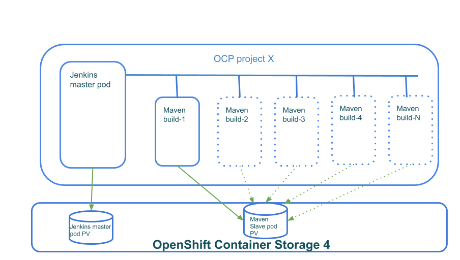

= Lab: Deploying and using Jenkins pipelines with OCS4.
:toc: right
:toclevels: 2
:icons: font
:language: bash
:numbered:
// Activate experimental attribute for Keyboard Shortcut keys
:experimental:

== Lab Overview

Jenkins is one of the most important development infrastructure components, but can we make Jenkins pipelines run faster? Using OpenShift Container Storage we can speed up the build time of applications by using persistent storage to save stateful data of dependencies/libraries (for example) that are needed during compilation.

=== In this lab you will learn how to:
* Create a Jenkins template that uses OpenShift Container Storage 4 persistent storage
* Implement a BuildConfig for the JAX-RS project
* Use Jenkins’s *PodTemplate* in the BuildConfig to create Jenkins (Maven) slave *Pods* that will use OpenShift Container Storage 4 persistent storage
* How to run a simple build and measure the performance
* How OpenShift Container Storage 4 help shorten the build time
* How to run the demo in a multi Jenkins environment simulating large engineering organization with many groups/projects using different Jenkins instances
* How to do all this from the command line :)

== Prerequisites:

* Make sure you have a running OCP cluster based on the RHPDS `OpenShift 4.2 Workshop`
* A copy of this git repo

== Deploying Jenkins

=== Jenkins introduction

Jenkins is basically a free and open source automation server. The gist of Jenkins is very simple, it intends to help the software development process by doing things that normally a developer would do manually, and doing it in an automated way with minimal to none human interaction. In that sense it matches the concept of continuous delivery (CD) perfectly. +
Jenkins is a server based system that runs as a servlet in a containerized environment. It can interact with all major version control tools and can automate builds using tools like Maven, Ant and SBT. +
Because of this level of integration with version control software, builds can easily be triggered by an action such as a "commit" in git. Builds can also start via a daily/hourly cron job or even by simply requesting a build URL. +

=== Our Jenkins demo

In our demo/example, we are going to use a Jenkins pipeline to build the `openshift-tasks` project (https://github.com/redhat-gpte-devopsautomation/openshift-tasks) to demonstrate how to implement a JAX-RS service. We are going to create an Openshift project that will hold a Jenkins *Pod* (that also uses OCS4 persistent storage) and then when we start our build, the Jenkins master *Pod* is going to create a Maven *Pod* to actually run the build. That Maven *Pod* will use OCP4 persistent storage. +
The actual code we compile is not important for the demo, we are just utilizing the build stages to show how OCS4 can save build time significantly.
The pipeline has well-defined stages:

1. Create the Maven *Pod*
2. Clone the code
3. Build the artifact (including getting all dependencies)
4. End the build.

[NOTE]
Pipelines usually have more stages, at least one testing stage, we are skipping these stages

.Jenkins pipeline demo components

=== Creating a Jenkins template that uses OpenShift Container Storage 4

OCP4 comes preconfigured with two Jenkins templates to use:

[source,role="execute"]
----
oc get templates -n openshift -o custom-columns=NAME:.metadata.name|grep -i jenkins
----
.Example output:
----
jenkins-ephemeral
jenkins-persistent
----

We are going to create a new template based on the *jenkins-persistent* template, to do so, please run the *create_ocs_jenkins_template* script. +
The script parameters (CSI_DRIVER, PV_SIZE and NEW_TEMPLATE_NAME) are self explanatory, you can edit the script and change them but remember that other scripts in this lab might use the default value of NEW_TEMPLATE_NAME. The script will:

1. Change the name of the template (so it can co-exists with the one we copied from).
2. Add the storage class (SC) we want to use in the template (the jenkins-persistent template just uses the default SC).
3. Add/change the size of the PV we want for the Jenkins *Pod*.
4. Add some Jenkins Java *Pod* creation parameters to speed up new containers creation.
5. Run the "oc create" command and then create the new template

After running the script, you should see another jenkins template:
[source,role="execute"]
----
oc get templates -n openshift -o custom-columns=NAME:.metadata.name|grep -i jenkins
----
.Example output:
----
jenkins-ephemeral
jenkins-persistent
jenkins-persistent-ocs
----

The last jenkins template *jenkins-persistent-ocs* is the one that we are going to use.

=== Creating our project

Now that we have a Jenkins OCS4 template, we can deploy Jenkins and use the *deploy_jenkins* bash script to:

1. Create a project
2. Create a PVC that will be used for all our builds
3. Create a Jenkins server *Pod* (using the template from previous step)
4. Create the Jenkins pipeline build configuration (as a BuildConfig) for our openshit-tasks project

The script accepts two variables from the command line, the OCP project name you want to use and the persistent storage driver you want to use (in our case OCS4).
The real "magic" takes place at the *BuildConfig*, lets take a look:
[source,yaml,linenums]
----
  1 kind: "BuildConfig"
  2 apiVersion: "v1"
  3 metadata:
  4   name: "jax-rs-build"
  5 spec:
  6   strategy:
  7     type: JenkinsPipeline
  8     jenkinsPipelineStrategy:
  9       jenkinsfile: |-
 10         *PodTemplate*(label: 'maven-s',
 11                     cloud: 'openshift',
 12                     inheritFrom: 'maven',
 13                     name: 'maven-s',
 14                     volumes: [persistentVolumeClaim(mountPath: '/home/jenkins/.m2', claimName: 'dependencies', readOnly: false) ]
 15               ) {
 16           node("maven-s") {
 17             stage('Source Checkout') {
 18               git url: "https://github.com/redhat-gpte-devopsautomation/openshift-tasks.git"
 19               script {
 20                 def pom = readMavenPom file: 'pom.xml'
 21                 def version = pom.version
 22               }
 23             }
 24             // Using Maven build the war file
 25             stage('Build JAX-RS') {
 26               echo "Building war file"
 27               sh "mvn clean package -DskipTests=true"
 28             }
 29           }
 30         }
----

So the pipeline is very simple, we create a Maven *Pod* (based on the OCP Maven default image, line #10), git clone our code (line #18), and then create the artifact using Maven (line #27). +
The "*PodTemplate*" section is where we attached the PV that is created in the previous step in the script (the claim is called "dependencies"). +
The importance of keeping the same claim is simple, for each build, when we build the artifact, we need to download all the dependencies to compile the code.
Since these dependencies don't really change most of the time for the same code, we use OCS4 persistent storage to keep the data persistent for each build, thus making any Maven build that follows the first build, up to 90% faster.

after explaining all this, lets run the script:
[source,role="execute"]
----
bash deploy_jenkins myjenkins-1 rook-ceph-block
----

=== Running the build and looking at results

The "oc" command to run a build is very simple and it is literally "oc start-build <build_name>", however we are going to use the bash script *run_builds* which will not only run this command for you, but also run the build 5 times in a sequential manner, measure the duration of each run and output this data into a log file per run.
The script accept three variables, the OCP project name where you created Jenkins, our BuildConfig, and a directory to place the outputs.
[source,role="execute"]
----
bash run_builds myjenkins-1 test1
----

If we look at the newly created "test1" directory, it should have 10 files, 2 files for each run of the build: +
The files that matches <project_name>-<BuildConfig_name>-<run_number> are literally the output of the Jenkins runs. +
The files starting with "log-" will hold the build duration data.
A quick grep sample of the results will show similar results to these:
[source,role="execute"]
----
cat log-test1-jax-rs-build-*|grep 'Total time'
----
.Example output:
----
[INFO] Total time: 01:39 min
[INFO] Total time: 5.337 s
[INFO] Total time: 3.510 s
[INFO] Total time: 3.258 s
[INFO] Total time: 2.930 s
----
What we are "grepping" for is the total time it took for the actual Maven *Pod* to run the build, or to be precise, the "mvn clean package -DskipTests=true" command, and as you can see, the first build took in this example, 99 seconds, while all the consecutive builds took less than 5 seconds. The reason was already explained before, the dependencies are downloaded for the first build and then reused again and again for any other build that follows. +
It is important to note that this is a fairly small project/code that we're using and bigger projects/code, will have even a bigger impact on the Maven commands as the dependencies will most likely be much larger.

=== Running our demo in a multi-tenant environment

In real-life scenarios of Jenkins in the Kubernetes/DevOps world, there is usually not just one Jenkins server running, but several.
It could be that there's a Jenkins server per development team, maybe a Jenkins server per engineering group (Dev, QE, Support, Professional services and so on).
It could be that a developer is working on several project that requires different version of Jenkins or Jenkins plugins and end up having several Jenkins servers (master *Pod*) per code projects,
so as you can see, the notion of having many Jenkins servers running on a single OpenShift cluster using some sort of software define storage is very real.
+
To simulate a multi Jenkins server environment, we are going to use the previous scripts (deploy_jenkins and run_builds) but we're going to "wrap" these two scripts by scripts that will create a multi Jenkins server environment.
The *init_and_deploy_jenkins-parallel* bash script variables are easy to understand. The script deploys NUMBER_OF_PROJECTS instances of Jenkins, with each project that holds a single Jenkins server named with the prefix of PROJECT_PREFIX. The script is doing the creation in batches of the DEPLOY_INCREMENT variable just to avoid any kind of resources issues during the *Pod* creation part. +
To run the script:
[source,role="execute"]
----
bash init_and_deploy_jenkins-parallel
----

Once we have our Jenkins servers/*Pods* running, we can run our previous demo in parallel on all the Jenkins servers. For that we will use the *run_builds-parallel* script, which basically runs the *run_builds* script for the number of projects we created previously (remember, each OCP project hold a single Jenkins server). The variable NUMBER_OF_PROJECTS need to match the same number from the *init_and_deploy_jenkins-parallel* script. +
The script also creates a separate directory per project to store the output from the runs. +
The script accept one variable and that is a name for the run so all other project directories output will be created under this RUN_NAME directory.
To run the script:
[source,role="execute"]
----
bash run_builds-parallel running_60_jenkins
----
Once all runs are done (should take roughly 10 minutes), you can simply run the *calculate_results* script to go through all directories and calculate all the averages per run. +
This script have some variables that needs to match previous scripts, NUMBER_OF_PROJECTS, PROJECT_PREFIX, BUILD_CONFIG and NUMBER_OF_BUILDS must match the variables from all 4 previous scripts. The script also accepts the RUN_NAME variable, the same one we used in the *run_builds-parallel* script.
[source,role="execute"]
----
bash calculate_results running_60_jenkins
----
The output should be similar to this (these numbers are in seconds):
[source,role="execute"]
----
bash calculate_results testing_60
----
.Example output:
----
Average for build 1: 91.2667
Average for build 2: 8.248
Average for build 3: 5.41643
Average for build 4: 5.64875
Average for build 5: 4.7366
----
