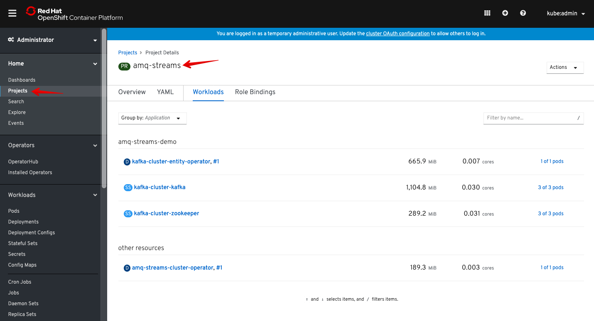
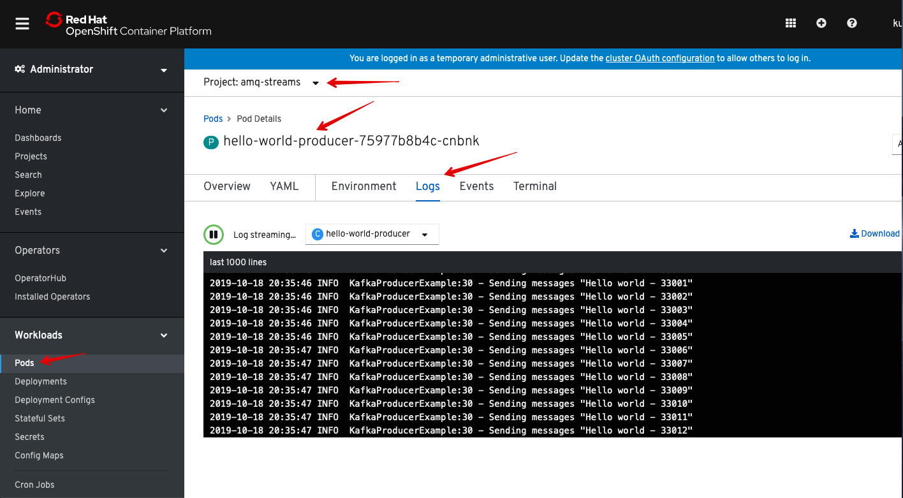

= Lab: Deploying Red Hat AMQ Streams backed by OpenShift Container Storage
#:toc: right
#:toclevels: 2

== Lab Overview

In this lab, you be deploying Red Hat AMQ Streams which is based on Apache Kafka, a popular platform for streaming data delivery and processing. 


=== In this lab you will learn

* Kafka introduction and storage considerations
* Installing Red Hat AMQ Streams Operator from OpenShift operator catalog (to check)
* Deploying Zookeeper and Kafka with persistent storage from OCS
* Creating Kafka topic and user, using their respective operators
* Creating a Kafka Producer and Consmer application
* Testing Kafka High Availablity powered by OCS

== Kafka introduction

- create a new project for RHT AMQ Streams

----
oc new-project amq-streams
----
- Install Red Hat AMQ Operator from Console

- Install AMQ cluster operator which is Responsible for deploying and managing Apache Kafka clusters within an OpenShift cluster.

```
oc apply -f 01-kafka-zookeeper.yaml
oc get all
``` 

```
datacenter:~/git/ocs-training/ocs4_amq_streams_ocs4$ oc get all
NAME                                                 READY   STATUS    RESTARTS   AGE
pod/amq-streams-cluster-operator-b985c7c7f-fxjdc     1/1     Running   0          102m
pod/kafka-cluster-entity-operator-84bfd5bdc4-755np   3/3     Running   0          13m
pod/kafka-cluster-kafka-0                            2/2     Running   0          14m
pod/kafka-cluster-kafka-1                            2/2     Running   0          14m
pod/kafka-cluster-kafka-2                            2/2     Running   0          14m
pod/kafka-cluster-zookeeper-0                        2/2     Running   0          15m
pod/kafka-cluster-zookeeper-1                        2/2     Running   0          15m
pod/kafka-cluster-zookeeper-2                        2/2     Running   0          15m

NAME                                     TYPE        CLUSTER-IP       EXTERNAL-IP   PORT(S)                      AGE
service/kafka-cluster-kafka-bootstrap    ClusterIP   172.30.105.210   <none>        9091/TCP,9092/TCP,9093/TCP   14m
service/kafka-cluster-kafka-brokers      ClusterIP   None             <none>        9091/TCP,9092/TCP,9093/TCP   14m
service/kafka-cluster-zookeeper-client   ClusterIP   172.30.108.113   <none>        2181/TCP                     15m
service/kafka-cluster-zookeeper-nodes    ClusterIP   None             <none>        2181/TCP,2888/TCP,3888/TCP   15m

NAME                                            READY   UP-TO-DATE   AVAILABLE   AGE
deployment.apps/amq-streams-cluster-operator    1/1     1            1           102m
deployment.apps/kafka-cluster-entity-operator   1/1     1            1           13m

NAME                                                       DESIRED   CURRENT   READY   AGE
replicaset.apps/amq-streams-cluster-operator-b985c7c7f     1         1         1       102m
replicaset.apps/kafka-cluster-entity-operator-84bfd5bdc4   1         1         1       13m

NAME                                       READY   AGE
statefulset.apps/kafka-cluster-kafka       3/3     14m
statefulset.apps/kafka-cluster-zookeeper   3/3     15m
datacenter:~/git/ocs-training/ocs4_amq_streams_ocs4$

```
- Verify PVC and PV
```
oc get pvc -n amq-streams
oc get pv -o json | jq -r '.items | sort_by(.spec.capacity.storage)[]| select(.spec.claimRef.namespace=="amq-streams") | [.spec.claimRef.name,.spec.capacity.storage] | @tsv'
```

```
datacenter:~/git/ocs-training/ocs4_amq_streams_ocs4$ oc get pvc -n amq-streams
NAME                             STATUS   VOLUME                                     CAPACITY   ACCESS MODES   STORAGECLASS                  AGE
data-kafka-cluster-kafka-0       Bound    pvc-91601dfe-f1b4-11e9-b1e6-0a6f9f40dc3e   100Gi      RWO            ocs-storagecluster-ceph-rbd   18h
data-kafka-cluster-kafka-1       Bound    pvc-9160e85a-f1b4-11e9-843c-12e73ceaa62c   100Gi      RWO            ocs-storagecluster-ceph-rbd   18h
data-kafka-cluster-kafka-2       Bound    pvc-91613a33-f1b4-11e9-843c-12e73ceaa62c   100Gi      RWO            ocs-storagecluster-ceph-rbd   18h
data-kafka-cluster-zookeeper-0   Bound    pvc-73630d23-f1b4-11e9-843c-12e73ceaa62c   10Gi       RWO            ocs-storagecluster-ceph-rbd   18h
data-kafka-cluster-zookeeper-1   Bound    pvc-7374c25c-f1b4-11e9-843c-12e73ceaa62c   10Gi       RWO            ocs-storagecluster-ceph-rbd   18h
data-kafka-cluster-zookeeper-2   Bound    pvc-73736821-f1b4-11e9-b1e6-0a6f9f40dc3e   10Gi       RWO            ocs-storagecluster-ceph-rbd   18h
datacenter:~/git/ocs-training/ocs4_amq_streams_ocs4$
datacenter:~/git/ocs-training/ocs4_amq_streams_ocs4$ oc get pv -o json | jq -r '.items | sort_by(.spec.capacity.storage)[]| select(.spec.claimRef.namespace=="amq-streams") | [.spec.claimRef.name,.spec.capacity.storage] | @tsv'
data-kafka-cluster-kafka-0	100Gi
data-kafka-cluster-kafka-1	100Gi
data-kafka-cluster-kafka-2	100Gi
data-kafka-cluster-zookeeper-0	10Gi
data-kafka-cluster-zookeeper-2	10Gi
data-kafka-cluster-zookeeper-1	10Gi
datacenter:~/git/ocs-training/ocs4_amq_streams_ocs4$
```

- Create kafka topic
```
oc apply -f 02-kafka-topic.yaml
```

```
$ oc get kt
NAME       PARTITIONS   REPLICATION FACTOR
my-topic   3            3
$
```

- Create Kafka user
```
$ oc apply -f 03-kafka-user.yaml
kafkauser.kafka.strimzi.io/kafka-user1 created
$ oc get kafkauser
NAME          AUTHENTICATION   AUTHORIZATION
kafka-user1   tls              simple
$
```
## Create a sample Kafka Producer and Consumer Application
- Kafka producer
```
oc apply -f 04-hello-world-producer.yaml
```
- review the producer messages
```
oc logs -n amq-streams -f $(oc get pods -l app=hello-world-producer -o name)
```
- press ``ctrl+c`` to cancel this producer messages

- Instead of CLI you could also view logs from GUI





- Kafka consumer
```
oc apply -f 05-hello-world-consumer.yaml

```
```
oc logs -n amq-streams -f $(oc get pods -l app=hello-world-consumer -o name)

```
press ``ctrl+c`` to cancel
