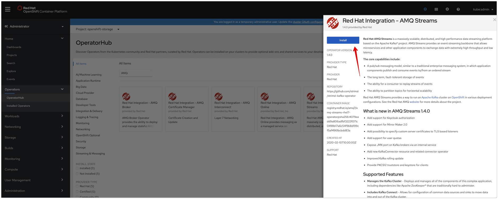

= Lab: Deploying Red Hat AMQ Streams backed by OpenShift Container Storage
:toc: right
:toclevels: 2
:icons: font
:language: bash
:numbered:
// Activate experimental attribute for Keyboard Shortcut keys
:experimental:

== Lab Overview

In this lab, you will be deploying Red Hat AMQ Streams which is based on Apache Kafka, a popular platform for streaming data delivery and processing. 

=== In this lab you will learn

* Kafka / RHT AMQ Streams introduction, architecture and storage use-case.
* Installing Red Hat AMQ Streams Operator from OpenShift OperatorHub
* Deploying Zookeeper and Kafka with persistent storage from OCS
* Creating Kafka topic and Kafka user, using their respective operators
* Creating a Kafka Producer and Consumer application
* Testing Kafka High Availability Powered by OCS

== Introduction

image::imgs/image-03.png[Apache Kafka]
image::imgs/image-04.png[Apache Kafka Architecture]
image::imgs/image-05.png[Apache Kafka use cases]
image::imgs/image-06.png[Red Hat AMQ Streams]
image::imgs/image-07.png[Storage use cases for Apache Kafka]

== Installing Red Hat AMQ Streams

- Create a new project called ``amq-streams`` from openshift console by navigating to the projects as shown below
    
image::imgs/image-13.png[Create amq-stream project]

NOTE: You can also create the project from the command line as shown below
[source,role="execute"]
----
oc new-project amq-streams
----

- Make sure to select the ``amq-streams`` project and search AMQ Streams Operator from the OperatorHub

image::imgs/image-08.png[Red Hat AMQ Streams Operator Installation]
- Install the AMQ Streams Operator



- Under Installation Mode, select ``amq-stream`` as the namespace 

NOTE: Selecting a specific namespace to help us purge the operator and its resources easily

image::imgs/image-10.png[Red Hat AMQ Streams Operator Installation]

- Verify the installed operator

image::imgs/image-11.png[Red Hat AMQ Streams Operator Installation]
image::imgs/image-12.png[Red Hat AMQ Streams Operator Installation]

NOTE: At this stage, you should have Red Hat AMQ Streams operator installed on your OpenShift 4 environment

== Creating Zookeeper and Kafka Clusters

Red Hat AMQ Streams provides the necessary operators which are responsible for deploying and managing Apache Kafka clusters on OpenShift.

- Make sure the default storage class is set to ``ocs-storagecluster-ceph-rbd`` Refer to link:https://github.com/red-hat-storage/ocs-training/tree/master/ocp4ocs4#change-the-default-storage-class-to-ceph-rbd[change the default storage class to Ceph RBD] module for more information.

[source,role="execute"]
----
oc get sc
----
Example output:
```
$ oc get sc
NAME                                    PROVISIONER                             AGE
gp2                                     kubernetes.io/aws-ebs                   11d
ocs-storagecluster-ceph-rbd (default)   openshift-storage.rbd.csi.ceph.com      10d
ocs-storagecluster-cephfs               openshift-storage.cephfs.csi.ceph.com   10d
$
```

- Create a Kafka cluster which will also deploy a zookeeper cluster required by Kafka

[source,role="execute"]
----
oc project amq-streams
oc apply -f https://raw.githubusercontent.com/red-hat-storage/ocs-training/master/ocs4kafka/01-kafka-zookeeper.yaml
---- 
- Monitor the cluster progress

[source,role="execute"]
----
watch oc get all
----
- Finally once the Kafka cluster is up and running, you should see output similar to below
```
$ oc get all
NAME                                                      READY   STATUS    RESTARTS   AGE
pod/amq-streams-cluster-operator-v1.3.0-b94f877f5-tzhhg   1/1     Running   0          6m24s
pod/kafka-cluster-entity-operator-67668f5954-zwxzc        3/3     Running   0          31s
pod/kafka-cluster-kafka-0                                 2/2     Running   0          2m58s
pod/kafka-cluster-kafka-1                                 2/2     Running   0          2m58s
pod/kafka-cluster-kafka-2                                 2/2     Running   0          2m58s
pod/kafka-cluster-zookeeper-0                             2/2     Running   0          4m2s
pod/kafka-cluster-zookeeper-1                             2/2     Running   0          4m2s
pod/kafka-cluster-zookeeper-2                             2/2     Running   0          4m2s

NAME                                             TYPE        CLUSTER-IP       EXTERNAL-IP   PORT(S)                      AGE
service/kafka-cluster-kafka-0                    ClusterIP   172.30.114.98    <none>        9094/TCP                     3m
service/kafka-cluster-kafka-1                    ClusterIP   172.30.123.161   <none>        9094/TCP                     3m
service/kafka-cluster-kafka-2                    ClusterIP   172.30.99.23     <none>        9094/TCP                     3m
service/kafka-cluster-kafka-bootstrap            ClusterIP   172.30.228.1     <none>        9091/TCP,9092/TCP,9093/TCP   3m
service/kafka-cluster-kafka-brokers              ClusterIP   None             <none>        9091/TCP,9092/TCP,9093/TCP   3m
service/kafka-cluster-kafka-external-bootstrap   ClusterIP   172.30.121.94    <none>        9094/TCP                     3m
service/kafka-cluster-zookeeper-client           ClusterIP   172.30.44.252    <none>        2181/TCP                     4m3s
service/kafka-cluster-zookeeper-nodes            ClusterIP   None             <none>        2181/TCP,2888/TCP,3888/TCP   4m3s

NAME                                                  READY   UP-TO-DATE   AVAILABLE   AGE
deployment.apps/amq-streams-cluster-operator-v1.3.0   1/1     1            1           6m25s
deployment.apps/kafka-cluster-entity-operator         1/1     1            1           32s

NAME                                                            DESIRED   CURRENT   READY   AGE
replicaset.apps/amq-streams-cluster-operator-v1.3.0-b94f877f5   1         1         1       6m25s
replicaset.apps/kafka-cluster-entity-operator-67668f5954        1         1         1       32s

NAME                                       READY   AGE
statefulset.apps/kafka-cluster-kafka       3/3     2m59s
statefulset.apps/kafka-cluster-zookeeper   3/3     4m3s

NAME                                                     HOST/PORT                                                                                          PATH   SERVICES                                 PORT   TERMINATION   WILDCARD
route.route.openshift.io/kafka-cluster-kafka-0           kafka-cluster-kafka-0-amq-streams.apps.cluster-espoo-ebad.espoo-ebad.example.opentlc.com                  kafka-cluster-kafka-0                    9094   passthrough   None
route.route.openshift.io/kafka-cluster-kafka-1           kafka-cluster-kafka-1-amq-streams.apps.cluster-espoo-ebad.espoo-ebad.example.opentlc.com                  kafka-cluster-kafka-1                    9094   passthrough   None
route.route.openshift.io/kafka-cluster-kafka-2           kafka-cluster-kafka-2-amq-streams.apps.cluster-espoo-ebad.espoo-ebad.example.opentlc.com                  kafka-cluster-kafka-2                    9094   passthrough   None
route.route.openshift.io/kafka-cluster-kafka-bootstrap   kafka-cluster-kafka-bootstrap-amq-streams.apps.cluster-espoo-ebad.espoo-ebad.example.opentlc.com          kafka-cluster-kafka-external-bootstrap   9094   passthrough   None
$

```
- As a part of the Kafka/Zookeepeer cluster creation PV and PVC were created. Verify the status of PVC is ``Bound``
[source,role="execute"]
----
oc get pvc -n amq-streams
oc get pv -o json | jq -r '.items | sort_by(.spec.capacity.storage)[]| select(.spec.claimRef.namespace=="amq-streams") | [.spec.claimRef.name,.spec.capacity.storage] | @tsv'
----
Example output:
```
$ oc get pvc -n amq-streams
NAME                             STATUS   VOLUME                                     CAPACITY   ACCESS MODES   STORAGECLASS                  AGE
data-kafka-cluster-kafka-0       Bound    pvc-91601dfe-f1b4-11e9-b1e6-0a6f9f40dc3e   100Gi      RWO            ocs-storagecluster-ceph-rbd   18h
data-kafka-cluster-kafka-1       Bound    pvc-9160e85a-f1b4-11e9-843c-12e73ceaa62c   100Gi      RWO            ocs-storagecluster-ceph-rbd   18h
data-kafka-cluster-kafka-2       Bound    pvc-91613a33-f1b4-11e9-843c-12e73ceaa62c   100Gi      RWO            ocs-storagecluster-ceph-rbd   18h
data-kafka-cluster-zookeeper-0   Bound    pvc-73630d23-f1b4-11e9-843c-12e73ceaa62c   10Gi       RWO            ocs-storagecluster-ceph-rbd   18h
data-kafka-cluster-zookeeper-1   Bound    pvc-7374c25c-f1b4-11e9-843c-12e73ceaa62c   10Gi       RWO            ocs-storagecluster-ceph-rbd   18h
data-kafka-cluster-zookeeper-2   Bound    pvc-73736821-f1b4-11e9-b1e6-0a6f9f40dc3e   10Gi       RWO            ocs-storagecluster-ceph-rbd   18h
$


$ oc get pv -o json | jq -r '.items | sort_by(.spec.capacity.storage)[]| select(.spec.claimRef.namespace=="amq-streams") | [.spec.claimRef.name,.spec.capacity.storage] | @tsv'
data-kafka-cluster-kafka-0	100Gi
data-kafka-cluster-kafka-1	100Gi
data-kafka-cluster-kafka-2	100Gi
data-kafka-cluster-zookeeper-0	10Gi
data-kafka-cluster-zookeeper-2	10Gi
data-kafka-cluster-zookeeper-1	10Gi
$
```
At this point you have a running Kafka and Zookeeper cluster on OpenShift 4, deployed through Red Hat AMQ Streams Operator, consuming persistent block storage from OpenShift Container Storage 4

== Create Kafka Topic and Kafka User

- To start consuming Kafka, we first need to create a Kafka topic. AMQ Streams provides an operator to manage Kafka Topics and Kafka Users
[source,role="execute"]
----
oc apply -f https://raw.githubusercontent.com/red-hat-storage/ocs-training/master/ocs4kafka/02-kafka-topic.yaml
----
- List Kafka Topics (kt)

[source,role="execute"]
----
oc get kt
----
Example output:
```
$ oc get kt
NAME       PARTITIONS   REPLICATION FACTOR
my-topic   3            3
$
```
- Create a Kafka user

[source,role="execute"]
----
oc apply -f https://raw.githubusercontent.com/red-hat-storage/ocs-training/master/ocs4kafka/03-kafka-user.yaml
----
- List Kafka Users

[source,role="execute"]
----
oc get kafkauser
----
Example output:
```
$ oc get kafkauser
NAME          AUTHENTICATION   AUTHORIZATION
kafka-user1   tls              simple
$
```
At this point, we have a Kafka Topic and a Kafka user created on our Kafka Cluster using Red Hat AMQ Streams Operator

== Create a sample Kafka Producer and Consumer Application

- To demonstrate Kafka usage, let's deploy a sample hello-world-producer application
[source,role="execute"]
----
oc apply -f https://raw.githubusercontent.com/red-hat-storage/ocs-training/master/ocs4kafka/04-hello-world-producer.yaml
----
This sample application will produce 1 Million messages in an iterative manner

- To review the Kafka producer messages lets tail to the logs of ``hello-world-producer`` app

[source,role="execute"]
----
oc logs -n amq-streams -f $(oc get pods -l app=hello-world-producer -o name)
----
You can leave the  hello-world-consumer shell tab open to see live messages production, however, you can always press kbd:[Ctrl+C] to cancel the producer messages

- Instead of CLI, you could also view logs from GUI

image::imgs/image-01.png[Producer app logs]
image::imgs/image-02.png[Producer app logs]

We now have a Kafka producer app generating messages and pushing the messages to Kafka Topic. We now deploy a sample hello world consumer app, which will consume messages from the Kafka Topic

- Deploy Kafka consumer application
[source,role="execute"]
----
oc apply -f https://raw.githubusercontent.com/red-hat-storage/ocs-training/master/ocs4kafka/05-hello-world-consumer.yaml
----

- Monitor logs of kafka consumer app, in real time using CLI Or via GIU (shown above)
[source,role="execute"]
----
oc logs -n amq-streams -f $(oc get pods -l app=hello-world-consumer -o name)
----
press kbd:[Ctrl+C] to cancel

== OCS : Making Kafka cluster more resilient

Kafka out-of-the-box provides high availability and fault tolerance. However, the storage backend used underneath Kafka plays a vital role in the overall resiliency of the system.

In this section, we will demonstrate how OpenShift Container Storage increases the resiliency of the Kafka cluster by instantly attaching the PV to replacement pods in case of failure detection. 

- Open four SSH sessions, and log in to OpenShift cluster using OC client
- In session-1: tail the real-time logs of Kafka producer application, created in the last section

[source,role="execute"]
----
oc logs -n amq-streams -f $(oc get pods -l app=hello-world-producer -o name)
----

- In session-2 : tail the real-time logs of kafka consumer application, created in the last section
[source,role="execute"]
----
oc logs -n amq-streams -f $(oc get pods -l app=hello-world-consumer -o name)
----

- In session-3: watch OCP Kafka pods, PV and PVC status
[source,role="execute"]
----
oc project amq-streams
watch oc get pods,pv,pvc
----

- Next, we will intentionally induce Kafka pod failure. Keep a close eye on all three sessions. OCS makes Kafka pod recovery instant, resulting in no outage in your messaging infrastructure.

- In session-4: run the following command to induce failure of the Kafka pod
[source,role="execute"]
----
oc delete pods kafka-cluster-kafka-0 --grace-period=0
----

Summary: You will notice that the Kafka producer and consumer applications would not notice any outage due to one of the Kafka pod failure, instead they will continue to function as nothing happened. In the background, when Kubernetes detect Kafka pod failure, it immediately launches a new Kafka pod and instantly attaches the persistent volume which was once attached to the previous Kafka pod. Kafka pod upon instantiation will start serving requests without rebuilding the dataset as the data is already persisted by the OCS persistent volume.
Hence compared to ephemeral storage, OCS persistent volume, preserves the data and complement Kafka cluster with faster recovery and resiliency in case of failures.