= Lab: Deploying OpenShift Cluster Logging backed by OpenShift Container Storage
:toc: right
:toclevels: 2
:icons: font
:source-language: bash
:numbered:
// Activate experimental attribute for Keyboard Shortcut keys
:experimental:

== Lab Overview

In this lab, you will be deploying OpenShift Cluster Logging to an OpenShift cluster. Cluster logging increases the observability and operational experience for applications running in OpenShift.

=== In this lab you will learn

* OpenShift Cluster Logging components and architecture
* Redundancy configuration options, and which to use with OCS
* Deploying Cluster Logging
* Deploying Event Router
* Inspect logs with Kibana

== Introduction

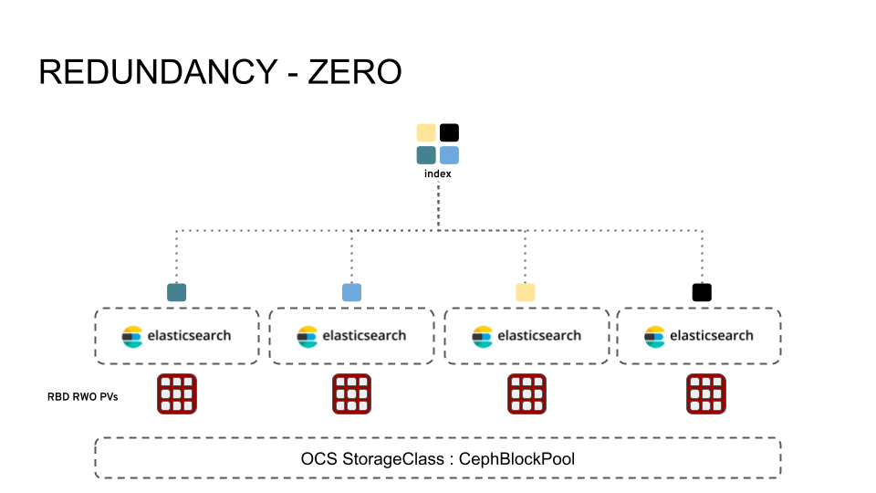
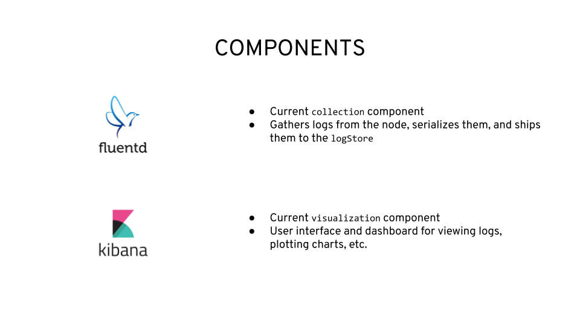
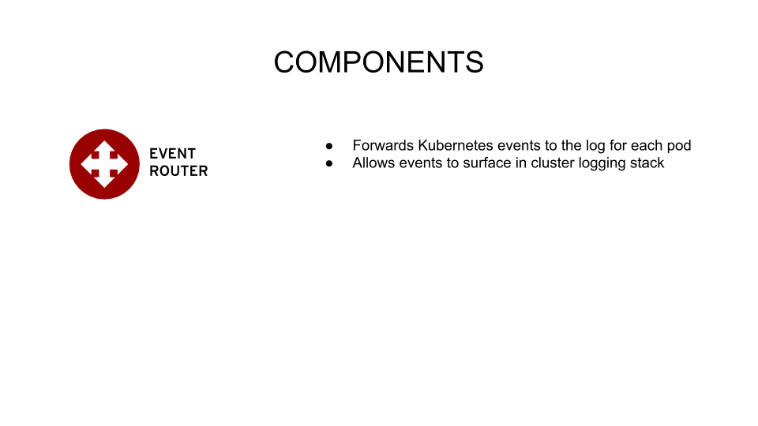
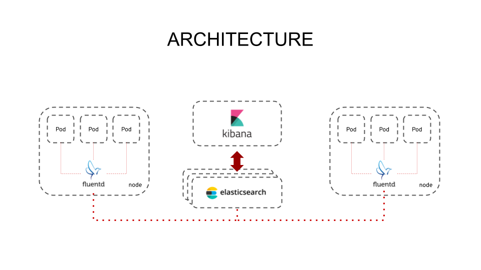
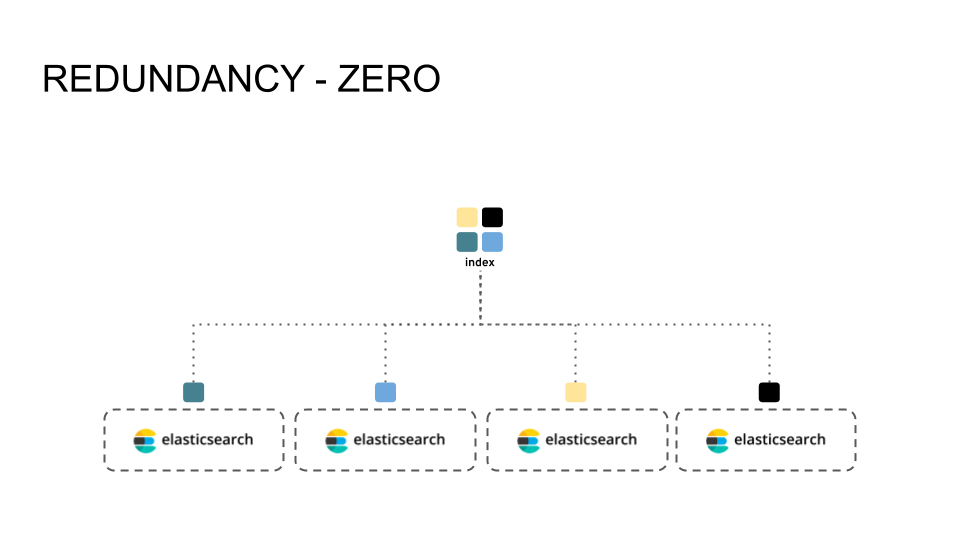
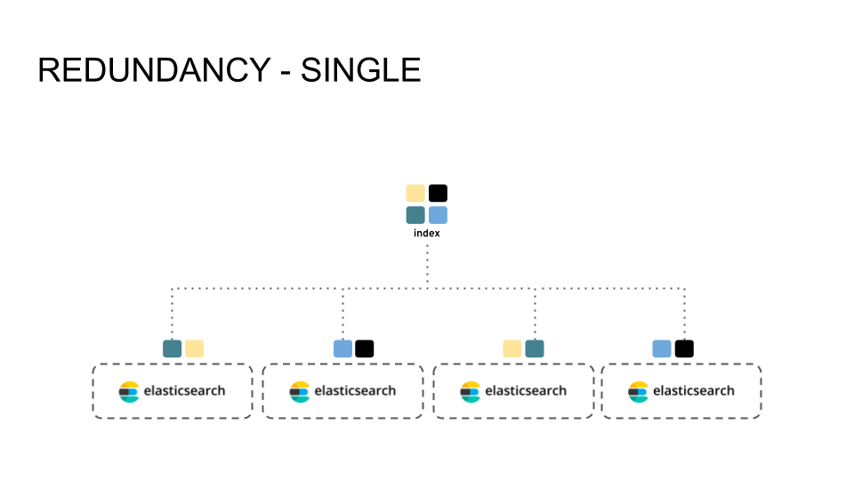
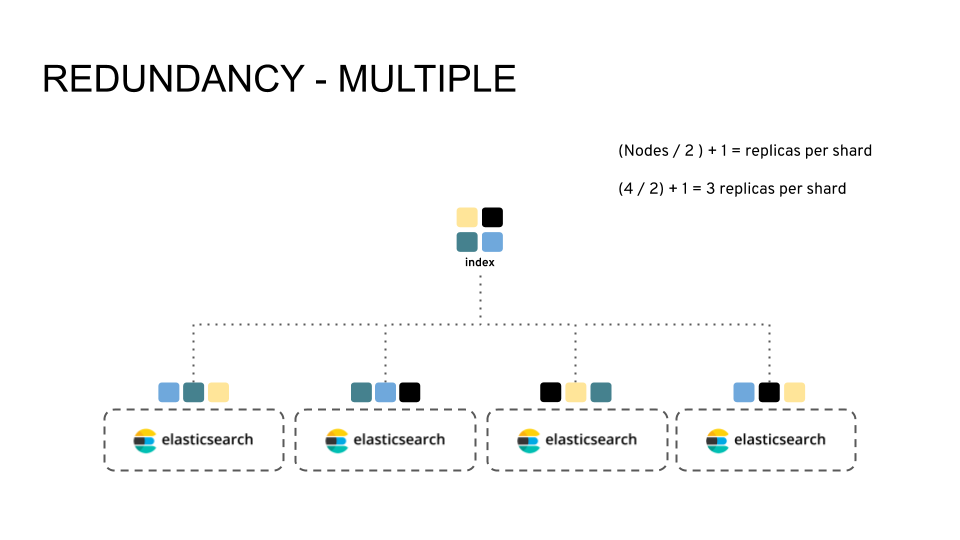
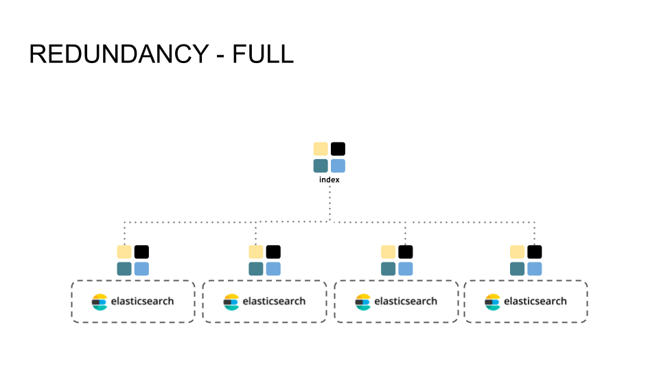
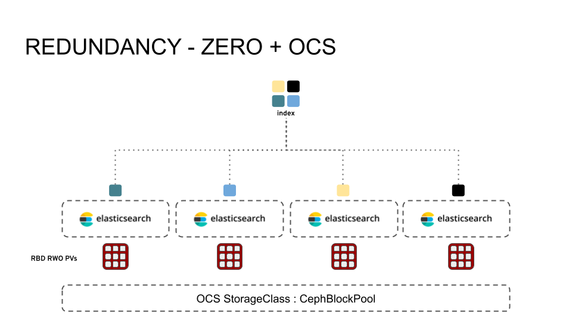

== Deploying Cluster Logging

=== Setup Operators

Before we install the Logging operator, we need to setup several namespaces, subscribe to the Elasticsearch operator, and setup RBAC policies. This is all handled by the ``logging-init.yaml`` file.

- Submit ``logging-init.yaml`` file

[source,role="execute"]
----
oc create -f https://raw.githubusercontent.com/red-hat-storage/ocs-training/master/ocs4logging/logging-init.yaml
----
    
Once submitted, then we can use the OpenShift Console to install the Cluster Logging operator from the catalog.

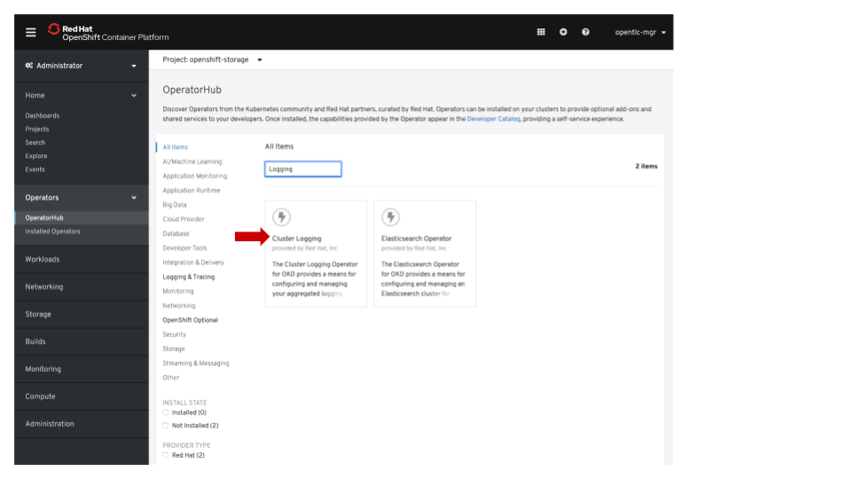
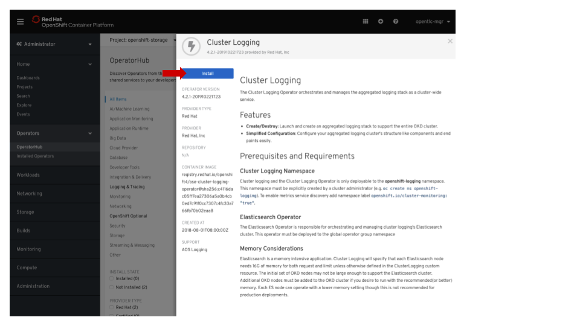
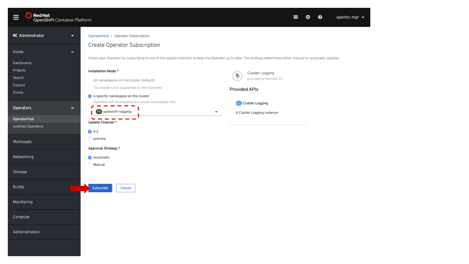

NOTE: Make sure to modify the namespace to openshift-logging!

After the Cluster Logging operator subscription has been configured, return to the console to verify that both the Cluster Logging and Elasticsearch operators reach the ``Running`` state.

[source,role="execute"]
----
oc get pods -n openshift-logging
----

The output should look something like this:

----
NAME                                        READY   STATUS    RESTARTS   AGE
cluster-logging-operator-64967c849b-w68sh   1/1     Running   0          108s
----

[source,role="execute"]
----
oc get pods -n openshift-operators-redhat
----

The output should look something like this:

----
NAME                                      READY   STATUS    RESTARTS   AGE
elasticsearch-operator-5979dddc8f-gb69w   1/1     Running   0          4m6s
----

=== Creating a Cluster Logging Instance

The next step is to create a ``ClusterLogging`` custom resource. The two important parameters

* ``storageClassName: ocs-storagecluster-ceph-rbd``
* ``redundancyPolicy: ZeroRedundancy``

This example CR will result in Elasticsearch indexes being sharded across all Elasticsearch instances, and stored on OpenShift Container Storage RWO Persistent Volumes (RBD). The amount of replication will not change if the number of Elasticsearch instances is scaled, which would not be the case with ``Multiple``  or ``Full`` redundancy policies.

[source,yaml]
----
apiVersion: "logging.openshift.io/v1"
kind: "ClusterLogging"
metadata:
  name: "instance"
  namespace: "openshift-logging"
spec:
  managementState: "Managed"
  logStore:
    type: "elasticsearch"
    elasticsearch:
      nodeCount: 3
      storage:
        storageClassName: ocs-storagecluster-ceph-rbd
        size: 200G
      redundancyPolicy: "ZeroRedundancy"
  visualization:
    type: "kibana"
    kibana:
      replicas: 1
  curation:
    type: "curator"
    curator:
      schedule: "30 3 * * *"
  collection:
    logs:
      type: "fluentd"
      fluentd: {}
----

- Submit ``logging-cr.yaml`` file

[source,role="execute"]
----
oc create -f https://raw.githubusercontent.com/red-hat-storage/ocs-training/master/ocs4logging/logging-cr.yaml
----

Verify all the components come online properly.

[source,role="execute"]
----
watch oc get pods -n openshift-logging
----

The output should detail the following pods, and they should all reach the Running state:

----
NAME                                            READY   STATUS    RESTARTS   AGE
cluster-logging-operator-64967c849b-w68sh       1/1     Running   0          37m
elasticsearch-cdm-wedgisnx-1-769b67bdfb-c6nkj   2/2     Running   0          20m
elasticsearch-cdm-wedgisnx-2-99cd5d7b8-jrkjj    2/2     Running   0          19m
elasticsearch-cdm-wedgisnx-3-66f7469f66-vvmcl   2/2     Running   0          18m
fluentd-4pt84                                   1/1     Running   0          20m
fluentd-crl2n                                   1/1     Running   0          20m
fluentd-fkxnc                                   1/1     Running   0          20m
fluentd-kv9qq                                   1/1     Running   0          20m
fluentd-r6ptj                                   1/1     Running   0          20m
fluentd-xkb6s                                   1/1     Running   0          20m
kibana-56bcf46446-f6z6x                         2/2     Running   0          20m
----
Furthermore, verify that the Elasticsearch pod are utilizing OCS by examining the PVs

[source,role="execute"]
----
oc get pv | grep elasticsearch
----

The output should show ``ocs-storagecluster-ceph-rbd`` as the storage class for all three of the Elasticsearch persistent volumes.

----
pvc-603e200d-006f-11ea-ba33-02eab89269b1   187Gi      RWO            Delete           Bound    openshift-logging/elasticsearch-elasticsearch-cdm-wedgisnx-1   ocs-storagecluster-ceph-rbd            22m
pvc-604229fa-006f-11ea-ba33-02eab89269b1   187Gi      RWO            Delete           Bound    openshift-logging/elasticsearch-elasticsearch-cdm-wedgisnx-2   ocs-storagecluster-ceph-rbd            22m
pvc-60437864-006f-11ea-ba33-02eab89269b1   187Gi      RWO            Delete           Bound    openshift-logging/elasticsearch-elasticsearch-cdm-wedgisnx-3   ocs-storagecluster-ceph-rbd            22m
----

==  Deploying the Event Router

The Event Router ensures that OpenShift Events make their way into the Cluster Logging infrastructure. This can be useful for operational teams better understand what is going on in their environment. First we will use the ``event-router.yaml`` example template, process it, and apply it to the cluster.

[source,role="execute"]
----
oc process -f https://raw.githubusercontent.com/red-hat-storage/ocs-training/master/ocs4logging/event-router.yaml | oc apply -f -
----

Validate that the Event Router installed:

[source,role="execute"]
----
oc logs $(oc get pods --selector component=eventrouter -o name -n openshift-logging) -n openshift-logging
----

The event router deployment is now complete!

== Inspect logs with Kibana

Use the following command to retrieve the web URI for the Kibana dashboard:

[source,role="execute"]
----
oc get -n openshift-logging route kibana
----

----
NAME     HOST/PORT                                                                     PATH   SERVICES   PORT    TERMINATION          WILDCARD
kibana   kibana-openshift-logging.apps.cluster-lax-8763.lax-8763.example.opentlc.com          kibana     <all>   reencrypt/Redirect   None
----

Once you open the dashboard in a browser, you will need to authorize access. Once in you can do an example search by typing in ``noobaa``  in the search bar. Doing so will load the relevant log messages for the the Noobaa component of OCS. Not only is Cluster Logging consuming OpenShift Container Storage, but Cluster Logging can be used to gain additional operational visibility into OpenShift Container Storage!

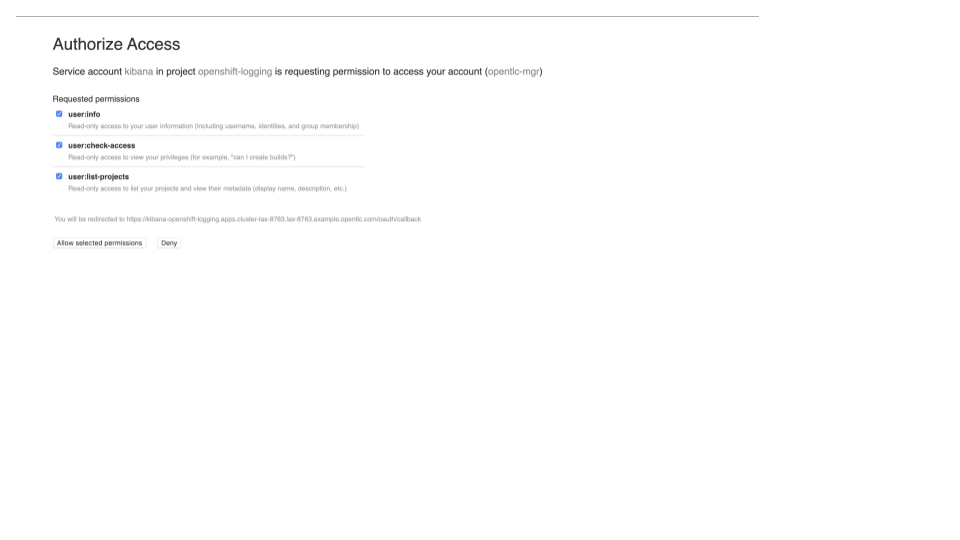
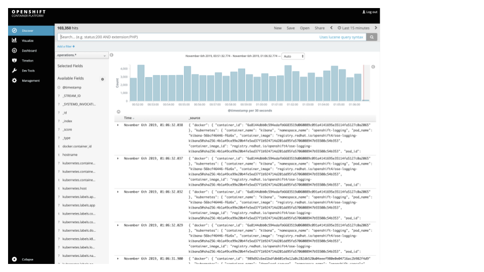
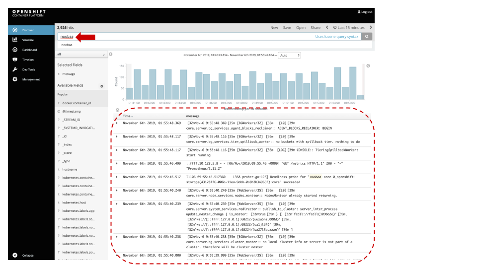

== Summary

By this point you have successfully added Cluster Logging to your OpenShift environment, and done so in such a way that it will benefit from all the persistent goodness that comes from OpenShift Container Storage. You've also configured the Event Router to collect Kubernetes events and foward them to your freshly setup Cluster Logging infrastructure. Finally, you were able to use the Kibana dashboard to search for logs for one of the OpenShift Container Storage pods!
